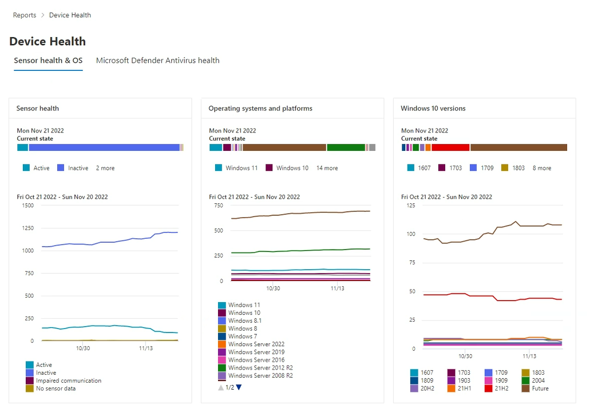
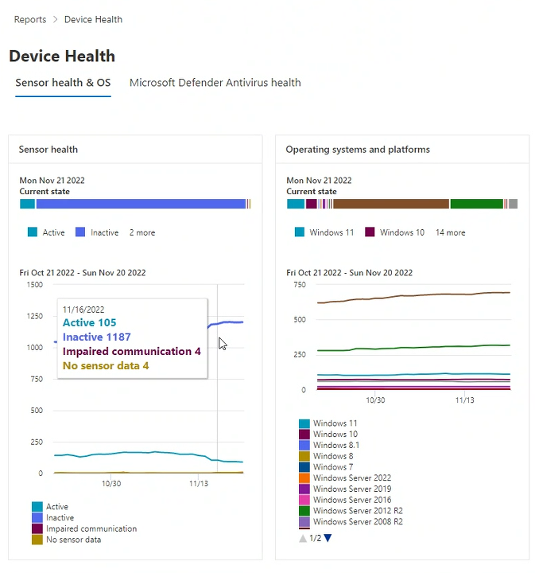
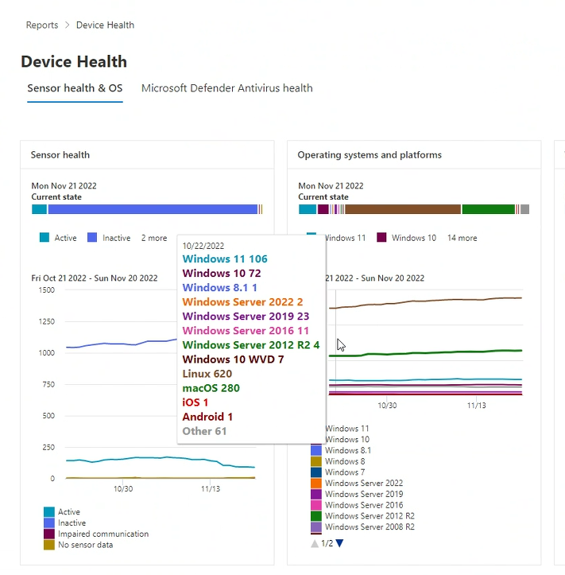
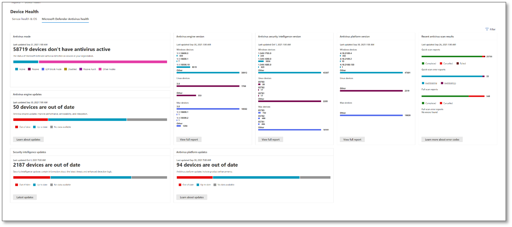
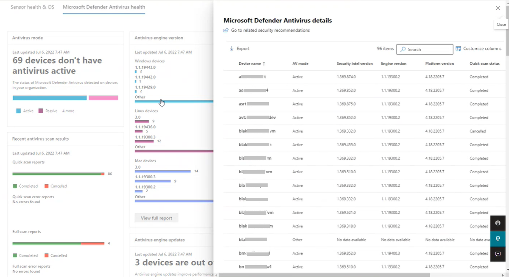
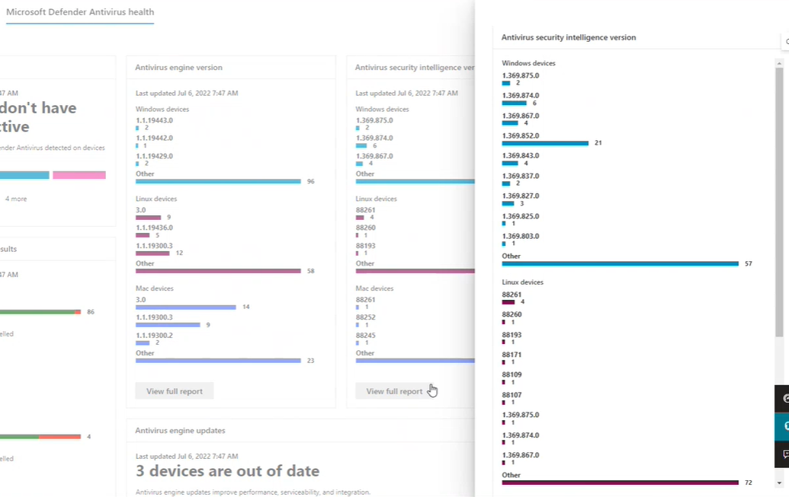
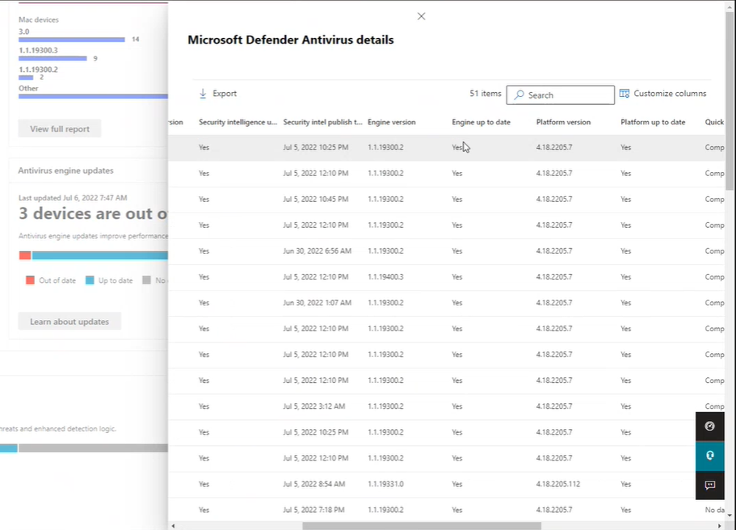

# Device health and compliance report in Microsoft Defender for Endpoint

[!INCLUDE [Microsoft 365 Defender rebranding](../../includes/microsoft-defender.md)]

**Applies to:**

- [Microsoft Defender for Endpoint](https://go.microsoft.com/fwlink/p/?linkid=2154037)
- [Microsoft 365 Defender](https://go.microsoft.com/fwlink/?linkid=2118804)

> Want to experience Microsoft Defender for Endpoint? [Sign up for a free trial.](https://signup.microsoft.com/create-account/signup?products=7f379fee-c4f9-4278-b0a1-e4c8c2fcdf7e&ru=https://aka.ms/MDEp2OpenTrial?ocid=docs-wdatp-exposedapis-abovefoldlink)

> [!IMPORTANT]
> Some information relates to prereleased product which may be substantially modified before it's commercially released. Microsoft makes no warranties, express or implied, with respect to the information provided here.
>
> Information about the features that are _commercially released_ follows the prerelease information in the section titled [Publicly-released: Device health and compliance report in Microsoft Defender for Endpoint](#publicly-released-device-health-and-compliance-report-in-microsoft-defender-for-endpoint).

## Public Preview - Device health and antivirus compliance report in Microsoft Defender for Endpoint

The devices status report provides high-level information about the devices in your organization. The report includes trending information showing the sensor health state, antivirus status, OS platforms, and Windows 10 versions.

> [!IMPORTANT]
>"For Windows Server 2012 R2 and Windows Server 2016 to appear in device health reports, the [New Windows Server 2012 R2 and 2016 unified solution](configure-server-endpoints) must be installed.

In the Microsoft 365 Security dashboard navigation panel, select **Reports**, and then open **Device health and compliance**.
The Device health and compliance dashboard is structured in two tabs:

- The [**Sensor health & OS** tab](#sensor-health--os-tab) provides general operating system information, divided into three cards that display the following device attributes:
  - [Sensor health card](#sensor-health-card)
  - [Operating systems and platforms card](#operating-systems-and-platforms-card)
  - [Windows 10 versions card](#windows-10-versions-card)

- The [**Microsoft Defender Antivirus health** tab](#microsoft-defender-antivirus-health-tab) has eight cards that report on aspects of Microsoft Defender Antivirus:
  - [Antivirus mode card](#antivirus-mode-card)
  - [Antivirus engine version card](#antivirus-engine-version-card)
  - [Antivirus security intelligence version card](#antivirus-security-intelligence-version-card)
  - [Antivirus platform version card](#antivirus-platform-version-card)
  - [Recent antivirus scan results card](#recent-antivirus-scan-results-card)
  - [Antivirus engine updates card](#antivirus-engine-updates-card)
  - [Security intelligence updates card](#security-intelligence-updates-card)
  - [Antivirus platform updates card](#antivirus-platform-updates-card)

### Sensor health & OS tab

Sensor health and OS cards report on general operating system health, which includes detection sensor health, up-to-date versus out-of-date operating systems, and Windows 10 versions.

> [!div class="mx-imgBorder"]
> 

Each of the three cards on the **Sensor health** tab have two reporting sections, _Current state_ and _device trends_, presented as graphs:

#### Current state graph

In each card, the Current state (referred to in some documentation as _Device summary_) is the top, horizontal bar graph. Current state is a snapshot that shows information collected about devices in your organization, scoped to the current day. This graph represents the distribution of devices across your organization that report status or are detected to be in a specific state.

> [!div class="mx-imgBorder"]
> 

#### Device trends graph

The lower graph on each of the three cards isn't named, but is commonly known as _device trends_. The device trends graph depicts the collection of devices across your organization, throughout the time span indicated directly above the graph.
By default, the device trends graph displays device information from the 30-day period, ending in the latest full day. To gain a better perspective about trends occurring in your organization, you can fine-tune the reporting period by adjusting the time period shown. To adjust the time period, open the filter and select a start day and end day.

> [!div class="mx-imgBorder"]
> 

#### Filtering data

Use the provided filters to include or exclude devices with certain attributes. You can select multiple filters to apply from the device attributes. When applied, filters apply to all three cards in the report.

For example, to show data about Windows 10 devices with Active sensor health state:

1. Under **Filters** > **Sensor health state** > **Active**.
2. Then select **OS platforms** > **Windows 10**.
3. Select **Apply**.

#### Sensor health card

The Sensor health card displays information about the sensor state on devices. Sensor health provides an aggregate view of devices that are:

- active
- inactive
- experiencing impaired communications
- or where no sensor data is reported

Devices that are either experiencing impaired communications, or devices from which no sensor data is detected could expose your organization to risks, and warrant investigation. Likewise, devices that are inactive for extended periods of time could expose your organization to threats due to out-of-date software. Devices that are inactive for long periods of time also warrant investigation.

#### Operating systems and platforms card

This card shows the distribution of operating systems and platforms that exist within your organization.
_OS systems and platforms_ can give useful insights into whether devices in your organization are running current or outdated operating systems. When new operating systems are introduced, security enhancements are frequently included that improve your organization's posture against security threats.

For example, Secure Boot, introduced in Windows 8, practically eliminated the threat from some of the most harmful types of malware. Improvements in Windows 10 provide PC manufacturers the option to prevent users from disabling the Secure Boot feature. Preventing users from disabling the Secure Boot feature removes almost any chance of malicious rootkits or other low-level malware from infecting the boot process.
Ideally, the “Current state” graph shows that the number of operating systems is weighted in favor of more current OS over older versions.  Otherwise, the trends graph indicates that new systems are being adopted and/or older systems are being updated or replaced.

#### Windows 10 versions card

The card shows the distribution of Windows devices and their versions in your organization.
In the same way that an upgrade from Windows 8 to Windows 10 improves security in your organization, changing from early releases of Windows to more current versions improves your posture against possible threats.

The Windows version trend graph can help you quickly determine whether your organization is keeping current by updating to the most recent, most secure versions of Windows 10.

### Microsoft Defender Antivirus health tab  

The Microsoft Defender Antivirus health tab contains eight cards that report on several aspects of Microsoft Defender Antivirus in your organization:

Two cards, [Antivirus mode card](#antivirus-mode-card) and [Recent antivirus scan results card](#recent-antivirus-scan-results-card), report about Microsoft Defender Antivirus functions.

The remaining six cards report about the Microsoft Defender Antivirus status for devices in your organization:

| _version_ cards: | _update_ cards{<a id="fn1">1</a>} |
|:---|:---|
| [Antivirus engine version card](#antivirus-engine-version-card)   [Antivirus security intelligence version card](#antivirus-security-intelligence-version-card)   [Antivirus platform version card](#antivirus-platform-version-card) | [Antivirus engine updates card](#antivirus-engine-updates-card)   [Security intelligence updates card](#security-intelligence-updates-card)   [Antivirus platform updates card](#antivirus-platform-updates-card) |
| The three update cards provide links to additional resources to learn more. | The three version cards provide flyout reports that provide additional information, and enable further exploration. |

{[1](#fn1)} For the three _updates_ cards, "**No data available**" indicates devices that aren't reporting update status. Devices that aren't reporting update status can be due to various reasons, such as:

- Computer is disconnected from the network
- Computer is powered down or in a hibernation state
- Microsoft Defender Antivirus is disabled
- Device is a non-Windows (Mac or Linux) device
- Cloud protection is not enabled

> [!NOTE]
>
> Currently, "Up-to-date" reporting is only available for Windows devices.  Up-to-date reporting generates information about Windows devices with cloud protection enabled and engine version: 1.1.19300.2 and newer. Cross-platform devices, such as Mac and Linux, are listed under "no data available."

> [!div class="mx-imgBorder"]
> 

#### Card functionality

The functionality is essentially the same for all cards. By clicking on a numbered bar in any of the cards, the **Microsoft Defender Antivirus details** flyout opens enabling you to review information about all the devices configured with the version number of an aspect on that card.

> [!div class="mx-imgBorder"]
> 

If the version number that you clicked on is:

- A current version, then **Remediation required** and **Security recommendation** aren't present
- An outdated version, a notification at the top of the report is present, indicating **Remediation required**, and a **Security recommendation** link is present. Select the security recommendation link to navigate to the threat and vulnerability management console, which can recommend appropriate antivirus updates.

To add or remove specific types of information on the **Microsoft Defender Antivirus details** flyout,  click **Customize Columns**. In **Customize Columns**, select or clear items to specify what you want included in the Microsoft Defender Antivirus details report.

> [!div class="mx-imgBorder"]
> 

Within the flyout: clicking on the name of the device will redirect you to the "Device page" for that device, where you can access detailed reports.

You can use the **Export** button within the _Microsoft Defender Antivirus details_ flyout to export a report to an Excel spreadsheet. Exported reports capture information based on your entry-point into the details report and which filters or customized columns you have set.

#### Microsoft Defender Antivirus version and update cards functionality

Following are descriptions for the six cards that report about the _version_ and _update_ information for Microsoft Defender Antivirus engine, security intelligence, and platform components:

##### Full report

In any of the three _version_ cards, click **View full report** to display the nine most recent Microsoft Defender Antivirus _version_ reports for each of the three device types: Windows, Mac, and Linux; if fewer than nine exist, they're all shown. An **Other** category captures recent antivirus engine versions ranking tenth and below, if detected.

> [!div class="mx-imgBorder"]
> 

A primary benefit of the three _version_ cards is that they provide quick indicators as to whether the most current versions of the antivirus engines, platforms, and security intelligence are being utilized. Coupled with the detailed information that is linked to the card, the versions cards become a powerful tool to check if versions are up to date and to gather information about individual computers, or groups of computers.
Ideally, when you run these reports, they'll indicate that the most current antivirus versions are installed, as opposed to older versions.
Use these reports to determine whether your organization is taking full advantage of the most current versions.

> [!div class="mx-imgBorder"]
> 

To help ensure your anti-malware solution detects the latest threats, get updates automatically as part of Windows Update.

For more details on the current versions and how to update the different Microsoft Defender Antivirus components, visit [Microsoft Defender Antivirus platform support](manage-updates-baselines-microsoft-defender-antivirus.md).

#### Card descriptions

Following are brief summaries of the collected information reported in each of the _Antivirus version_ cards:

##### Antivirus mode card

Reports on how many devices in your organization – on the date indicated on the card – are in any of the following Microsoft Defender Antivirus modes:

| value | mode |
|---|---|
| 0 | Active |
| 1 | Passive |
| 2 | Disabled (uninstalled, disabled, or SideBySidePassive {also known as Low Periodic Scan}) |
| 3 | Others (Not running, Unknown) |
| 4 | EDRBlocked |

> [!div class="mx-imgBorder"]
> 

Following are descriptions for each mode:

- **Active** mode - In active mode, Microsoft Defender Antivirus is used as the primary antivirus app on the device. Files are scanned, threats are remediated, and detected threats are listed in your organization's security reports and in your Windows Security app.
- **Passive** mode - In passive mode, Microsoft Defender Antivirus isn't used as the primary antivirus app on the device. Files are scanned, and detected threats are reported, but threats aren't remediated by Microsoft Defender Antivirus. IMPORTANT: Microsoft Defender Antivirus can run in passive mode only on endpoints that are onboarded to Microsoft Defender for Endpoint. See [Requirements for Microsoft Defender Antivirus to run in passive mode](microsoft-defender-antivirus-compatibility.md#requirements-for-microsoft-defender-antivirus-to-run-in-passive-mode).
- **Disabled** mode  - synonymous with: uninstalled, disabled, sideBySidePassive, and Low Periodic Scan. When disabled, Microsoft Defender Antivirus isn't used. Files aren't scanned, and threats aren't remediated. In general, Microsoft doesn't recommend disabling or uninstalling Microsoft Defender Antivirus.
- **Others** mode - Not running, Unknown
- **EDR in Block** mode - In endpoint detection and response (EDR) blocked mode. See [Endpoint detection and response in block mode](edr-in-block-mode.md)

Devices that are in either passive, LPS, or Off present a potential security risk and should be investigated.

For details about LPS, see [Use limited periodic scanning in Microsoft Defender Antivirus](limited-periodic-scanning-microsoft-defender-antivirus.md).

##### Recent antivirus scan results card

This card has two bars graphs showing all-up results for quick scans and full scans. In both graphs, the first bar indicates the completion rate for scans, and indicate **Completed**, **Canceled**, or **Failed**. The second bar in each section provides the error codes for failed scans.
By scanning the **Mode** and **Recent scan results** columns, you can quickly identify devices that aren't in active antivirus scan mode, and devices that have failed or canceled recent antivirus scans. You can return to the report with this information and gather more details and security recommendations. If any error codes are reported in this card, there will be a link to learn more about error codes.

For more details on the current Microsoft Defender Antivirus versions and how to update the different Microsoft Defender Antivirus components, visit [Manage Microsoft Defender Antivirus updates and apply baselines](manage-updates-baselines-microsoft-defender-antivirus.md).

##### Antivirus engine version card

Shows the real-time results of the most current Microsoft Defender Antivirus engine versions installed across Windows Devices, Mac devices, and Linux devices in your organization. Microsoft Defender Antivirus engine is updated monthly.
For more information on the current versions and how to update the different Microsoft Defender Antivirus components, see [Microsoft Defender Antivirus platform support](manage-updates-baselines-microsoft-defender-antivirus.md).

##### Antivirus security intelligence version card

Lists the most common _Microsoft Defender Antivirus security intelligence_ versions installed on devices on your network.
Microsoft continually updates Microsoft Defender security intelligence to address the latest threats, and to refine detection logic. These refinements to security intelligence enhance Microsoft Defender Antivirus’ (and other Microsoft anti-malware solutions’) ability to accurately identify potential threats. This security intelligence works directly with cloud-based protection to deliver AI-enhanced, next-generation protection that is fast and powerful.

##### Antivirus platform version card

Shows the real-time results of the most current Microsoft Defender Antivirus platform versions installed across versions of Windows, Mac, and Linux devices in your organization. Microsoft Defender Antivirus platform is updated monthly.
For more details on the current versions and how to update the different Microsoft Defender Antivirus components, see [Microsoft Defender Antivirus platform support](manage-updates-baselines-microsoft-defender-antivirus.md)

##### Antivirus engine updates card

This card identifies devices that have antivirus engine versions that are up to date versus out of date.
The general definition of ‘_Up to date_’ – the engine version on the device is the most recent engine release {the Engine is usually released monthly, via Windows Update (WU)}.  There's a three-day grace period from the day when WU is released.

| Microsoft considers devices with **Antivirus engine updates** that have:  |  to be:  |
|:----|:----|
| Communicated to Defender in last 7 days with Signature Publish time within last 7 days _and have_ Engine or Platform version build time _within_ last 60 days   | Up-to-date  |
| Communicated to Defender in last 7 days with Signature Publish time within last 7 days but Engine or Platform version build time _older than_ 60 days | Out-of-date  |
| Communicated to Defender in last 7 days with Signature Publish time _greater than_  days  | No data available  |
| NOT communicated to Defender in last 7 days and whose last status was "Up-to-date"  | No data available  |
| NOT communicated to Defender in last 7 days and whose last status was "Out-of-date"  | No data available |

##### Security intelligence updates card

This card identifies devices that have security intelligence versions that are up to date versus out of date.
The general definition of ‘**Up to date**’ – the security intelligence version on the device was written in the past 7 days.

| Microsoft considers devices with **Security Intelligence updates** that have:  | to be:  |
|:----|:----|
|  A security intelligence version written in the past 7 days | Up-to-date  |
| Communicated to Defender in last 7 days with Signature Publish time within last 7 days | Up-to-date  |
| Communicated to Defender in last 7 days with Signature Publish time greater than last 7 days | Out-of-date |
| NOT communicated to Defender in last 7 days and whose last status was "Up-to-date"  |  No data available  |
| NOT communicated to Defender in last 7 days and whose last status was Out-of-date  | Out-of-date |

##### Antivirus platform updates card

This card identifies devices that have Antivirus platform versions that are up to date versus out of date.
The general definition of ‘_Up to date_’ – the platform version on the device is the most recent platform release (Platform is usually released monthly, via Windows Update).  There's a three-day grace period from the day when WU is released.

| Microsoft considers devices with **Antivirus platform updates** that have:  |  to be:  |
|:----|:----|
| Communicated to Defender in last 7 days with Signature Publish time within last 7 days _and have_ Engine or Platform version build time _within_ last 60 days   | Up-to-date  |
| Communicated to Defender in last 7 days with Signature Publish time within last 7 days but Engine or Platform version build time _older than_ 60 days | Out-of-date  |
| Communicated to Defender in last 7 days with Signature Publish time _greater than_  days  | No data available  |
| NOT communicated to Defender in last 7 days and whose last status was "Up-to-date"  | No data available  |
| NOT communicated to Defender in last 7 days and whose last status was "Out-of-date"  | No data available |

For information about Manage Microsoft Defender Antivirus update versions, see: [Monthly platform and engine versions](manage-updates-baselines-microsoft-defender-antivirus.md#monthly-platform-and-engine-versions)

### Related articles

[Threat protection report](threat-protection-reports.md)

## End of section - Public Preview: Device health and antivirus compliance report in Microsoft Defender for Endpoint

## Publicly released: Device health and compliance report in Microsoft Defender for Endpoint

The devices status report provides high-level information about the devices in your organization. The report includes trending information showing the sensor health state, antivirus status, OS platforms, and Windows 10 versions.

The dashboard is structured into two sections:

****

|Section|Description|
|---|---|
|1|Device trends|
|2|Device summary (current day)|
|||

### Device trends

By default, the device trends graph displays device information from the 30-day period ending in the latest full day. To gain better perspective on trends occurring in your organization, you can fine-tune the reporting period by adjusting the time period shown. To adjust the time period, select a time range from the drop-down options:

- 30 days
- Three months
- Six months
- Custom

> [!NOTE]
> These filters are only applied on the device trends section. It doesn't affect the device summary section.

### Device summary

Unlike the device trends graph, the device summary graph shows device information scoped to the current day.

> [!NOTE]
> The data reflected in the summary section is scoped to 180 days prior to the current date. For example if today's date is March 27, 2019, the data on the summary section will reflect numbers starting from September 28, 2018 to March 27, 2019.
>
> The filter applied on the trends section is not applied on the summary section.

The device trends section allows you to drill down to the devices list with the corresponding filter applied to it. For example, clicking on the Inactive bar in the Sensor health state card will bring you the devices list with results showing only devices whose sensor status is inactive.

### Device attributes

The report is made up of cards that display the following device attributes:

- **Health state**: shows information about the sensor state on devices. This graph provides an all-up view of devices that are active, experiencing impaired communications, inactive, or where no sensor data is seen.
- **Antivirus status for active Windows 10 devices**: shows the number of devices and status of Microsoft Defender Antivirus.
- **OS platforms**: shows the distribution of OS platforms that exists within your organization.
- **Windows 10 versions**: shows the distribution of Windows 10 devices and their versions in your organization.

### Filter data

Use the provided filters to include or exclude devices with certain attributes.

You can select multiple filters to apply from the device attributes.

> [!NOTE]
> These filters apply to **all** the cards in the report.

For example, to show data about Windows 10 devices with Active sensor health state:

1. Under **Filters > Sensor health state > Active**.
2. Then select **OS platforms > Windows 10**.
3. Select **Apply**.

### Related topic

- [Threat protection report](threat-protection-reports.md)
