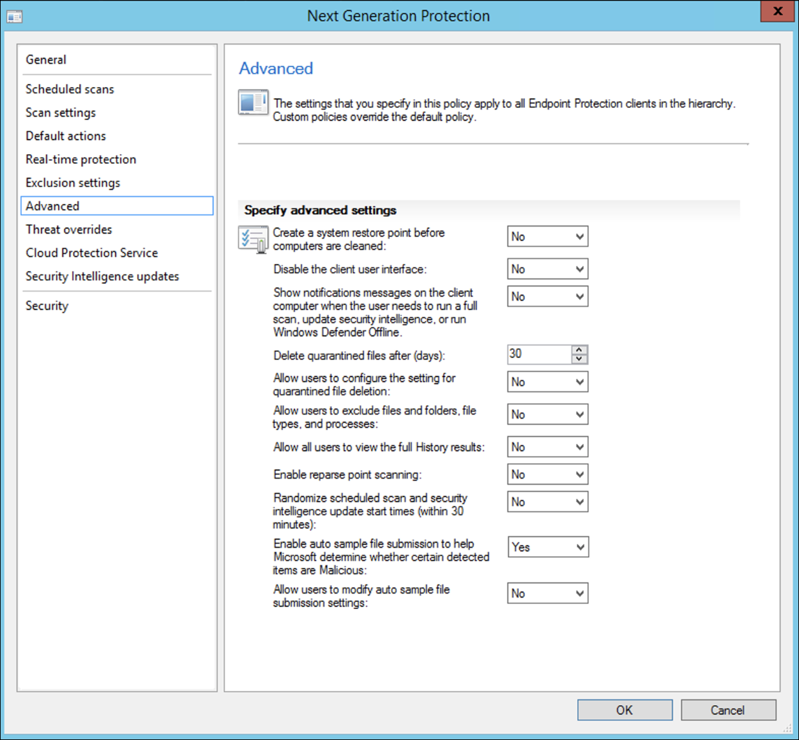
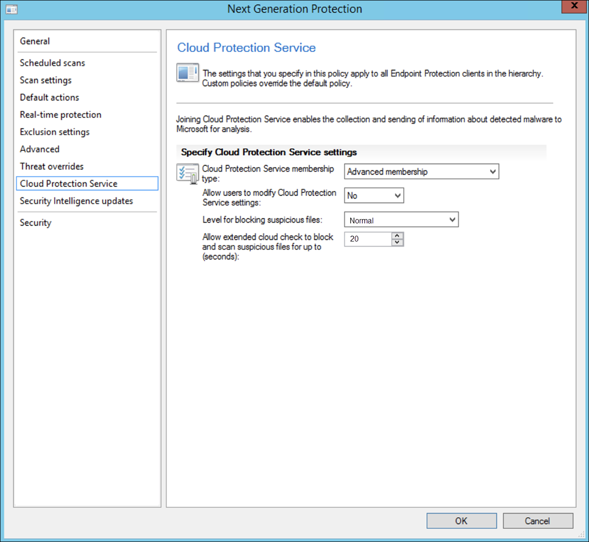
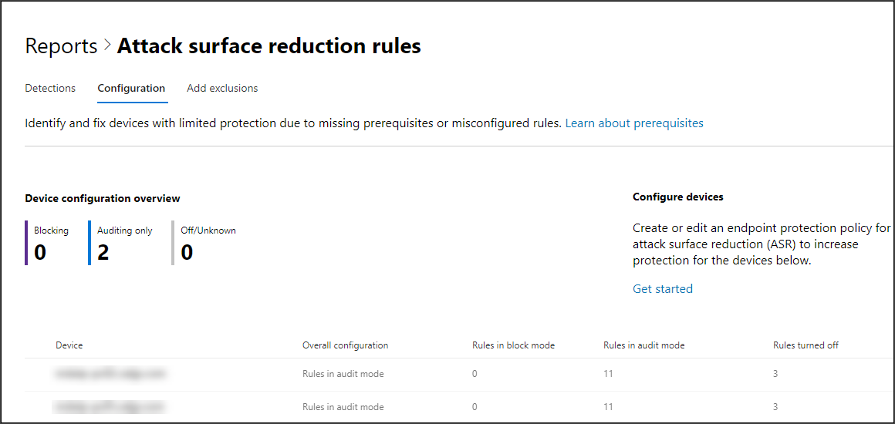

# Onboarding using Microsoft Endpoint Configuration Manager

[!INCLUDE [Microsoft 365 Defender rebranding](../../includes/microsoft-defender.md)]

**Applies to:**
- [Microsoft Defender for Endpoint](https://go.microsoft.com/fwlink/p/?linkid=2154037)
- [Microsoft 365 Defender](https://go.microsoft.com/fwlink/?linkid=2118804)

> Want to experience Microsoft Defender for Endpoint? [Sign up for a free trial.](https://signup.microsoft.com/create-account/signup?products=7f379fee-c4f9-4278-b0a1-e4c8c2fcdf7e&ru=https://aka.ms/MDEp2OpenTrial?ocid=docs-wdatp-exposedapis-abovefoldlink)

This article is part of the Deployment guide and acts as an example onboarding method.

In the [Planning](deployment-strategy.md) topic, there were several methods provided to onboard devices to the service. This topic covers the co-management architecture.

*Diagram of environment architectures*

While Defender for Endpoint supports onboarding of various endpoints and tools, this article does not cover them. For information on general onboarding using other supported deployment tools and methods, see [Onboarding overview](onboarding.md).

This topic guides users in:

- Step 1: Onboarding Windows devices to the service
- Step 2: Configuring Defender for Endpoint capabilities

This onboarding guidance will walk you through the following basic steps that you need to take when using Microsoft Endpoint Configuration Manager:

- **Creating a collection in Microsoft Endpoint Configuration Manager**
- **Configuring Microsoft Defender for Endpoint capabilities using Microsoft Endpoint Configuration Manager**

> [!NOTE]
> Only Windows devices are covered in this example deployment.

## Step 1: Onboard Windows devices using Microsoft Endpoint Configuration Manager

### Collection creation

To onboard Windows devices with Microsoft Endpoint Configuration Manager, the deployment can target an existing collection or a new collection can be created for testing.

Onboarding using tools such as Group policy or manual method does not install any agent on the system.

Within the Microsoft Endpoint Configuration Manager console the onboarding process will be configured as part of the compliance settings within the console.

Any system that receives this required configuration will maintain that configuration for as long as the Configuration Manager client continues to receive this policy from the management point.

Follow the steps below to onboard endpoints using Microsoft Endpoint Configuration Manager.

1. In Microsoft Endpoint Configuration Manager console, navigate to **Assets and Compliance \> Overview \> Device Collections**.

    

2. Right Click **Device Collection** and select **Create Device Collection**.

    

3. Provide a **Name** and **Limiting Collection**, then select **Next**.

    

4. Select **Add Rule** and choose **Query Rule**.

    

5. Click **Next** on the **Direct Membership Wizard** and click on **Edit Query Statement**.

     

6. Select **Criteria** and then choose the star icon.

     

7. Keep criterion type as **simple value**, choose where as **Operating System - build number**, operator as **is greater than or equal to** and value **14393** and click on **OK**.

    

8. Select **Next** and **Close**.

    

9. Select **Next**.

    

After completing this task, you now have a device collection with all the Windows endpoints in the environment.

## Step 2: Configure Microsoft Defender for Endpoint capabilities

This section guides you in configuring the following capabilities using Microsoft Endpoint Configuration Manager on Windows devices:

- [**Endpoint detection and response**](#endpoint-detection-and-response)
- [**Next-generation protection**](#next-generation-protection)
- [**Attack surface reduction**](#attack-surface-reduction)

### Endpoint detection and response

#### Windows 10 and Windows 11

From within the Microsoft 365 Defender portal it is possible to download the '.onboarding' policy that can be used to create the policy in System Center Configuration
Manager and deploy that policy to Windows 10 and Windows 11 devices.

1. From a Microsoft 365 Defender portal, select [Settings and then Onboarding](https://security.microsoft.com/preferences2/onboarding).

2. Under Deployment method select the supported version of **Microsoft Endpoint Configuration Manager**.

    

3. Select **Download package**.

    

4. Save the package to an accessible location.
5. In  Microsoft Endpoint Configuration Manager, navigate to: **Assets and Compliance > Overview > Endpoint Protection > Microsoft Defender ATP Policies**.

6. Right-click **Microsoft Defender ATP Policies** and select **Create Microsoft Defender ATP Policy**.

    

7. Enter the name and description, verify **Onboarding** is selected, then select **Next**.

    

8. Click **Browse**.

9. Navigate to the location of the downloaded file from step 4 above.

10. Click **Next**.
11. Configure the Agent with the appropriate samples (**None** or **All file types**).

    

12. Select the appropriate telemetry (**Normal** or **Expedited**) then click **Next**.

    

13. Verify the configuration, then click **Next**.

     

14. Click **Close** when the Wizard completes.

15. In the Microsoft Endpoint Configuration Manager console, right-click the Defender for Endpoint policy you just created and select **Deploy**.

     

16. On the right panel, select the previously created collection and click **OK**.

    

#### Previous versions of Windows Client (Windows 7 and Windows 8.1)

Follow the steps below to identify the Defender for Endpoint Workspace ID and Workspace Key, that will be required for the onboarding of previous versions of Windows.

1. From a Microsoft 365 Defender portal, select **Settings** \> **Endpoints** \> **Onboarding** (under **Device Management**).

2. Under operating system choose **Windows 7 SP1 and 8.1**.

3. Copy the **Workspace ID** and **Workspace Key** and save them. They will be used later in the process.

    

4. Install the Microsoft Monitoring Agent (MMA).

   MMA is currently (as of January 2019) supported on the following Windows Operating Systems:

   - Server SKUs: Windows Server 2008 SP1 or Newer
   - Client SKUs: Windows 7 SP1 and later

   The MMA agent will need to be installed on Windows devices. To install the agent, some systems will need to download the [Update for customer experience and diagnostic telemetry](https://support.microsoft.com/help/3080149/update-for-customer-experience-and-diagnostic-telemetry) in order to collect the data with MMA. These system versions include but may not be limited to:

   - Windows 8.1
   - Windows 7
   - Windows Server 2016
   - Windows Server 2012 R2
   - Windows Server 2008 R2

   Specifically, for Windows 7 SP1, the following patches must be installed:

   - Install [KB4074598](https://support.microsoft.com/help/4074598/windows-7-update-kb4074598)
   - Install either [.NET Framework 4.5](https://www.microsoft.com/download/details.aspx?id=30653) (or later) **or** [KB3154518](https://support.microsoft.com/help/3154518/support-for-tls-system-default-versions-included-in-the-net-framework). Do not install both on the same system.

5. If you're using a proxy to connect to the Internet see the Configure proxy settings section.

Once completed, you should see onboarded endpoints in the portal within an hour.

### Next generation protection

Microsoft Defender Antivirus is a built-in antimalware solution that provides next generation protection for desktops, portable computers, and servers.

1. In the Microsoft Endpoint Configuration Manager console, navigate to **Assets and Compliance \> Overview \> Endpoint Protection \> Antimalware Polices** and choose **Create Antimalware Policy**.

    

2. Select **Scheduled scans**, **Scan settings**, **Default actions**, **Real-time protection**, **Exclusion settings**, **Advanced**, **Threat overrides**, **Cloud Protection Service** and **Security intelligence   updates** and choose **OK**.

    

    In certain industries or some select enterprise customers might have specific
needs on how Antivirus is configured.

    [Quick scan versus full scan and custom scan](/windows/security/threat-protection/microsoft-defender-antivirus/scheduled-catch-up-scans-microsoft-defender-antivirus#quick-scan-versus-full-scan-and-custom-scan)

    For more details, see [Windows Security configuration framework](/windows/security/threat-protection/windows-security-configuration-framework/windows-security-configuration-framework).
  
    

    

    

    

    

    

    

    

3. Right-click on the newly created antimalware policy and select **Deploy**.

    

4. Target the new antimalware policy to your Windows collection and click **OK**.

     

After completing this task, you now have successfully configured Windows
Defender Antivirus.

### Attack surface reduction

The attack surface reduction pillar of Defender for Endpoint includes the feature set that is available under Exploit Guard. Attack surface reduction (ASR) rules, Controlled Folder Access, Network Protection and Exploit
Protection.

All these features provide an audit mode and a block mode. In audit mode there is no end-user impact. All it does is collect additional telemetry and make it available in the Microsoft 365 Defender portal. The goal with a deployment is to step-by-step move security controls into block mode.

To set ASR rules in Audit mode:

1. In the Microsoft Endpoint Configuration Manager console, navigate to **Assets and Compliance \> Overview \> Endpoint Protection \> Windows Defender Exploit Guard** and choose **Create Exploit Guard Policy**.

   

2. Select **Attack Surface Reduction**.

3. Set rules to **Audit** and click **Next**.

    

4. Confirm the new Exploit Guard policy by clicking on **Next**.

    

5. Once the policy is created click **Close**.

    

6. Right-click on the newly created policy and choose **Deploy**.

    

7. Target the policy to the newly created Windows collection and click **OK**.

    

After completing this task, you now have successfully configured ASR rules in audit mode.

Below are additional steps to verify whether ASR rules are correctly applied to endpoints. (This may take few minutes)

1. From a web browser, navigate to <https://security.microsoft.com>.

2. Select **Configuration management** from left side menu.

3. Click **Go to attack surface management** in the Attack surface management panel.

    

4. Click **Configuration** tab in Attack surface reduction rules reports. It shows ASR rules configuration overview and ASR rules status on each devices.

    

5. Click each device shows configuration details of ASR rules.

    

See [Optimize ASR rule deployment and detections](/microsoft-365/security/defender-endpoint/configure-machines-asr) for more details.

#### Set Network Protection rules in Audit mode

1. In the Microsoft Endpoint Configuration Manager console, navigate to **Assets and  Compliance \> Overview \> Endpoint Protection \> Windows Defender Exploit Guard** and choose **Create Exploit Guard Policy**.

    

2. Select **Network protection**.

3. Set the setting to **Audit** and click **Next**.

    

4. Confirm the new Exploit Guard Policy by clicking **Next**.

    

5. Once the policy is created click on **Close**.

    

6. Right-click on the newly created policy and choose **Deploy**.

    

7. Select the policy to the newly created Windows collection and choose **OK**.

    

After completing this task, you now have successfully configured Network Protection in audit mode.

#### To set Controlled Folder Access rules in Audit mode

1. In the Microsoft Endpoint Configuration Manager console, navigate to **Assets and Compliance \> Overview \> Endpoint Protection \> Windows Defender Exploit Guard** and choose **Create Exploit Guard Policy**.

    

2. Select **Controlled folder access**.

3. Set the configuration to **Audit** and click **Next**.

    

4. Confirm the new Exploit Guard Policy by clicking on **Next**.

    

5. Once the policy is created click on **Close**.

    

6. Right-click on the newly created policy and choose **Deploy**.

    

7. Target the policy to the newly created Windows collection and click **OK**.

    

You have now successfully configured Controlled folder access in audit mode.

## Related topic

- [Onboarding using Microsoft Endpoint Manager](onboarding-endpoint-manager.md)
