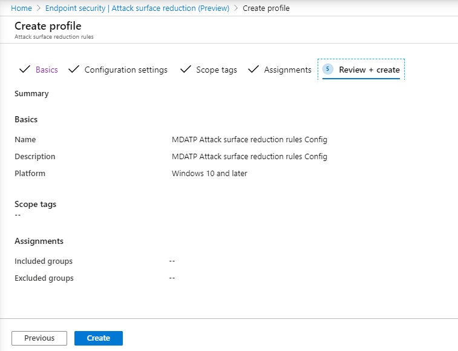
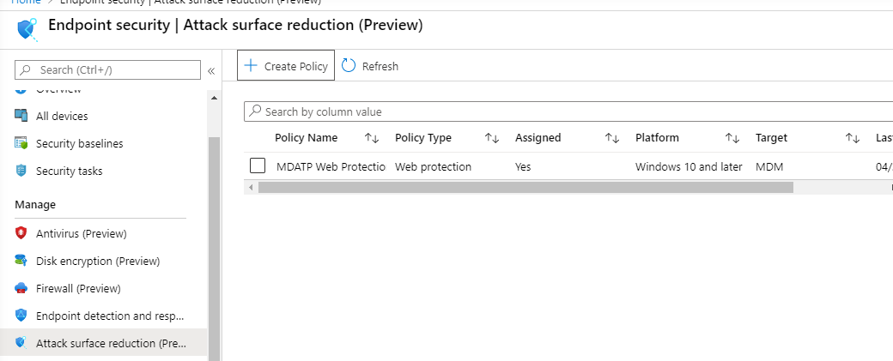
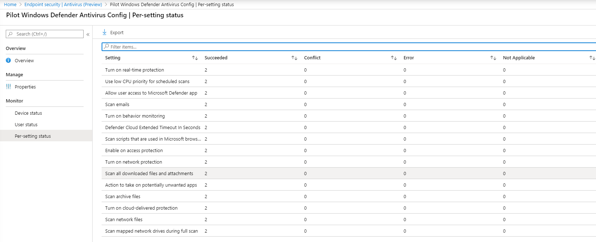
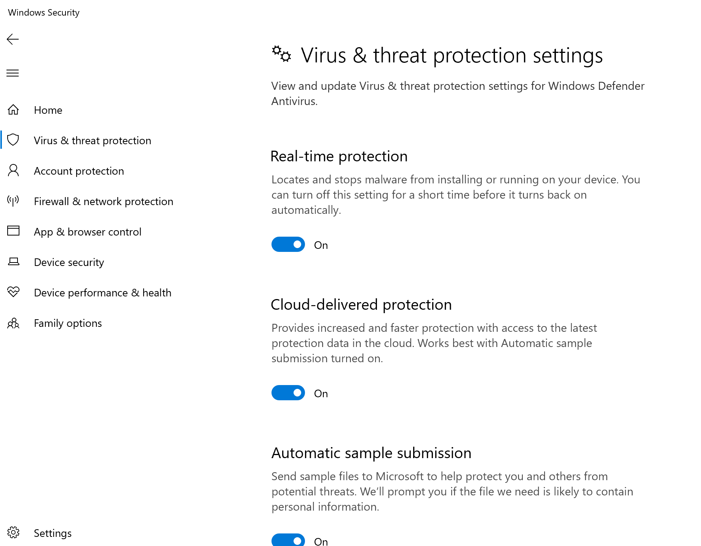

# Onboarding using Microsoft Endpoint Manager

[!INCLUDE [Microsoft 365 Defender rebranding](../../includes/microsoft-defender.md)]

**Applies to:**
- [Microsoft Defender for Endpoint Plan 2](https://go.microsoft.com/fwlink/p/?linkid=2154037)
- [Microsoft 365 Defender](https://go.microsoft.com/fwlink/?linkid=2118804)

> Want to experience Microsoft Defender for Endpoint? [Sign up for a free trial.](https://signup.microsoft.com/create-account/signup?products=7f379fee-c4f9-4278-b0a1-e4c8c2fcdf7e&ru=https://aka.ms/MDEp2OpenTrial?ocid=docs-wdatp-exposedapis-abovefoldlink)

This article is part of the Deployment guide and acts as an example onboarding method.

In the [Planning](deployment-strategy.md) topic, there were several methods provided to onboard devices to the service. This topic covers the cloud-native architecture.

*Diagram of environment architectures*

While Defender for Endpoint supports onboarding of various endpoints and tools, this article does not cover them. For information on general onboarding using other supported deployment tools and methods, see [Onboarding overview](onboarding.md).

[Microsoft Endpoint Manager](/mem/endpoint-manager-overview) is a solution platform that unifies several services. It includes [Microsoft Intune](/mem/intune/fundamentals/what-is-intune) and [Microsoft Endpoint Configuration Manager](/mem/configmgr).

This topic guides users in:

- Step 1: Onboarding devices to the service by creating a group in Microsoft Endpoint Manager (MEM) to assign configurations on
- Step 2: Configuring Defender for Endpoint capabilities using Microsoft Endpoint Manager

This onboarding guidance will walk you through the following basic steps that you need to take when using Microsoft Endpoint Manager:

- [Identifying target devices or users](#identify-target-devices-or-users)
  - Creating an Azure Active Directory group (User or Device)
- [Creating a Configuration Profile](#step-2-create-configuration-policies-to-configure-microsoft-defender-for-endpoint-capabilities)
  - In Microsoft Endpoint Manager, we'll guide you in creating a separate policy for each capability.

## Resources

Here are the links you'll need for the rest of the process:

- [MEM portal](https://aka.ms/memac)
- [Microsoft Defender for Endpoint](https://securitycenter.windows.com/)
- [Intune Security baselines](/mem/intune/protect/security-baseline-settings-defender-atp#microsoft-defender)

For more information about Microsoft Endpoint Manager, check out these resources:

- [Microsoft Endpoint Manager page](/mem/)
- [Blog post on convergence of Intune and ConfigMgr](https://www.microsoft.com/microsoft-365/blog/2019/11/04/use-the-power-of-cloud-intelligence-to-simplify-and-accelerate-it-and-the-move-to-a-modern-workplace/)
- [Introduction video on MEM](https://www.microsoft.com/microsoft-365/blog/2019/11/04/use-the-power-of-cloud-intelligence-to-simplify-and-accelerate-it-and-the-move-to-a-modern-workplace)

## Step 1: Onboard devices by creating a group in MEM to assign configurations on

### Identify target devices or users

In this section, we will create a test group to assign your configurations on.

> [!NOTE]
> Intune uses Azure Active Directory (Azure AD) groups to manage devices and users. As an Intune admin, you can set up groups to suit your organizational needs.
>
> For more information, see [Add groups to organize users and devices](/mem/intune/fundamentals/groups-add).

### Create a group

1. Open the MEM portal.

2. Open **Groups > New Group**.

    > [!div class="mx-imgBorder"]
    > 

3. Enter details and create a new group.

    > [!div class="mx-imgBorder"]
    > 

4. Add your test user or device.

5. From the **Groups > All groups** pane, open your new group.

6. Select  **Members > Add members**.

7. Find your test user or device and select it.

    > [!div class="mx-imgBorder"]
    > 

8. Your testing group now has a member to test.

## Step 2: Create configuration policies to configure Microsoft Defender for Endpoint capabilities

In the following section, you'll create a number of configuration policies.

First is a configuration policy to select which groups of users or devices will be onboarded to Defender for Endpoint:

- [Endpoint detection and response](#endpoint-detection-and-response)

Then you will continue by creating several different types of endpoint security policies:

- [Next-generation protection](#next-generation-protection)
- [Attack surface reduction](#attack-surface-reduction---attack-surface-reduction-rules)

### Endpoint detection and response

1. Open the MEM portal.

2. Navigate to **Endpoint security > Endpoint detection and response**. Click on **Create Profile**.

    > [!div class="mx-imgBorder"]
    > 

3. Under **Platform, select Windows 10 and Later, Profile - Endpoint detection
    and response > Create**.

4. Enter a name and description, then select  **Next**.

    > [!div class="mx-imgBorder"]
    > 

5. Select settings as required, then select  **Next**.

    > [!div class="mx-imgBorder"]
    > 

    > [!NOTE]
    > In this instance, this has been auto populated as Defender for Endpoint has already been integrated with Intune. For more information on the integration, see [Enable Microsoft Defender for Endpoint in Intune](/mem/intune/protect/advanced-threat-protection-configure#to-enable-microsoft-defender-atp).
    >
    > The following image is an example of what you'll see when Microsoft Defender for Endpoint is NOT integrated with Intune:
    >
    > 

6. Add scope tags if necessary, then select  **Next**.

    > [!div class="mx-imgBorder"]
    > 

7. Add test group by clicking on **Select groups to include** and choose your group, then select  **Next**.

    > [!div class="mx-imgBorder"]
    > 

8. Review and accept, then select  **Create**.

    > [!div class="mx-imgBorder"]
    > 

9. You can view your completed policy.

    > [!div class="mx-imgBorder"]
    > 

### Next-generation protection

1. Open the MEM portal.

2. Navigate to **Endpoint security > Antivirus > Create Policy**.

    > [!div class="mx-imgBorder"]
    > 

3. Select **Platform - Windows 10 and Later - Windows and Profile - Microsoft Defender Antivirus > Create**.

4. Enter name and description, then select  **Next**.

    > [!div class="mx-imgBorder"]
    > 

5. In the **Configuration settings page**: Set the configurations you require for Microsoft Defender Antivirus (Cloud Protection, Exclusions, Real-Time Protection, and Remediation).

    > [!div class="mx-imgBorder"]
    > 

6. Add scope tags if necessary, then select  **Next**.

    > [!div class="mx-imgBorder"]
    > 

7. Select groups to include, assign to your test group, then select  **Next**.

    > [!div class="mx-imgBorder"]
    > 

8. Review and create, then select  **Create**.

    > [!div class="mx-imgBorder"]
    > 

9. You'll see the configuration policy you created.

    > [!div class="mx-imgBorder"]
    > 

### Attack Surface Reduction - Attack surface reduction rules

1. Open the MEM portal.

2. Navigate to **Endpoint security > Attack surface reduction**.

3. Select  **Create Policy**.

4. Select **Platform - Windows 10 and Later - Profile - Attack surface reduction
    rules > Create**.

    > [!div class="mx-imgBorder"]
    > 

5. Enter a name and description, then select  **Next**.

    > [!div class="mx-imgBorder"]
    > 

6. In the **Configuration settings page**: Set the configurations you require for
    Attack surface reduction rules, then select  **Next**.

    > [!NOTE]
    > We will be configuring all of the Attack surface reduction rules to Audit.
    >
    > For more information, see [Attack surface reduction rules](attack-surface-reduction.md).

    > [!div class="mx-imgBorder"]
    > 

7. Add Scope Tags as required, then select  **Next**.

    > [!div class="mx-imgBorder"]
    > 

8. Select groups to include and assign to test group, then select  **Next**.

    > [!div class="mx-imgBorder"]
    > 

9. Review the details, then select  **Create**.

    > [!div class="mx-imgBorder"]
    > 

10. View the policy.

    > [!div class="mx-imgBorder"]
    > 

### Attack Surface Reduction - Web Protection

1. Open the MEM portal.

2. Navigate to **Endpoint security > Attack surface reduction**.

3. Select  **Create Policy**.

4. Select **Windows 10 and Later - Web protection > Create**.

    > [!div class="mx-imgBorder"]
    > 

5. Enter a name and description, then select  **Next**.

    > [!div class="mx-imgBorder"]
    > 

6. In the **Configuration settings page**: Set the configurations you require for
   Web Protection, then select  **Next**.

    > [!NOTE]
    > We are configuring Web Protection to Block.
    >
    > For more information, see [Web Protection](web-protection-overview.md).

    > [!div class="mx-imgBorder"]
    > 

7. Add **Scope Tags as required > Next**.

    > [!div class="mx-imgBorder"]
    > 

8. Select **Assign to test group > Next**.

    > [!div class="mx-imgBorder"]
    > 

9. Select **Review and Create > Create**.

    > [!div class="mx-imgBorder"]
    > 

10. View the policy.

    > [!div class="mx-imgBorder"]
    > 

## Validate configuration settings

### Confirm policies have been applied

Once the Configuration policy has been assigned, it will take some time to apply.

For information on timing, see [Intune configuration information](/mem/intune/configuration/device-profile-troubleshoot#how-long-does-it-take-for-devices-to-get-a-policy-profile-or-app-after-they-are-assigned).

To confirm that the configuration policy has been applied to your test device, follow the following process for each configuration policy.

1. Open the MEM portal and navigate to the relevant policy as shown in the
    steps above. The following example shows the next generation protection settings.

    > [!div class="mx-imgBorder"]
    > 

2. Select  the **Configuration Policy** to view the policy status.

    > [!div class="mx-imgBorder"]
    > 

3. Select  **Device Status** to see the status.

    > [!div class="mx-imgBorder"]
    > 

4. Select  **User Status** to see the status.

    > [!div class="mx-imgBorder"]
    > 

5. Select  **Per-setting status** to see the status.

    > [!TIP]
    > This view is very useful to identify any settings that conflict with another policy.

    > [!div class="mx-imgBorder"]
    > 

### Confirm endpoint detection and response

1. Before applying the configuration, the Defender for Endpoint Protection service should not be started.

    > [!div class="mx-imgBorder"]
    > 

2. After the configuration has been applied, the Defender for Endpoint Protection Service should be started.

    > [!div class="mx-imgBorder"]
    > 

3. After the services are running on the device, the device appears in Microsoft Defender Security Center.

    > [!div class="mx-imgBorder"]
    > 

### Confirm next-generation protection

1. Before applying the policy on a test device, you should be able to manually
    manage the settings as shown below.

    > [!div class="mx-imgBorder"]
    > 

2. After the policy has been applied, you should not be able to manually manage
    the settings.

    > [!NOTE]
    > In the following image **Turn on cloud-delivered protection** and
    > **Turn on real-time protection** are being shown as managed.

    > [!div class="mx-imgBorder"]
    > 

### Confirm Attack Surface Reduction - Attack surface reduction rules

1. Before applying the policy on a test device, pen a PowerShell Window and type `Get-MpPreference`.

2. This should respond with the following lines with no content:

    > AttackSurfaceReductionOnlyExclusions:
    >
    > AttackSurfaceReductionRules_Actions:
    >
    > AttackSurfaceReductionRules_Ids:

    

3. After applying the policy on a test device, open a PowerShell Windows and type `Get-MpPreference`.

4. This should respond with the following lines with content as shown below:

    

### Confirm Attack Surface Reduction - Web Protection

1. On the test device, open a PowerShell Windows and type
    `(Get-MpPreference).EnableNetworkProtection`.

2. This should respond with a 0 as shown below.

    

3. After applying the policy, open a PowerShell Windows and type
    `(Get-MpPreference).EnableNetworkProtection`.

4. This should respond with a 1 as shown below.

    
