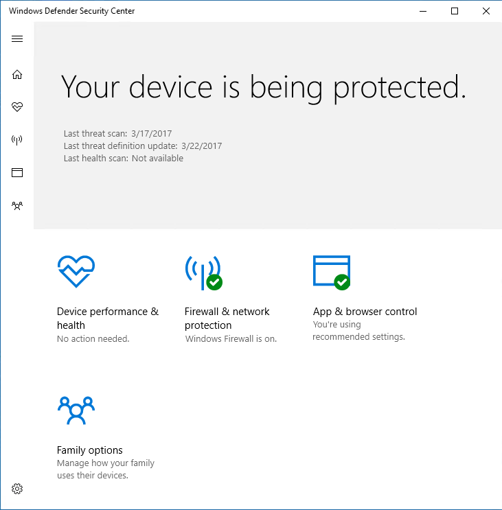
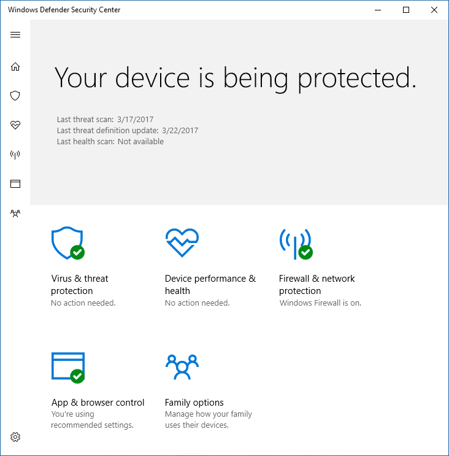
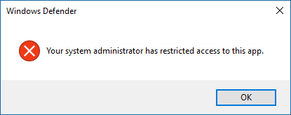

# Prevent users from seeing or interacting with the Microsoft Defender Antivirus user interface

[!INCLUDE [Microsoft 365 Defender rebranding](../../includes/microsoft-defender.md)]

**Applies to:**

- [Microsoft Defender for Endpoint](/microsoft-365/security/defender-endpoint/)

You can use Group Policy to prevent users on endpoints from seeing the Microsoft Defender Antivirus interface. You can also prevent them from pausing scans.

## Hide the Microsoft Defender Antivirus interface

In Windows 10, versions 1703, hiding the interface will hide Microsoft Defender Antivirus notifications and prevent the Virus & threat protection tile from appearing in the Windows Security app.

With the setting set to **Enabled**:

With the setting set to **Disabled** or not configured:

>[!NOTE]
>Hiding the interface will also prevent Microsoft Defender Antivirus notifications from appearing on the endpoint. Microsoft Defender for Endpoint notifications will still appear. You can also individually [configure the notifications that appear on endpoints](configure-notifications-microsoft-defender-antivirus.md)

In earlier versions of Windows 10, the setting will hide the Windows Defender client interface. If the user attempts to open it, they will receive a warning that says, "Your system administrator has restricted access to this app."

## Use Group Policy to hide the Microsoft Defender AV interface from users

1. On your Group Policy management machine, open the [Group Policy Management Console](/previous-versions/windows/desktop/gpmc/group-policy-management-console-portal), right-click the Group Policy Object you want to configure and click **Edit**.

2. Using the **Group Policy Management Editor** go to **Computer configuration**.

3. Click **Administrative templates**.

4. Expand the tree to **Windows components > Microsoft Defender Antivirus > Client interface**.

5. Double-click the **Enable headless UI mode** setting and set the option to **Enabled**. Click **OK**. 

See [Prevent users from locally modifying policy settings](configure-local-policy-overrides-microsoft-defender-antivirus.md) for more options on preventing users form modifying protection on their PCs.

## Prevent users from pausing a scan

You can prevent users from pausing scans, which can be helpful to ensure scheduled or on-demand scans are not interrupted by users.

> [!NOTE]
> This setting is not supported on Windows 10.

### Use Group Policy to prevent users from pausing a scan

1. On your Group Policy management machine, open the [Group Policy Management Console](/previous-versions/windows/desktop/gpmc/group-policy-management-console-portal), right-click the Group Policy Object you want to configure and click **Edit**.

2. Using the **Group Policy Management Editor** go to **Computer configuration**.

3. Click **Administrative templates**.

4. Expand the tree to **Windows components** > **Microsoft Defender Antivirus** > **Scan**.

5. Double-click the **Allow users to pause scan** setting and set the option to **Disabled**. Click **OK**. 

## Related articles

- [Configure the notifications that appear on endpoints](configure-notifications-microsoft-defender-antivirus.md)

- [Configure end-user interaction with Microsoft Defender Antivirus](configure-end-user-interaction-microsoft-defender-antivirus.md)

- [Microsoft Defender Antivirus in Windows 10](microsoft-defender-antivirus-in-windows-10.md)