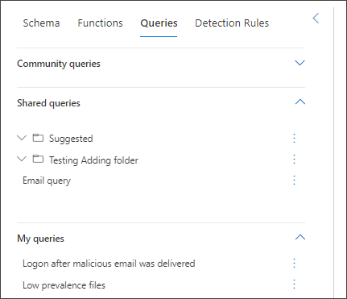
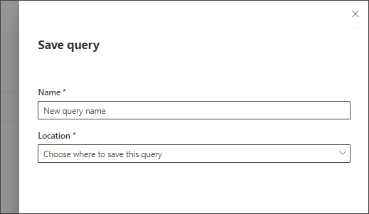

# Use shared queries in advanced hunting

[!INCLUDE [Microsoft 365 Defender rebranding](../includes/microsoft-defender.md)]

**Applies to:**
- Microsoft 365 Defender
- Microsoft Defender for Endpoint

[Advanced hunting](advanced-hunting-overview.md) queries can be shared among users in the same organization. You can also find queries shared publicly on GitHub. These queries let you quickly pursue specific threat hunting scenarios without having to write queries from scratch.

## Save, modify, and share a query
You can save a new or existing query so that it is only accessible to you or shared with other users in your organization. 

1. Create or modify a query. 

2. Click the **Save query** drop-down button and select **Save as**.
    
3. Enter a name for the query. 

   

4. Select the folder where you'd like to save the query.
    - **Shared queries** — shared to all users your organization
    - **My queries** — accessible only to you
    
5. Select **Save**. 

## Delete or rename a query
1. Select the three dots to the right of a query you want to rename or delete.

    

2. Select **Delete** and confirm deletion. Or select **Rename** and provide a new name for the query.

## Create a direct link to a query
To generate a link that opens your query directly in the advanced hunting query editor, finalize your query and select **Share link**.

## Access queries in the GitHub repository  
Microsoft security researchers regularly share advanced hunting queries in a [designated public repository on GitHub](https://aka.ms/hunting-queries). This repository is open to contributions. To contribute, [join GitHub for free](https://github.com/).

>[!tip]
>Microsoft security researchers also provide advanced hunting queries that you can use to locate activities and indicators associated with emerging threats. These queries are provided as part of the [threat analytics](/windows/security/threat-protection/microsoft-defender-atp/threat-analytics) reports in Microsoft Defender Security Center.

## Related topics
- [Advanced hunting overview](advanced-hunting-overview.md)
- [Learn the query language](advanced-hunting-query-language.md)
- [Work with query results](advanced-hunting-query-results.md)
- [Hunt across devices, emails, apps, and identities](advanced-hunting-query-emails-devices.md)
- [Understand the schema](advanced-hunting-schema-tables.md)
- [Apply query best practices](advanced-hunting-best-practices.md)