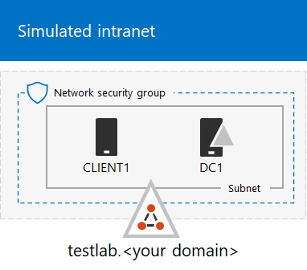

# Add endpoints to your Microsoft 365 Defender pilot environment

**Applies to:**
- Microsoft 365 Defender

This article is [Step 1 of 3](eval-defender-investigate-respond.md) in the process of performing an investigation and response of an incident in Microsoft 365 Defender. For more information about this process, see the [overview](eval-defender-investigate-respond.md) article.

Now that your pilot environment has all of the Microsoft 365 Defender components enabled, it's time to create an incident with a simulated attack and use the Microsoft 365 Defender portal to investigate and respond.

An incident in Microsoft 365 Defender is a collection of correlated alerts and associated data that make up the story of an attack. 
Microsoft 365 services and apps create alerts when they detect a suspicious or malicious event or activity. Individual alerts provide valuable clues about a completed or ongoing attack. However, attacks typically employ various techniques against different types of entities, such as devices, users, and mailboxes. The result is multiple alerts for multiple entities in your tenant.

You'll simulate an attack on a Windows 10 device using a PowerShell script and then investigate, remediate, and resolve the incident.

First, you need to add endpoints to your pilot environment.

## Add pilot environment endpoints

To simulate an attack on a Windows 10 device, you need to add an Active Directory Domain Services (AD DS) domain controller and a Windows 10 device to your pilot environment.

1. Verify your pilot environment tenant has [enabled Microsoft 365 Defender](m365d-enable.md#confirm-that-the-service-is-on).

2. Verify that your domain controller:

   - Runs Windows Server 2008 R2 or a later version.
   - Reports to [Microsoft Defender for Identity](/azure/security-center/security-center-wdatp) and has enabled [remote management](/windows-server/administration/server-manager/configure-remote-management-in-server-manager).
   - Has [Microsoft Defender for Identity and Microsoft Cloud App Security integration](/cloud-app-security/mdi-integration) enabled.
   - Has a test user is created in the test domain. Administrator-level permissions are not needed.

3. Verify that your test device:

   - Runs Windows 10 version 1903 or a later version.
   - Is joined to the AD DS domain controller domain.
   - Has [Windows Defender Antivirus](/windows/security/threat-protection/windows-defender-antivirus/configure-windows-defender-antivirus-features) enabled. If you are having trouble enabling Windows Defender Antivirus, see this [troubleshooting topic](/windows/security/threat-protection/microsoft-defender-atp/troubleshoot-onboarding#ensure-that-windows-defender-antivirus-is-not-disabled-by-a-policy).
   - Is [onboarded to Microsoft Defender for Endpoint](/windows/security/threat-protection/microsoft-defender-atp/configure-endpoints).

If you use tenant and device groups, create a dedicated device group for the test device and push it to top level.

One alternative is to host your AD DS domain controller and test device as virtual machines in Microsoft Azure infrastructure services. You can use the instructions in [Phase 1 of the simulated enterprise Test Lab Guide](/microsoft-365/enterprise/simulated-ent-base-configuration-microsoft-365-enterprise#phase-1-create-a-simulated-intranet), but skip the creation of the APP1 virtual machine.

Here is the result.

## Next step

Step 2 of 3: [Simulate an attack and response with Microsoft 365 Defender](eval-defender-investigate-respond-simulate-attack.md)

### Navigation you may need

[Create the Microsoft 365 Defender Evaluation Environment](eval-create-eval-environment.md)
