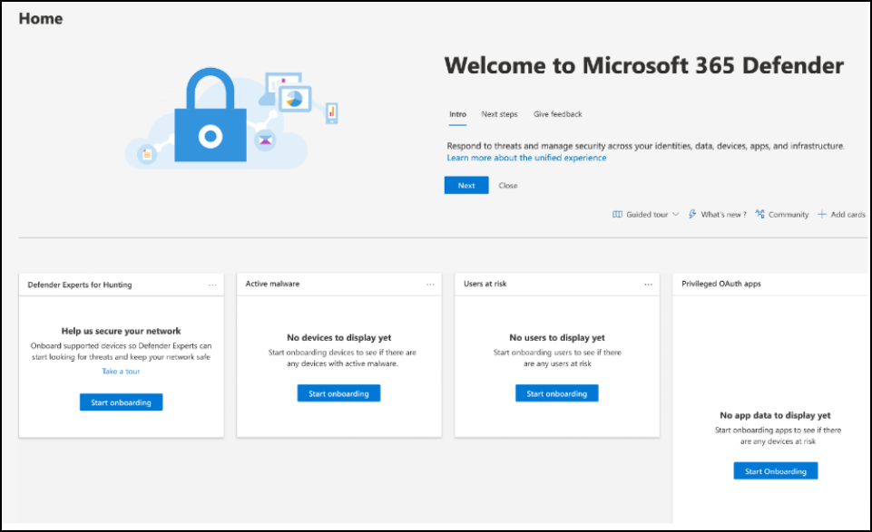
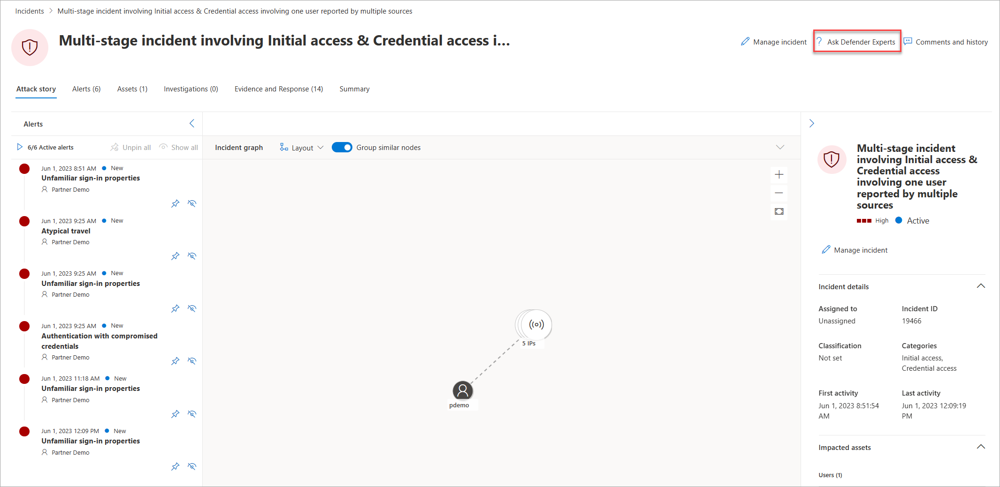

# Start using Microsoft Defender Experts for Hunting

[!INCLUDE [Microsoft 365 Defender rebranding](../../includes/microsoft-defender.md)]

**Applies to:**

- [Microsoft 365 Defender](https://go.microsoft.com/fwlink/?linkid=2118804)

## Onboarding

If you're new to Microsoft 365 Defender and Defender Experts for Hunting:  

1. Upon getting your welcome email, select **Log into Microsoft 365 Defender**.
2. Sign in if you already have a Microsoft account. If none, create one.
3. The Microsoft 365 Defender quick tour will get you familiar with the security suite, where the capabilities are and how important they are. Select **Take a quick tour**.  
4. Read the short descriptions about what the Microsoft Defender Experts service is and the capabilities it provides. Select **Next**. You'll see the welcome page:

## Receive Defender Experts Notifications

The Defender Experts Notifications service includes:
- Threat monitoring and analysis, reducing dwell time and the risk to your business
- Hunter-trained artificial intelligence to discover and target both known attacks and emerging threats 
- Identification of the most pertinent risks, helping SOCs maximize their effectiveness 
- Help in scoping compromises and as much context as can be quickly delivered to enable a swift SOC response 

Refer to the following screenshot to see a sample Defender Experts Notification:

### Where you'll find Defender Experts Notifications

You can receive Defender Experts Notifications from Defender Experts through the following mediums: 

- The Microsoft 365 Defender portal's [Incidents](https://security.microsoft.com/incidents?tid=f839b112-d9d7-4d27-9bf6-94542403f21c) page
- The Microsoft 365 Defender portal's [Alerts](https://security.microsoft.com/alerts?tid=f839b112-d9d7-4d27-9bf6-94542403f21c) page
- OData alerting [API](../../security/defender-endpoint/get-alerts.md) and [REST API](../defender-endpoint/configure-siem.md)
- [DeviceAlertEvents](../../security/defender-endpoint/advanced-hunting-devicealertevents-table.md) table in Advanced hunting
- Your inbox if you choose to have Defender Experts Notifications sent to you via email. See [Get incident notifications](../../security/defender/incidents-overview.md), for details.

### Create an email notification rule

You can create rules to send email notifications for notification recipients. For full details, see [Configure alert notifications](../../security/defender/incidents-overview.md) to create, edit, delete, or troubleshoot email notifications.

## View Defender Expert Notifications

You'll start receiving Defender Experts Notifications from Defender Experts in your email after you've configured your system to receive email notification. 

1. Select the link in the email to go to the corresponding alert context in the dashboard tagged with **Defender Experts**.
2. From the **Alerts** page, select the same alert topic as the one you received in the email, to view further details.

### Filter to view just the Defender Experts Notifications

You can also filter your incidents and alerts if you want to only see the Defender Experts Notifications amongst the many alerts. To do so:

1. On the navigation menu, go to **Incidents & alerts** > **Incidents** > select the  icon.
2. Scroll down to the **Tags** field > select the **Defender Experts** check box.
3. Select **Apply**.

### Collaborate with Experts on Demand

> [!NOTE]
> Experts on Demand is included in your Defender Experts for Hunting subscription with monthly allocations. However, it's not a security incident response service. It's intended to provide a better understanding of complex threats affecting your organization. Engage with your own security incident response team to address urgent security incident response issues. If you don't have your own security incident response team and would like Microsoft's help, create a support request in the [Premier Services Hub](/services-hub/).

Select **Ask Defender Experts** directly inside the Microsoft 365 security portal to get swift and accurate responses to all your threat hunting questions. Experts can provide insight to better understand the complex threats your organization may face. Experts on Demand can help to: 

- Gather additional information on alerts and incidents, including root causes and scope
- Gain clarity into suspicious devices, alerts, or incidents and take next steps if faced with an advanced attacker
- Determine risks and available protections related to threat actors, campaigns, or emerging attacker techniques

The option to **Ask Defender Experts** is available in several places throughout the portal:

- Device page actions menu

- Device inventory page flyout menu

- Alerts page flyout menu

- Incidents page actions menu

- Incidents inventory page

[**image yet to be added by engg**]

> [!NOTE]
> If you'd like to track the status of your Experts on Demand cases through Microsoft Services Hub, reach out to your Customer Success Account Manager. Watch this [video](https://www.microsoft.com/videoplayer/embed/RE4pk9f) for a quick overview of the Microsoft Services Hub.

### What's next

- [Understand the Defender Experts for Hunting report in Microsoft 365 Defender](defender-experts-report.md)