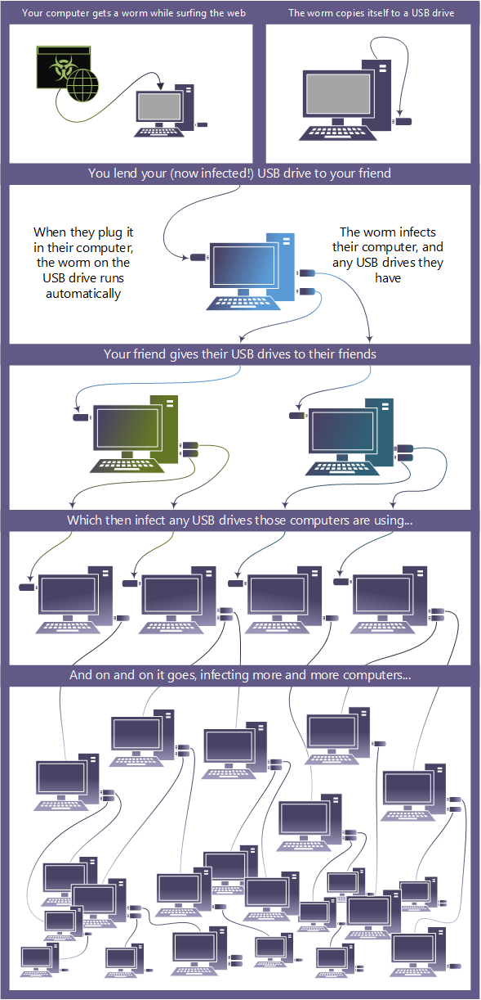

# Worms

A worm is a type of malware that can copy itself and often spreads through a network by exploiting security vulnerabilities. It can spread through email attachments, text messages, file-sharing programs, social networking sites, network shares, removable drives, and software vulnerabilities.

## How worms work

Worms represent a large category of malware. Different worms use different methods to infect devices. Depending on the variant, they can steal sensitive information, change security settings, send information to malicious hackers, stop users from accessing files, and other malicious activities.

Jenxcus (also known as Dunihi), Gamarue (also known as Androm), and Bondat have consistently remained at the top of the list of malware that infects users running Microsoft software. Although these worms share some commonalities, it's interesting to note that they also have distinct characteristics.

* **Jenxcus** has capabilities of not only infecting removable drives but can also act as a backdoor that connects back to its server. This threat typically gets into a device from a drive-by download attack, meaning it's installed when users just visit a compromised web page.

* **Gamarue** typically arrives through spam campaigns, exploits, downloaders, social networking sites, and removable drives. When Gamarue infects a device, it becomes a distribution channel for other malware. We’ve seen it distribute other malware such as info stealers, spammers, clickers, downloaders, and rogues.

* **Bondat** typically arrives through fictitious Nullsoft Scriptable Install System (NSIS), Java installers, and removable drives. When Bondat infects a system, it gathers information about the machine such as device name, Globally Unique Identifier (GUID), and OS build. It then sends that information to a remote server.

Both Bondat and Gamarue have clever ways of obscuring themselves to evade detection. By hiding what they're doing, they try to avoid detection by security software.

* [**WannaCrypt**](https://www.microsoft.com/wdsi/threats/malware-encyclopedia-description?Name=Ransom:Win32/WannaCrypt) also deserves a mention here. Unlike older worms that often spread just because they could, modern worms often spread to drop a payload (like ransomware).

This image shows how a worm can quickly spread through a shared USB drive.

 

### *Figure worm spreading from a shared USB drive*

## How to protect against worms

Enable [Microsoft Defender Antivirus](/microsoft-365/security/defender-endpoint/microsoft-defender-antivirus-in-windows-10) in Windows 10. It provides real-time protection against threats and detects and removes known unwanted software.

Download [Microsoft Security Essentials](https://www.microsoft.com/download/details.aspx?id=5201) for real-time protection in Windows 7 or Windows Vista.

In case threat removal is unsuccessful, read about [troubleshooting malware detection and removal problems](https://www.microsoft.com/wdsi/help/troubleshooting-infection).

For more general tips, see [prevent malware infection](/microsoft-365/security/defender-endpoint/prevent-malware-infection).