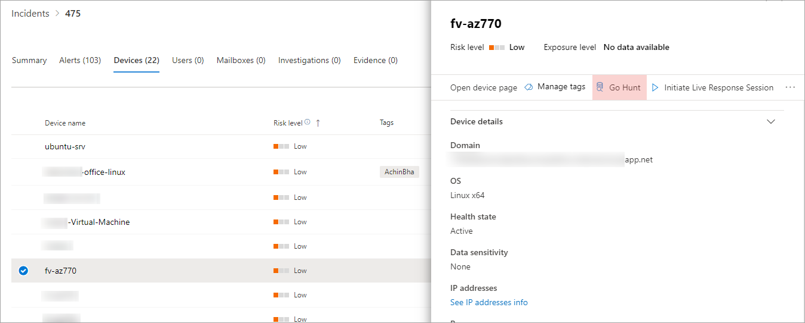

# Quickly hunt for entity information while investigating an incident

**Applies to:**
- Microsoft Threat Protection

[!INCLUDE [Prerelease information](../includes/prerelease.md)]

The [incident page](investigate-incidents.md#incident-overview) in Microsoft Threat Protection enables you to quickly review details about users, devices, and many other entities associated with an incident. As you select an entity, Microsoft Threat Protection displays additional information as well as actions you could take on that entitity.



By selecting **Go hunt** from the available actions, you can quickly investigate the entity using powerful query-based [advanced hunting](advanced-hunting-overview.md) capabilities. Microsoft Threat Protection automatically runs an advanced hunting query that checks all relevant schema tables for information about the entity. 

Here is an example of the go hunt query for the device **fv-az770**:

```kusto
let selectedTimestamp = datetime(2020-06-02T02:06:47.1167157Z);
let deviceName = "fv-az770.example.com";
let deviceId = "device-guid";
search in (DeviceLogonEvents, DeviceProcessEvents, DeviceNetworkEvents, DeviceFileEvents, DeviceRegistryEvents, DeviceImageLoadEvents, DeviceEvents, DeviceImageLoadEvents, IdentityLogonEvents, IdentityQueryEvents)
Timestamp between ((selectedTimestamp - 1h) .. (selectedTimestamp + 1h))
and DeviceName == deviceName
// or RemoteDeviceName == deviceName
// or DeviceId == deviceId
| take 100
```
To keep the results manageable, the query is scoped to around the same time period as the alerts involving that device. With some knowledge of the [query language](advanced-hunting-query-language.md), you can adjust the query to your preference.

Apart from modifying the query to get more relevant results, you can also:
- [View your results as charts](advanced-hunting-query-results.md#view-query-results-as-a-table-or-chart)
- [Create custom detection rules](custom-detection-rules.md) based on the query

## Supported entity types
You can use the go hunt action after selecting any of these entity types:

- Files
- Emails
- Email clusters
- Mailboxes
- Users
- Devices
- IP addresses
- URLs

## Related topics
- [Advanced hunting overview](advanced-hunting-overview.md)
- [Learn the query language](advanced-hunting-query-language.md)
- [Work with query results](advanced-hunting-query-results.md)
- [Custom detection rules](custom-detection-rules.md)