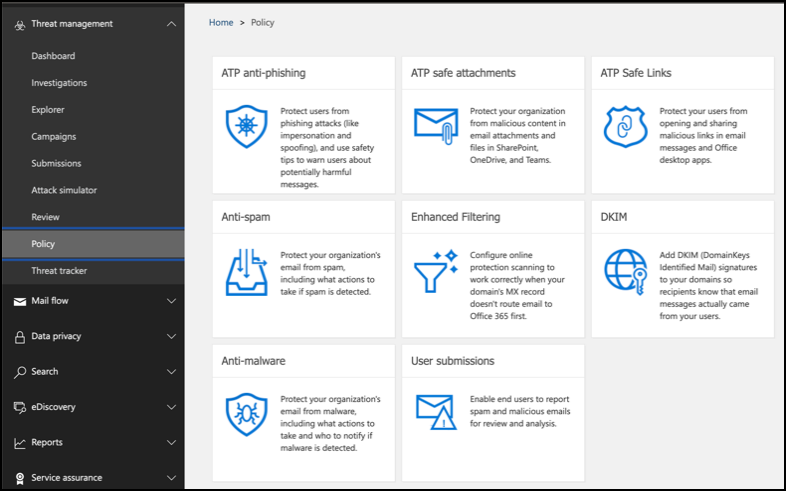
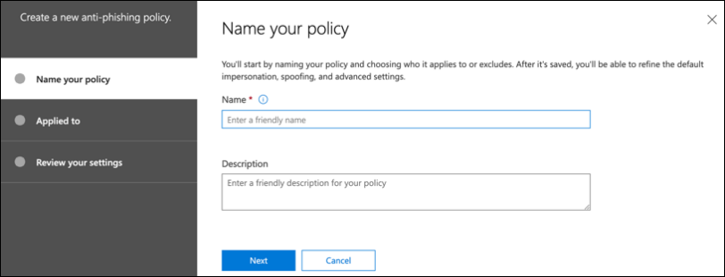
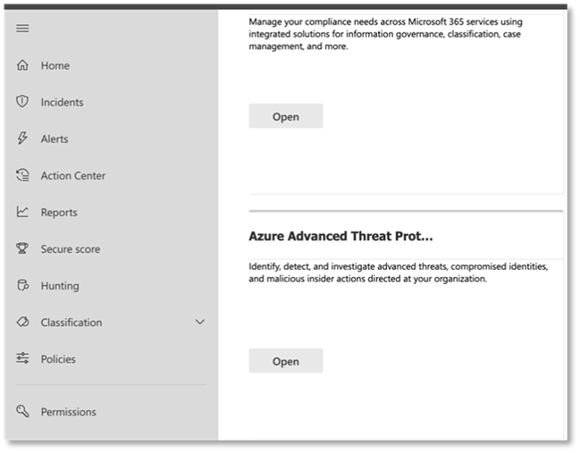

# Configure Microsoft 365 Defender pillars for your trial lab or pilot environment

[!INCLUDE [Microsoft 365 Defender rebranding](../includes/microsoft-defender.md)]

**Applies to:**
- Microsoft 365 Defender

Creating a Microsoft 365 Defender trial lab or pilot environment and deploying it is a three-phase process:

| [Phase 1: Prepare](prepare-mtpeval.md) | [Phase 2: Set up](setup-mtpeval.md) | Phase 3: Onboard |  [Back to pilot playbook](mtp-pilot.md) |
|--|--|--|--|
|| |*You are here!* | |

You're currently in the configuration phase.

Preparation is key to any successful deployment. In this article, you'll be guided on the points you'll need to consider as you prepare to deploy Microsoft Defender for Endpoint.

## Microsoft 365 Defender pillars
Microsoft 365 Defender consists of four pillars. Although one pillar can already provide value to your network organization's security, enabling the four Microsoft 365 Defender pillars will give your organization the most value.

This section will guide you to configure:
-	Microsoft Defender for Office 365
-	Microsoft Defender for Identity 
-	Microsoft Cloud App Security
-	Microsoft Defender for Endpoint

## Configure Microsoft Defender for Office 365

>[!NOTE]
>Skip this step if you've already enabled Defender for Office 365. 

There's a PowerShell Module called the *Office 365 Advanced Threat Protection Recommended Configuration Analyzer (ORCA)* that helps determine some of these settings. When run as an administrator in your tenant, get-ORCAReport will help generate an assessment of the anti-spam, anti-phish, and other message hygiene settings. You can download this module from https://www.powershellgallery.com/packages/ORCA/. 

1. Navigate to [Office 365 Security & Compliance Center](https://protection.office.com/homepage) > **Threat management** > **Policy**.

   
 
2. Click **Anti-phishing**, select **Create** and fill in the policy name and description. Click **Next**.

   

   > [!NOTE]
   > Edit your Advanced anti-phishing policy in Microsoft Defender for Office 365. Change **Advanced Phishing Threshold** to **2 - Aggressive**.

3. Click the **Add a condition** drop-down menu and select your domain(s) as recipient domain. Click **Next**.

   
 
4. Review your settings. Click **Create this policy** to confirm. 

   
 
5. Select **Safe Attachments** and select the **Turn on ATP for SharePoint, OneDrive, and Microsoft Teams** option.

   

6. Click the + icon to create a new safe attachment policy, apply it as recipient domain to your domains. Click **Save**.

   
 
7. Next, select the **Safe Links** policy, then click the pencil icon to edit the default policy.

8. Make sure that the **Do not track when users click safe links** option is not selected, while the rest of the options are selected. See [Safe Links settings](https://docs.microsoft.com/microsoft-365/security/office-365-security/recommended-settings-for-eop-and-office365-atp) for details. Click **Save**. 

   

9. Next select the **Anti-malware** policy, select the default, and choose the pencil icon.

10. Click **Settings** and select **Yes and use the default notification text** to enable **Malware Detection Response**. Turn the **Common Attachment Types Filter** on. Click **Save**.

    
  
11. Navigate to [Office 365 Security & Compliance Center](https://protection.office.com/homepage) > **Search** > **Audit log search** and turn Auditing on.

    

12. Integrate Microsoft Defender for Office 365 with Microsoft Defender for Endpoint. Navigate to [Office 365 Security & Compliance Center](https://protection.office.com/homepage) > **Threat management** > **Explorer** and select **Microsoft Defender for Endpoint Settings** on the upper right corner of the screen. In the Defender for Endpoint connection dialog box, turn on **Connect to Microsoft Defender for Endpoint**.

    

## Configure Microsoft Defender for Identity

>[!NOTE]
>Skip this step if you've already enabled Microsoft Defender for Identity

1. Navigate to [Microsoft 365 Security Center](https://security.microsoft.com/info) > select **More Resources** > **Microsoft Defender for Identity**.

   

2. Click **Create** to start the Microsoft Defender for Identity wizard. 

   

3. Choose **Provide a username and password to connect to your Active Directory forest**.  

   

4. Enter your Active Directory on-premises credentials. This can be any user account that has read access to Active Directory.

   

5. Next, choose **Download Sensor Setup** and transfer file to your domain controller.

   

6. Execute the Microsoft Defender for Identity Sensor Setup and begin following the wizard.

   
 
7. Click **Next** at the sensor deployment type.

   
 
8. Copy the access key because you need to enter it next in the Wizard.

   
 
9. Copy the access key into the Wizard and click **Install**. 

   

10. Congratulations, you've successfully configured Microsoft Defender for Identity on your domain controller.

    
 
11. Under the [Microsoft Defender for Identity](https://go.microsoft.com/fwlink/?linkid=2040449) settings section, select **Microsoft Defender for Endpoint **, then turn on the toggle. Click **Save**. 

    

>[!NOTE]
>Windows Defender ATP has been rebranded as Microsoft Defender for Endpoint. Rebranding changes across all of our portals are being rolled out the for consistency.

## Configure Microsoft Cloud App Security

>[!NOTE]
>Skip this step if you've already enabled Microsoft Cloud App Security. 

1. Navigate to [Microsoft 365 Security Center](https://security.microsoft.com/info) > **More Resources** > **Microsoft Cloud App Security**.

   

2. At the information prompt to integrate Microsoft Defender for Identity, select **Enable Microsoft Defender for Identity data integration**.
  
   

   > [!NOTE]
   > If you don’t see this prompt, it might mean that your Microsoft Defender for Identity data integration has already been enabled. However, if you are not sure, contact your IT Administrator to confirm. 

3. Go to **Settings**, turn on the **Microsoft Defender for Identity integration** toggle, then click **Save**. 

   
   
   > [!NOTE]
   > For new Microsoft Defender for Identity instances, this integration toggle is automatically turned on. Confirm that your Microsoft Defender for Identity integration has been enabled before you proceed to the next step.
 
4. Under the Cloud discovery settings, select **Microsoft Defender for Endpoint integration**, then enable the integration. Click **Save**.

   

5. Under Cloud discovery settings, select **User enrichment**, then enable the integration with Azure Active Directory.

   

## Configure Microsoft Defender for Endpoint

>[!NOTE]
>Skip this step if you've already enabled Microsoft Defender for Endpoint.

1. Navigate to [Microsoft 365 Security Center](https://security.microsoft.com/info) > **More Resources** > **Microsoft Defender Security Center**. Click **Open**.

   
 
2. Follow the Microsoft Defender for Endpoint wizard. Click **Next**. 

   

3. Choose based on your preferred data storage location, data retention policy, organization size, and opt-in for preview features.

   
   
   > [!NOTE]
   > You cannot change some of the settings, like data storage location, afterwards. 

   Click **Next**. 

4. Click **Continue** and it will provision your Microsoft Defender for Endpoint tenant.

   

5. Onboard your endpoints through Group Policies, Microsoft Endpoint Manager or by running a local script to Microsoft Defender for Endpoint. For simplicity, this guide uses the local script.

6. Click **Download package** and copy the onboarding script to your endpoint(s).

   

7. On your endpoint, run the onboarding script as Administrator and choose Y. 

   

8. Congratulations, you've onboarded your first endpoint.

   

9. Copy-paste the detection test from the Microsoft Defender for Endpoint wizard.

   

10. Copy the PowerShell script to an elevated command prompt and run it. 

    

11. Select **Start using Microsoft Defender for Endpoint** from the Wizard.

    
 
12. Visit the [Microsoft Defender Security Center](https://securitycenter.windows.com/). Go to **Settings** and then select **Advanced features**. 

    

13. Turn on the integration with **Microsoft Defender for Identity**.  

    

14. Turn on the integration with **Office 365 Threat Intelligence**.

    

15. Turn on integration with **Microsoft Cloud App Security**.

    

16. Scroll down and click **Save preferences** to confirm the new integrations.

    

## Start the Microsoft 365 Defender service

>[!NOTE]
>Starting June 1, 2020, Microsoft automatically enables Microsoft 365 Defender features for all eligible tenants. See this [Microsoft Tech Community article on license eligibility](https://techcommunity.microsoft.com/t5/security-privacy-and-compliance/microsoft-threat-protection-will-automatically-turn-on-for/ba-p/1345426) for details. 

Go to [Microsoft 365 Security Center](https://security.microsoft.com/homepage). Navigate to **Settings** and then select **Microsoft 365 Defender**.

  

For a more comprehensive guidance, see [Turn on Microsoft 365 Defender](mtp-enable.md). 

Congratulations! You've just created your Microsoft 365 Defender trial lab or pilot environment! Now you can familiarize yourself with the Microsoft 365 Defender user interface! See what you can learn from the following Microsoft 365 Defender interactive guide and know how to use each dashboard for your day-to-day security operation tasks.

>[!VIDEO https://aka.ms/MTP-Interactive-Guide]

Next, you can simulate an attack and see how the cross product capabilities detect, create alerts, and automatically respond to a fileless attack on an endpoint.

## Next step
|[Attack simulation phase](mtp-pilot-simulate.md) | Run the attack simulation for your Microsoft 365 Defender pilot environment.
|:-------|:-----|
