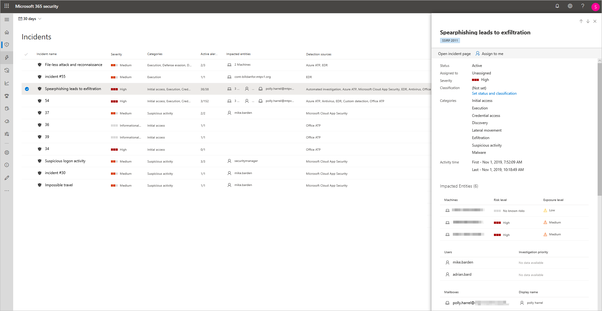

# Investigate incidents in Microsoft Threat Protection

**Applies to:**
- Microsoft Threat Protection

Microsoft Threat Protection aggregates all related alerts and investigations from endpoints, identities, and mailboxes to give you a comprehensive look into entire breadth of an attack. 

Investigate the alerts that affect your network, understand what they mean, and collate evidence associated with the incidents so that you can devise an effective remediation plan. 

## Investigate an incident

1. Select an incident from the incident queue.   This opens a side panel and gives a preview of important information such as status, severity, category, and the impacted entities.
 

2. Select **Open incident page**.   This opens the incident page where you'll find more information incident details, comments and actions, tabs (alerts, machines, users, investigations, evidence).

   

    
    Clicking the **Linked by** field shows an elaborate explanation for the reason the alerts were correlated. 

3. Review the alerts, machines, users, other entities involved in the incident.

## Alerts 
You can view all the alerts related to the incident and other information about them such as severity, entities that were involved in the alert, the detection source of the alerts (Azure ATP, Microsoft Defender ATP , Office  365 ATP) and the reason they were linked together. 

## Machines 
The machines tab lists all the devices where alerts related to the incident are seen as reported by Microsoft Defender ATP and Azure ATP. 

Selecting the name of the machine where the attack was conducted navigates you to its Machine page where you can see alerts that were triggered on it and related events provided to ease investigation. 

Selecting the Timeline tab enables you to scroll through the machine timeline and view all events and behaviors observed on the machine in chronological order, interspersed with the alerts raised. 

## Users 
See users that have been identified to be part of, or related to a given incident as reported by Microsoft Cloud App Security. 

Selecting the username navigates you to the user’s Cloud App Security page where further investigation can be conducted.

## Mailboxes
Investigate mail that's been identified to be part of, or related to an incident. To do further investigative work, selecting the mail related alert will open Office 365 Advanced Threat Protection where you can take remediation actions.

## Investigations
Select **Investigations** to see all the automated investigations that were triggered by Azure ATP and Microsoft Defender ATP alerts. By default, it waits for user approval before performing corresponding remediation actions.

Select an investigation to navigate to the Investigation details page, which displays the following:
- Alert(s) that triggered the automated investigation
- Impacted users and machines  
  If indicators are found on additional machines, these additional machines will be listed as well.
- List of evidences   The entities found and analyzed, such as files, processes, services, drivers, and network addresses. These entities are analyzed for possible relationships to the alert and rated as benign or malicious.
- Threats found   Known threats that are found during the investigation.

## Evidence
Microsoft Threat Protection automatically investigates all the incidents' supported events and suspicious entities in the alerts, providing you with auto-response and information about the important files, processes, services, and more. This helps quickly detect and block potential threats in the incident. 

Each of the analyzed entities will be marked as infected, remediated, or suspicious. 

## Related topics
- [Incidents overview](incidents-overview.md)
- [Prioritize incidents](incident-queue.md)
- [Manage incidents](manage-incidents.md)