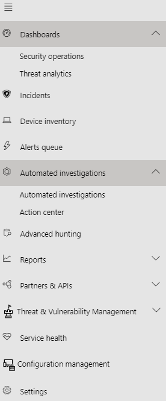
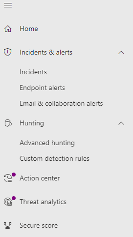
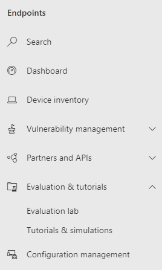
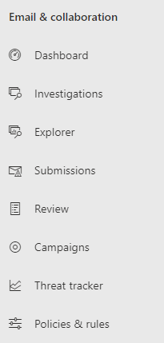
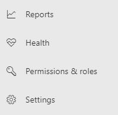

# Microsoft Defender for Endpoint in the Microsoft 365 security center

The new Microsoft 365 security center combines security capabilities that protect, detect, investigate, and respond to email, collaboration, *and* device threats. This security center brings together functionality from existing Microsoft security portals, including Microsoft Defender Security Center and the Office 365 security & compliance center. [Learn more about the Microsoft 365 security center](https://docs.microsoft.com/microsoft-365/security/mtp/overview-security-center)

Use this URL to access the new security center: https://security.microsoft.com

## Microsoft Defender Security Center navigation (old)

Historically, the [Microsoft Defender Security Center](https://docs.microsoft.com/windows/security/threat-protection/microsoft-defender-atp/portal-overview) has been the home for Microsoft Defender for Endpoint. Enterprise security teams have used it to monitor and assist in responding to alerts of potential advanced persistent threat activity or data breaches. However, in the interest of reducing the number of portals, the Microsoft 365 security center will be the new home for monitoring and managing security across your Microsoft identities, data, devices, apps, and infrastructure.

This what the current Microsoft Defender Security Center navigation pane looks like, for comparison.

## Microsoft 365 security navigation (new)

The Microsoft 365 security navigation pane will look fairly familiar if you are coming from the Microsoft Defender Security Center. However there are some new and updated elements.

> [!IMPORTANT]
> What you see in the Microsoft 365 security center depends on your current subscriptions. For example, if you don't have a license for Microsoft Defender for Office 365, then the Email & Collaboration section will not be shown. 

|Alerts & Actions  |Endpoints  
|---------|---------
| |  

|Email & Collaboration  |Access & Reporting  |
|---------|---------|
 |   |     |

## Changes

This table is a quick reference of the areas where change has occurred between the Microsoft Defender Security Center and the Microsoft 365 security portal.

### Alerts and actions

|**New area**  |**Description of change**  |
|---------|---------|
| Incidents & alerts  | Previously separate sections, "Incidents" and "Alerts queue."  |
| [Hunting](https://docs.microsoft.com/windows/security/threat-protection/microsoft-defender-atp/advanced-hunting-overview)  |  Now includes "Advanced hunting" and "Custom detection rules."   |
| Threat analytics |  It's on it's own, no longer under the "Dashboards" section.   |

### Endpoints

|**New area**  |**Description of change**  |
|---------|---------|
|Search   |  Instead of being in the heading, Microsoft Defender for Endpoint search bar is moving under the Endpoints section. You can continue to search for devices, files, users, URLs, IPs, vulnerabilities, software, and recommendations.  |
|[Dashboard](https://docs.microsoft.com/windows/security/threat-protection/microsoft-defender-atp/security-operations-dashboard)   |  This page will be the current “Security operations” dashboard. The threat analytics dashboard will be in the first navigation section, generally called alerts and actions.   |
|Device inventory | No changes. |
|[Vulnerability management](https://docs.microsoft.com/windows/security/threat-protection/microsoft-defender-atp/next-gen-threat-and-vuln-mgt)    |    Name was shortened to fit in the navigation pane. It is the same as the threat and vulnerability management section, with all the pages underneath.     |
| Partners and APIs | No changes, except the & became "and." |
| Evaluations & tutorials    |     New testing and learning capabilities.     |
| Configuration management   |  No changes.  |

### Access and reporting

|**New area**  |**Description of change**  |
|---------|---------|
| Reports  | See reports from the endpoint section and the email & collaboration section, including the Threat protection, Device health and compliance, and Vulnerable devices reports. |
| Health  |  Currently includes the "Service health" page. |
| Settings |  Manage your settings for the Microsoft 365 security center, Microsoft 365 Defender, Endpoints, Email & collaboration, Identities, and Device discovery.   |
