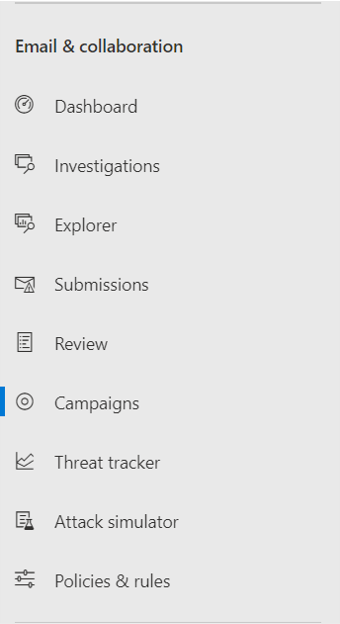
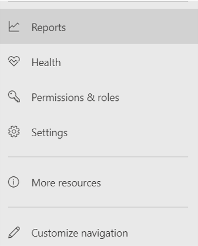

# Microsoft Defender for Endpoint in the Microsoft 365 security center

**Applies to:**
- [Microsoft 365 Defender](https://go.microsoft.com/fwlink/?linkid=2118804)

The new [Microsoft 365 security center](https://docs.microsoft.com/microsoft-365/security/mtp/overview-security-center) at [https://security.microsoft.com](https://security.microsoft.com) combines security capabilities that protect, detect, investigate, and respond to email, collaboration, identity, and device threats. This security center brings together functionality from existing Microsoft security portals, including Microsoft Defender Security Center and the Office 365 security & compliance center.

If you are familiar with the Microsoft Defender Security Center, this article helps describe some of the changes and improvements in the new Microsoft 365 Security Center. However there are some new and updated elements to be aware of.

Historically, the [Microsoft Defender security center](https://docs.microsoft.com/windows/security/threat-protection/microsoft-defender-atp/portal-overview) has been the home for Microsoft Defender for Endpoint. Enterprise security teams have used it to monitor and assist in responding to alerts of potential advanced persistent threat activity or data breaches. To help reduce the number of portals, the Microsoft 365 security center will be the new home for monitoring and managing security across your Microsoft identities, data, devices, apps, and infrastructure.

> [!IMPORTANT]
> What you see in the Microsoft 365 security center depends on your current subscriptions. For example, if you don't have a license for Microsoft Defender for Office 365, then the Email & Collaboration section will not be shown. 

Access the new security center: [https://security.microsoft.com](https://security.microsoft.com).

## What's changed

This table is a quick reference of the changes between the Microsoft Defender Security Center and the Microsoft 365 security portal.

### Alerts and actions

|**Area**  |**Description of change**  |
|---------|---------|
| [Incidents & alerts](incidents-overview.md)  | In the Microsoft 365 security center, you can manage incidents and alerts across all of your endpoints, email, and identities. We've converged the experience to help you find related events more easily. For more information, see [Incidents Overview](incidents-overview.md).   |
| [Hunting](https://docs.microsoft.com/windows/security/threat-protection/microsoft-defender-atp/advanced-hunting-overview)  |  Now includes "Advanced hunting" and "Custom detection rules."   |
|Action center    | Lists pending and completed actions that were taken following automated investigations and remediation actions. Formerly, the Action center in the Microsoft Defender Security Center listed pending and completed actions for remediation actions taken on devices only, while Automated investigations listed alerts and status. In the new and improved Microsoft 365 security center, the Action center brings together remediation actions and investigations across email, devices, and users—all in one location.  |
| Threat analytics |  Moved from under the "Dashboards" section.   |

### Endpoints

|**Area**  |**Description of change**  |
|---------|---------|
|Search   |  Instead of being in the heading, Microsoft Defender for Endpoint search bar is moving under the Endpoints section. You can continue to search for devices, files, users, URLs, IPs, vulnerabilities, software, and recommendations.  |
|[Dashboard](https://docs.microsoft.com/windows/security/threat-protection/microsoft-defender-atp/security-operations-dashboard)   |  This is your security operations dashboard. It tells you at a glance how many active alerts were triggered, which devices are at risk, which users are at risk, and severity level for alerts, devices, and users. You can also see if any devices have sensor issues, your overall service health, and how any unresolved alerts were detected.      Formerly, the security operations dashboard that was in the Microsoft Defender Security Center also listed the number and status of any automated investigations. In the new and improved Microsoft 365 security center, details about automated investigations are found in the Incidents view. In the navigation pane, go to Incidents & alerts > Incidents. Select an incident, then choose the Investigations tab to view details about an automated investigation.     The threat analytics dashboard is now in the top alerts and actions navigation section.   |
|Device inventory | No changes. |
|[Vulnerability management](https://docs.microsoft.com/windows/security/threat-protection/microsoft-defender-atp/next-gen-threat-and-vuln-mgt)    |    Name was shortened to fit in the navigation pane. It is the same as the threat and vulnerability management section, with all the pages underneath.     |
| Partners and APIs | No changes. |
| Evaluations & tutorials    |     New testing and learning capabilities.     |
| Configuration management   |  No changes.  |

### Access and reporting

|**Area**  |**Description of change**  |
|---------|---------|
| Reports  | See reports from the endpoint section and the email & collaboration section, including the Threat protection, Device health and compliance, and Vulnerable devices reports. |
| Health  |  Currently includes the "Service health" page. |
| Settings |  Manage your settings for the Microsoft 365 security center, Microsoft 365 Defender, Endpoints, Email & collaboration, Identities, and Device discovery.   |

## Microsoft 365 security navigation (new)

Historically, the [Microsoft Defender Security Center](https://docs.microsoft.com/windows/security/threat-protection/microsoft-defender-atp/portal-overview) has been the home for Microsoft Defender for Endpoint. Enterprise security teams have used it to monitor and assist in responding to alerts of potential advanced persistent threat activity or data breaches. However, in the interest of reducing the number of portals, the Microsoft 365 security center will be the new home for monitoring and managing security across your Microsoft identities, data, devices, apps, and infrastructure.

The Microsoft 365 security navigation pane will look fairly familiar if you are coming from the Microsoft Defender Security Center. However there are some new and updated elements.

> [!IMPORTANT]
> What you see in the Microsoft 365 security center depends on your current subscriptions. For example, if you don't have a license for Microsoft Defender for Office 365, then the Email & Collaboration section will not be shown. 

## Navigation and the Guided Tour

The left navigation, or quick launch bar, will look familiar. However, there are some new and updated elements in this security center.

### Alerts & Actions
Brings together incident and alert management across your email, devices, and identities. You can also hunt for security threats using hunting queries.

### Endpoints
View and manage the security of endpoints in your organization. If you've used the Microsoft Defender security center, this will look familiar.

### Email & collaboration
Track and investigate threats to your users' email, track campaigns, and more. If you've used the Office 365 Security and Compliance center, this will look familiar. 

### Access and Reports
View reports, change your settings, and modify user roles.

## Microsoft Defender Security Center navigation

This what the current Microsoft Defender Security Center navigation pane looks like, for comparison.

## Related information
