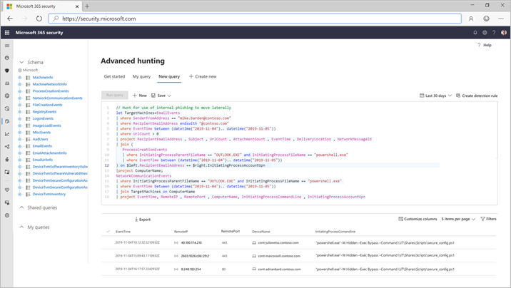

# Microsoft Threat Protection

**Applies to:**
- Microsoft Threat Protection

[!include[Prerelease information](prerelease.md)]

Microsoft Threat Protection is a unified pre and post breach enterprise defense suite that natively integrates across endpoint, identity, email, and applications to detect, prevent, investigate and automatically respond to sophisticated attacks.  

With the integrated Microsoft Threat Protection solution, security professionals can stitch together the threat signals that each of these products receive and determine the full scope and impact of the threat; how it entered the environment, what it's affected, and how it's currently impacting the organization. Microsoft Threat Protection takes automatic action to prevent or stop the attack and self-heal affected mailboxes, endpoints, and user identities.  

Microsoft Threat Protection suite protects: 
- **Endpoints with Microsoft Defender ATP** - Microsoft Defender ATP is a unified endpoint platform for preventative protection, post-breach detection, automated investigation, and response. 
- **Email and collaboration with Office 365 ATP** - Office 365 ATP safeguards your organization against malicious threats posed by email messages, links (URLs) and collaboration tools. 
- **Identities with Azure ATP and Azure AD Identity Protection** - Azure ATP uses Active Directory signals to identify, detect, and investigate advanced threats, compromised identities, and malicious insider actions directed at your organization. 
- **Applications with Microsoft Cloud App security** - Microsoft Cloud App security is a comprehensive cross-SaaS solution bringing deep visibility, strong data controls, and enhanced threat protection to your cloud apps. 

Microsoft Threat Protection's unique cross-product layer augments the individual suite components to:
- Help protect against attacks and coordinate defensive responses across the suite through signal sharing and automated actions
- Narrate the full story of the attack across product alerts, behaviors, and context for security teams by joining data on alerts, suspicious events and impacted assets to 'incidents'
- Automate response to compromise by triggering self-healing for impacted assets through automated remediation
- Enable security teams to perform detailed and effective threat hunting across endpoint and Office data

  
Cross-product incident (Overview)

 
All related alerts across the suite products correlated together into a single incident (alerts view)

 
Query-based hunting on top of email and endpoint raw data

Microsoft Threat Protection cross-product features include: 
- **Cross-product single pane of glass** - Central view all information for detections, impacted assets, automated actions taken, and related evidence in a single queue and a single pane in [security.microsoft.com](https://security.microsoft.com). 
- **Combined incidents queue** - To help security professionals focus on what is critical by ensuring the full attack scope, impacted assets and automated remediation actions are grouped together and surfaced in a timely manner. 
- **Automatic response to threats** - Critical threat information is shared in real time between the Microsoft Threat Protection products to help stop the progression of an attack. For example, if a malicious file is detected on an endpoint protected by Microsoft Defender ATP, it will instruct Office 365 ATP to scan and remove the file from all e-mail messages. The file will be blocked on sight by the entire Microsoft 365 security suite.
- **Self-healing for compromised devices, user identities, and mailboxes** - Microsoft Threat Protection uses AI-powered automatic actions and playbooks to remediate impacted assets back to a secure state. Microsoft Threat Protection leverages automatic remediation capabilities of the suite products to ensure all impacted assets related to an incident are automatically remediated where possible.
- **Cross-product threat hunting** - Security teams can leverage their unique organizational knowledge to hunt for signs of compromise by creating their own custom queries over the raw data collected by the various protection products. Microsoft Threat Protection provides query-based access to 30 days of historic raw signals and alert data across endpoint and Office 365 ATP data. 

<h2>Microsoft Threat Protection services
</h2>
<table><tr><td>
<b><a href="https://docs.microsoft.com/windows/security/threat-protection/microsoft-defender-atp/microsoft-defender-advanced-threat-protection"><b>Microsoft Defender Advanced Threat Protection</b>
</a></td>
<td>
<b><a href="https://docs.microsoft.com/office365/securitycompliance/office-365-atp"><b>Office 365 Advanced Threat Protection</b>
</a></td>
<td>
<b><a href="https://docs.microsoft.com/azure-advanced-threat-protection/"><b>Azure Advanced Threat Protection</b></a>
</td>
<td>
<b><a href="https://docs.microsoft.com/cloud-app-security/"><b>Microsoft Cloud App Security</b></a>
</td>
</tr>
</table>
 

## Get started
Customers with a Microsoft 365 E5 or equivalent license can use Microsoft Threat Protection. To begin, enable the service in the Microsoft 365 security center at [security.microsoft.com](https://security.microsoft.com). For more information, read:
- [Licensing requirements](prerequisites.md#licensing-requirements)
- [Turn on Microsoft Threat Protection](mtp-enable)

