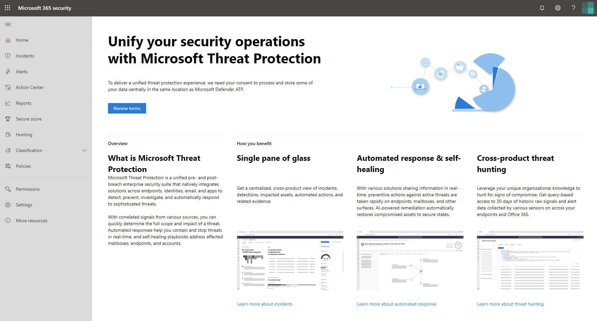

# Turn on Microsoft Threat Protection

**Applies to:**
- Microsoft Threat Protection

Microsoft Threat Protection unifies your incident response process by integrating key capabilities across Microsoft Defender Advanced Threat Protection (ATP), Office 365 ATP, Microsoft Cloud App Security, and Azure ATP. This unified experience adds powerful features you can access in the Microsoft 365 security center.

To get the best protection and optimize Microsoft Threat Protection, we recommend deploying all applicable supported services on your network. For more information, [read about deploying supported services](deploy-supported-services.md).

## Check license eligibility and required permissions
A Microsoft 365 E5, E5 Security, A5, or A5 Security license or a valid combination of licenses provides access to supported services and entitles you to use Microsoft Threat Protection in Microsoft 365 security center.

For detailed licensing information, [read the licensing requirements](prerequisites.md#licensing-requirements).

### Check your role
You must be a **global administrator** or a **security administrator** in Azure Active Directory to turn on Microsoft Threat Protection. [View your roles in Azure AD](https://docs.microsoft.com//azure/active-directory/users-groups-roles/directory-manage-roles-portal)

## Start using the service
Microsoft Threat Protection aggregates data from the various integrated services. It will process and store data centrally to identify new insights and make centralized response workflows possible.

Before you turn on the service, the Microsoft 365 security center ([security.microsoft.com](https://security.microsoft.com)) shows the Microsoft Threat Protection welcome page when you select **Incidents**, **Action center**, or **Hunting** from the navigation pane. These navigation options are not shown if you are not eligible to use Microsoft Threat Protection.

*Microsoft Threat Protection welcome page in Microsoft 365 security center*

To turn on Microsoft Threat Protection, simply complete the process from the welcome page. You can also turn on Microsoft Threat Protection by accessing **Settings** ([security.microsoft.com/settings](https://security.microsoft.com/settings)) in the navigation pane and selecting **Microsoft Threat Protection**. Click **Save**.

>[!NOTE]
>If you don't see **Settings** in the navigation pane or couldn't access the page, check your permissions and licenses.

### Select data center location
If Microsoft Defender ATP has been provisioned for your organization, data will be stored and processed in the same data center location you have selected for [your Microsoft Defender ATP data](https://docs.microsoft.com/windows/security/threat-protection/microsoft-defender-atp/data-storage-privacy). If you don't have Microsoft Defender ATP, you will be asked to choose a new data center location specifically for Microsoft Threat Protection. 

You need to provide consent before data is shared between services and aggregated.

### Confirm that the service is on
Once the service is provisioned, it adds:

- [Incidents management](incidents-overview.md)
- An action center for managing [automated investigation and response](mtp-autoir.md)
- [Advanced hunting](advanced-hunting-overview.md) capabilities

*Microsoft 365 security center with incidents management and other Microsoft Threat Protection capabilities*

### Getting Azure ATP data
To share Azure ATP data with Microsoft Threat Protection, ensure that Microsoft Cloud App Security and Azure ATP integration is turned on. [Learn more about this integration](https://docs.microsoft.com/cloud-app-security/aatp-integration)

## Turn off Microsoft Threat Protection
To stop using Microsoft Threat Protection, go to **Settings** > **Microsoft Threat Protection** > **Opt-in / Opt-out** in the Microsoft 365 security center. Unselect **Turn on Microsoft Threat Protection** and save the changes.

Corresponding features will be removed from the Microsoft 365 security center.

## Get assistance

Microsoft support staff can help provision or deprovision the service and related resources on your tenant. For assistance, select **Need help?** in the Microsoft 365 security center. When contacting support, mention Microsoft Threat Protection.

## Related topics

- [Microsoft Threat Protection overview](microsoft-threat-protection.md)
- [Licensing requirements and other prerequisites](prerequisites.md)
- [Deploy supported services](deploy-supported-services.md)
- [Microsoft Defender ATP overview](https://docs.microsoft.com/windows/security/threat-protection/microsoft-defender-atp/microsoft-defender-advanced-threat-protection)
- [Office 365 ATP overview](../office-365-security/office-365-atp.md)
- [Microsoft Cloud App Security overview](https://docs.microsoft.com/cloud-app-security/what-is-cloud-app-security)
- [Azure ATP overview](https://docs.microsoft.com/azure-advanced-threat-protection/what-is-atp)
- [Microsoft Defender ATP data storage](https://docs.microsoft.com/windows/security/threat-protection/microsoft-defender-atp/data-storage-privacy)
