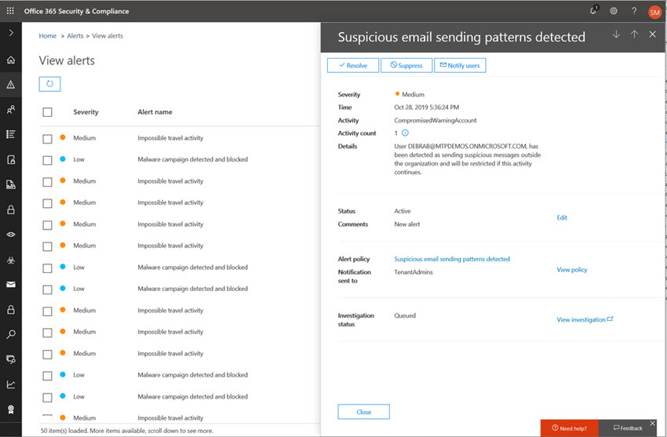
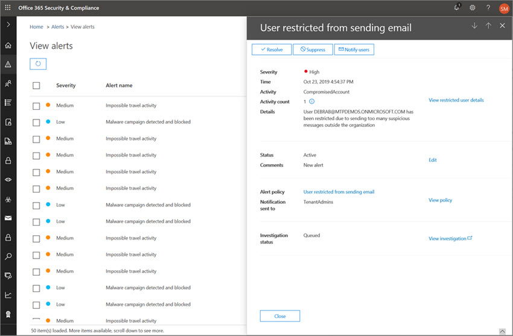

# Address compromised user accounts with automated investigation and response

As you might already know, [Office 365 Advanced Threat Protection Plan 2](office-365-atp.md#office-365-atp-plan-1-and-plan-2) includes powerful [automated investigation and response](office-365-air.md) (AIR) capabilities. Such capabilities can save your security operations team a lot of time and effort dealing with threats. Recently, AIR capabilities were enhanced to include a compromised user security playbook (currently in preview). 

The compromised user security playbook enables your organization's security team to:
- Speed up detection of compromised user accounts;
- Limit the scope of a breach when an account is compromised; and 
- Respond to compromised users more effectively and efficiently.

## Compromised user alerts

When a user account is compromised, atypical or anomalous behaviors occur. For example, phishing and spam messages might be sent internally from a trusted user account. Office 365 Advanced Threat Protection can detect such anomalies in email patterns and collaboration activity within Office 365. When this happens, alerts are triggered, and the threat mitigation process begins.

For example, here's an alert that was triggered because of suspicious email sending:

And here's an example of an alert that was triggered when a sending limit was reached for a user:

## Investigate and respond to a compromised user

When a user account is compromised, alerts are triggered. And in some cases, that user account is blocked and prevented from sending any further email messages until the issue is resolved by your organization's security operations team. 

### Investigate restricted users

> [!IMPORTANT]
> You must have appropriate permissions to perform the following task. [Find out how to get AIR and see required permissions](automated-investigation-response-office.md#how-to-get-air).

1. Go to [https://protection.office.com](https://protection.office.com) and sign in.

2. In the navigation pane, choose Alerts > Dashboard.

3. In the Other alerts widget, choose Restricted Users.

## Keep the following points in mind

- **Stay on top of your alerts**. The longer a compromise goes undetected, the larger the potential for widespread impact and cost to your organization, customers, and partners. Early detection and timely response are critical to mitigate threats, and especially when a user's account is compromised. See [Automatically investigate and respond to threats in Office 365](https://docs.microsoft.com/microsoft-365/security/office-365-security/office-365-air) and [Alerts in the Office 365 Security &amp; Compliance Center](alerts.md).
- **Automation assists but does not replace your security operations team**. In particular, automated investigation and response capabilities can detect a compromised user early on, but your security operations team will likely need to engage and do some investigation and remediation. See [Review and approve actions](https://docs.microsoft.com/microsoft-365/security/office-365-security/office-365-air#review-and-approve-actions).
- **Don't rely on a suspicious login alert as your only indicator**. When a user account is compromised, it might or might not trigger a suspicious login alert. Sometimes it's the series of activities that occur after an account is compromised that triggers an alert.

## Next steps

- [Find out how to get AIR and see required permissions](automated-investigation-response-office.md#how-to-get-air)
- [Learn more about alerts](../../compliance/alert-policies.md)
- [Manually find and investigate malicious email that was delivered in Office 365](investigate-malicious-email-that-was-delivered.md)
- [Learn about AIR in Microsoft Defender ATP](https://docs.microsoft.com/windows/security/threat-protection/microsoft-defender-atp/automated-investigations)
- [Visit the Microsoft 365 Roadmap to see what's coming soon and rolling out](https://www.microsoft.com/microsoft-365/roadmap?filters=)

