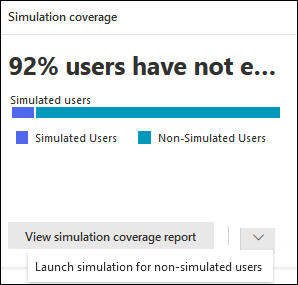
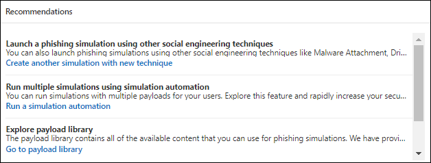
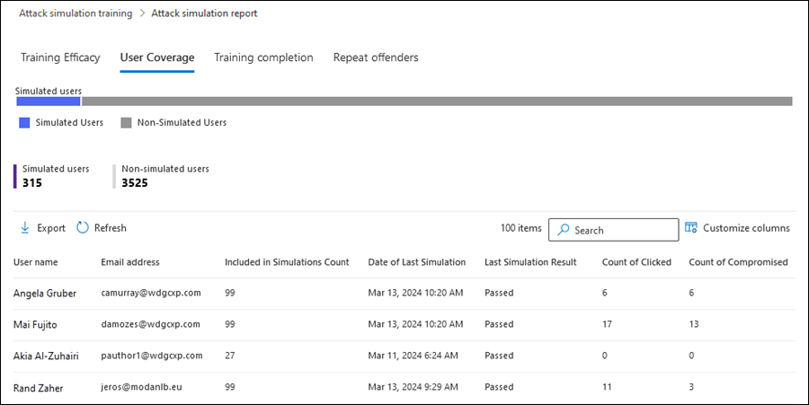

# Insights and reports for Attack simulation training in Defender for Office 365

**Applies to**
 [Microsoft Defender for Office 365 plan 2](defender-for-office-365.md)

In Attack simulation training in Microsoft Defender for Office Plan 2 or Microsoft 365 E5, Microsoft provides insights and reports from the results of simulations and the corresponding trainings. This information keeps you informed on the threat readiness progress of your users, as well as recommended next steps to better prepare your users for future attacks.

Insights and reports are available in the following locations in Attack simulation training in the Microsoft 365 Defender portal:

- The **Overview** tab.
- Simulation details on the **Simulations** tab.

The rest of this article describes the available information.

For getting started information about Attack simulation training, see [Get started using Attack simulation training](attack-simulation-training-get-started.md).

## Insights and reports on the Overview tab of Attack simulation training

To go to the **Overview** tab, open the Microsoft 365 Defender portal at <a href="https://go.microsoft.com/fwlink/p/?linkid=2077139" target="_blank">https://security.microsoft.com</a>, go to **Email & collaboration** \> **Attack simulation training**, and verify that the **Overview** tab is selected (it's the default). To go directly to the **Overview** tab on the **Attack simulation training** page, use <https://security.microsoft.com/attacksimulator?viewid=overview>.

The rest of this section describes the information that's available on the **Overview** tab of Attack simulation training.

### Recent simulations card

The **Recent simulations** card on the **Overview** tab shows the last three simulations that you've created or run in your organization.

You can select a simulation to view details.

Selecting **View all simulations** takes you to the **Simulations** tab.

Selecting **Launch a simulation** starts the simulation creation wizard. For more information, see [Simulate a phishing attack in Defender for Office 365](attack-simulation-training.md).

### Behavior impact on compromise rate card

The **Behavior impact on compromise rate** card on the **Overview** tab shows how your users responded to your simulations as compared to the historical data in Microsoft 365. You can use these insights to track progress in users threat readiness by running multiple simulations against the same groups of users.

The chart data itself shows the following information:

- **Predicted compromise rate**\*: The average compromise rate for Attack simulation training simulations that use the same type of payload across all other Microsoft 365 organizations.
- **Actual compromise rate**\*: The actual percentage of users that fell for the simulation.

If you hover over a data point in the chart, the actual percentage values are shown.

The following summary information is also shown on the card:

- **users less susceptible to phishing**: The difference between the actual number of users compromised by the simulated attack and the predicted compromise rate. This number of users is less likely to be compromised by similar attacks in the future.
- **x% better than predicted rate**: Indicates how users did overall in contrast with the predicted compromise rate.

To see a more detailed report, click **View simulations and training efficacy report**. This report is explained [later in this article](#training-efficacy-tab-for-the-attack-simulation-report).

### Simulation coverage card

The **Simulation coverage** card on the **Overview** tab shows the percentage of users in your organization who've received a simulation (**Simulated users**) vs. those who haven't received a simulation (**Non-simulated users**). You can hover over a section in the chart to see the actual number of users in each category.

Selecting **Launch simulation for non-simulated users** starts the simulation creation wizard where the users who didn't receive the simulation are automatically selected on the **Target user** page. For more information, see [Simulate a phishing attack in Defender for Office 365](attack-simulation-training.md).

Selecting **View simulation coverage report** takes you to the [User coverage tab for the Attack simulation report](#user-coverage-tab-for-the-attack-simulation-report).

### Training completion card

The **Training completion** card on the **Overview** tab organizes the percentages of users who received trainings based on the results of simulations into the following categories:

- **Completed**
- **In progress**
- **Incomplete**

You can hover over a section in the chart to see the actual number of users in each category.

Selecting **View training completion report** takes you to the [Training completion tab for the Attack simulation report](#training-completion-tab-for-the-attack-simulation-report).

### Repeat offenders card

The **Repeat offenders** card on the **Overview** tab shows the information about repeat offenders. A _repeat offender_ is a user who was compromised by consecutive simulations. The default number of consecutive simulations is two, but you can change the value on the **Settings** tab of Attack simulation training at <https://security.microsoft.com/attacksimulator?viewid=setting>.

The chart organizes repeat offender data by [simulation type](attack-simulation-training.md#select-a-social-engineering-technique):

- **All**
- **Malware attachment**
- **Link to malware**
- **Credential harvest**
- **Link in attachments**
- **Drive-by URL**

Selecting **View repeat offender report** takes you to the [Repeat offenders tab for the Attack simulation report](#repeat-offenders-tab-for-the-attack-simulation-report).

### Recommendations card

The **Recommendations** card on the **Overview** tab suggests different types of simulations to run.

Selecting **Launch now** starts the simulation creation wizard with the specified simulation type automatically selected on the **Select technique** page. For more information, see [Simulate a phishing attack in Defender for Office 365](attack-simulation-training.md).

### Attack simulation report

You can open the **Attack simulation report** from the **Overview** tab by clicking on the **View ... report** buttons that are available in many of the cards that are described in this article. To go directly to the report, use <https://security.microsoft.com/attacksimulationreport>

#### Training efficacy tab for the Attack simulation report

On the **Attack simulation report** page, the **Training efficacy** tab is selected by default. This tab provides the same information that's available in the **Behavior impact on compromise rate** card, with additional context from the simulation itself.

The chart shows the **Predicted compromise rate** and **Actual compromised rate**. If you hover over a section in the chart, the actual percentage values for are shown.

The details table below the chart shows the following information:

- **Simulation name**
- **Simulation technique**
- **Simulation tactics**
- **Predicted compromised rate**
- **Actual compromised rate**
- **Total users targeted**
- **Count of clicked users**

You can sort the results by clicking on an available column header.

Click **Customize columns** to remove the columns that are shown. When you're finished, click **Apply**.

Use  **Search** box to filter the results by **Simulation name** or **Simulation Technique**. Wildcards aren't supported.

If you click the  **Export report** button, report generation progress is shown as a percentage of complete. In the dialog that opens, you can choose to open the .csv file, save the .csv file, and remember the selection.

#### User coverage tab for the Attack simulation report

On the **User coverage** tab, the chart shows the **Simulated users** and **Non-simulated users**. If you hover over a data point in the chart, the actual values are shown.

The details table below the chart shows the following information:

- **Username**
- **Email address**
- **Included in simulation**
- **Date of last simulation**
- **Last simulation result**
- **Count of clicked**
- **Count of compromised**

You can sort the results by clicking on an available column header.

Click **Customize columns** to remove the columns that are shown. When you're finished, click **Apply**.

Use  **Search** box to filter the results by **Username** or **Email address**. Wildcards aren't supported.

If you click the  **Export report** button, report generation progress is shown as a percentage of complete. In the dialog that opens, you can choose to open the .csv file, save the .csv file, and remember the selection.

#### Training completion tab for the Attack simulation report

On the **Training completion** tab, the chart shows the number of **Completed**, **In progress**, and **Incomplete** simulations. If you hover over a section in the chart, the actual values are shown.

The details table below the chart shows the following information:

- **Username**
- **Email address**
- **Included in simulation**
- **Date of last simulation**
- **Last simulation result**
- **Name of most recent training completed**
- **Date completed**
- **All trainings**

You can sort the results by clicking on an available column header.

Click **Customize columns** to remove the columns that are shown. When you're finished, click **Apply**.

Click  **Filter** to filter the chart and details table by one or more of the following values:

- **Completed**
- **In progress**
- **All**

When you're finished configuring the filters, click **Apply**, **Cancel**, or **Clear filters**.

Use  **Search** box to filter the results by **Username** or **Email address**. Wildcards aren't supported.

If you click the  **Export report** button, report generation progress is shown as a percentage of complete. In the dialog that opens, you can choose to open the .csv file, save the .csv file, and remember the selection.

#### Repeat offenders tab for the Attack simulation report

A _repeat offender_ is a user who was compromised by consecutive simulations. The default number of consecutive simulations is two, but you can change the value on the **Settings** tab of Attack simulation training at <https://security.microsoft.com/attacksimulator?viewid=setting>.

On the **Repeat offenders** tab, the chart organizes repeat offender data by [simulation type](attack-simulation-training.md#select-a-social-engineering-technique):

- **All**
- **Credential harvest**
- **Malware attachment**
- **Link in attachment**
- **Link to malware**
- **Drive-by URL**

If you hover over a data point in the chart, the actual values are shown.

The details table below the chart shows the following information:

- **User**
- **Repeat count**
- **Simulation types**
- **Simulations**

You can sort the results by clicking on an available column header.

Click **Customize columns** to remove the columns that are shown. When you're finished, click **Apply**.

Click  **Filter** to filter the chart and details table by some or all of the simulation type values:

- **Credential harvest**
- **Malware attachment**
- **Link in attachment**
- **Link to malware**
- **Drive-by URL**

When you're finished configuring the filters, click **Apply**, **Cancel**, or **Clear filters**.

Use  **Search** box to filter the results by any of the column values. Wildcards aren't supported.

If you click the  **Export report** button, report generation progress is shown as a percentage of complete. In the dialog that opens, you can choose to open the .csv file, save the .csv file, and remember the selection.

## Insights and reports in the simulation details of Attack simulation training

To go to the **Simulations** tab, open the Microsoft 365 Defender portal at <a href="https://go.microsoft.com/fwlink/p/?linkid=2077139" target="_blank">https://security.microsoft.com</a>, go to **Email & collaboration** \> **Attack simulation training**, and then click the **Simulations** tab. To go directly to the **Simulations** tab on the **Attack simulation training** page, use <https://security.microsoft.com/attacksimulator?viewid=simulations>.

When you select a simulation from the list, a details page opens. This page contains the configuration settings of the simulation that you would expect to see (status, launch date, payload used, etc.).

The rest of this section describe the insights and reports that are available on the simulation details page.

### Simulation impact section

The **Simulation impact** section on the simulation details page shows how many users were completely tricked by the simulation and the total number of users in the simulation. The information that's shown varies based on the simulation type. For example:

- Links: **Entered credentials** and **Did not enter credentials**.

  

- Attachments: **Opened attachment** and **Did not open attachment**.

  

If you hover over a section in the chart, the actual numbers for each category are shown.

### All user activity section

The **All user activity** section on the simulation details page shows numbers for the possible outcomes of the simulation. The information that's shown varies based on the simulation type. For example:

- **SuccessfullyDeliveredEmail**
- **ReportedEmail**: How many users reported the simulation message as suspicious.
- Links:
  - **EmailLinkClicked**: How many users clicked on the link in the simulation message.
  - **CredSupplied**: After clicking on the link, how many users supplied their credentials.

    

- Attachments:
  - **AttachmentOpened**: How many users opened the attachment in the simulation message.

    

### Training completion section

The **Training completion** section on the simulation details page shows the trainings that are required for the simulation, and how many users have completed the trainings.

## Recommended actions section

The **Recommended actions** section on the simulation details page shows recommendation actions from [Microsoft Secure Score](../defender/microsoft-secure-score.md) and the effect the action will have on your Secure Score. These recommendations are based on the payload that was used in the simulation, and will help protect your users and your environment. Selecting an **Improvement action** from the list takes you to the location to implement the suggested action.

## Related Links

[Get started using Attack simulation training](attack-simulation-training-get-started.md)

[Create a phishing attack simulation](attack-simulation-training.md)

[create a payload for training your people](attack-simulation-training-payloads.md)
