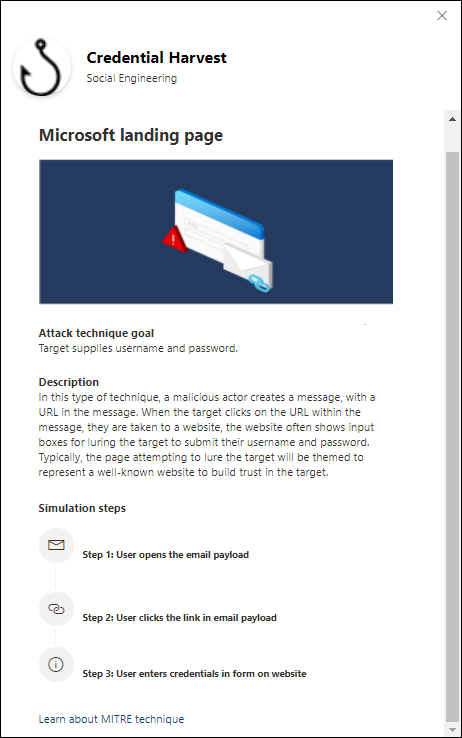
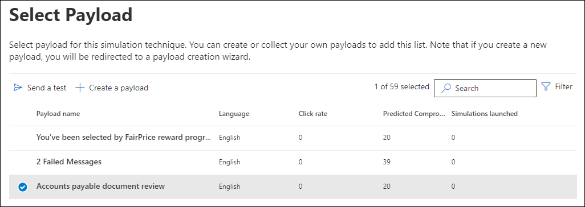
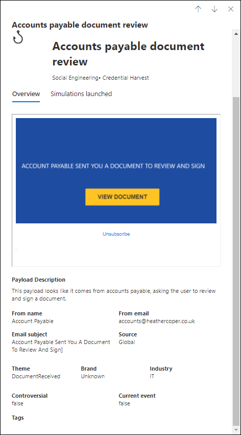
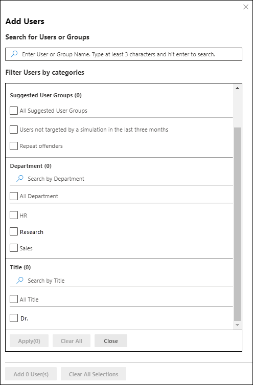

# Simulate a phishing attack in Defender for Office 365

**Applies to**
 [Microsoft Defender for Office 365 plan 2](defender-for-office-365.md)

Attack simulation training in Microsoft Defender for Office 365 Plan 2 or Microsoft 365 E5 lets you run benign cyberattack simulations in your organization. These simulations test your security policies and practices, as well as train your employees to increase their awareness and decrease their susceptibility to attacks. This article walks you through creating a simulated phishing attack using Attack simulation training.

For getting started information about Attack simulation training, see [Get started using Attack simulation training](attack-simulation-training-get-started.md).

To launch a simulated phishing attack, do the following steps:

1. In the Microsoft 365 Defender portal at <https://security.microsoft.com/>, go to **Email & collaboration** \> **Attack simulation training**.

   To go directly to the **Attack simulation training**, use <https://security.microsoft.com/attacksimulator> and switch to the **[Simulations](https://security.microsoft.com/attacksimulator?viewid=simulations)** tab.

2. On the **Attack simulation training** page, select the **Simulations** tab.

3. On the **Simulations** tab, select  **Launch a simulation**.

   

4. A 7-page simulation creation wizard opens. The rest of this article describes the pages and the settings they contain.

> [!NOTE]
> At any point during the simulation creation wizard, you can click **Save and close** to save your progress and continue configuring the simulation later.

## Select a social engineering technique

On the **Select technique** page, select an available social engineering technique, which was curated from the [MITRE ATT&CK® framework](https://attack.mitre.org/techniques/enterprise/). Different payloads are available for different techniques. The following social engineering techniques are available:

- **Credential harvest**: Attempts to collect credentials by taking users to a well-known looking website with input boxes to submit a username and password.
- **Malware attachment**: Adds a malicious attachment to a message. When the user opens the attachment, arbitrary code is run that will help the attacker compromise the target's device.
- **Link in attachment**: A type of credential harvest hybrid. An attacker inserts a URL into an email attachment. The URL within the attachment follows the same technique as credential harvest.
- **Link to malware**: Runs some arbitrary code from a file hosted on a well-known file sharing service. The message sent to the user will contain a link to this malicious file. Opening the file and help the attacker compromise the target's device.
- **Drive-by URL**: The malicious URL in the message takes the user to a familiar-looking website that silently runs and/or installs code code on the user's device.

If you click the **View details** link in the description, a details flyout opens that describes the technique and the simulation steps that result from the technique.

When you're finished, click **Next**.

## Name and describe the simulation

On the **Name simulation** page, configure the following settings:

- **Name**: Enter a unique, descriptive name for the simulation.
- **Description**: Enter an optional detailed description for the simulation.

When you're finished, click **Next**.

## Select a payload

On the **Select payload** page, you need to select an existing payload from the list, or create a new payload.

The following details are displayed in the list of payloads to help you choose:

- **Name**
- **Language**: The language of the payload content. Microsoft's payload catalog (global) provides payloads in 10+ languages which can also be filtered.
- **Click rate**: How many people have clicked on this payload.
- **Predicted compromise rate**: Historical data for the payload across Microsoft 365 that predicts the percentage of people who will get compromised by this payload.
- **Simulations launched** counts the number of times this payload was used in other simulations.

In the  **Search** box, you can type part of the payload name and press Enter to filter the results.

If you click **Filter**, the following filters are available:

- **Complexity**: Calculated based on the number of indicators in the payload that indicate a possible attack (spelling errors, urgency, etc.). More indicators are easier to identify as an attack and indicate lower complexity. The available values are:
  - **Low**
  - **Medium**
  - **High**
- **Source**: Indicates whether the payload was created in your organization or is a part of Microsoft's pre-existing payload catalog. Valid values are:
  - **Global**
  - **Tenant**
  - **All**
- **Language**: Valid values are: **English**, **Spanish**, **German**, **Japanese**, **French**, **Portuguese**, **Dutch**, **Italian**, **Swedish**, **Chinese (Simplified)**, **Norwegian Bokmål**, **Polish**, **Russian**, **Finnish**, **Korean**, **Turkish**, **Hungarian**, **Hebrew**, **Thai**, **Arabic**, **Vietnamese**, **Slovak**, **Greek**, **Indonesian**, **Romanian**, **Slovenian**, **Croatian**, **Catalan**, and **Other**.
- **Add tag(s)**
- **Filter by theme**: Valid values are: **Account activation**, **Account verification**, **Billing**, **Clean up mail**, **Document received**, **Expense**, **Fax**, **Finance report**, **Incoming messages**, **Invoice**, **Items received**, **Login alert**, **Mail received**, **Password**, **Payment**, **Payroll**, **Personalized offer**, **Quarantine**, **Remote work**, **Review message**, **Security update**, **Service suspended**, **Signature required**, **Upgrade mailbox storage Verify mailbox**, **Voicemail**, and **Other**.
- **Filter by brand**: Valid values are: **American Express**, **Capital One**, **DHL**, **DocuSign**, **Dropbox**, **Facebook**, **First American**, **Microsoft**, **Netflix**, **Scotiabank**, **SendGrid**, **Stewart Title**, **Tesco**, **Wells Fargo**, **Syrinx Cloud**, and **Other**.
- **Filter by event**: Valid values are: **Banking**, **Business services**, **Consumer services**, **Education**, **Energy**, **Construction**, **Consulting**, **Financial services**, **Government**, **Hospitality**, **Insurance**, **Legal**, **Courier services**, **IT**, **Healthcare**, **Manufacturing**, **Retail**, **Telecom**, **Real estate**, and **Other**.
- **Current event**: Valid values are **Yes** or **No**.
- **Controversial**: Valid values are **Yes** or **No**.

When you're finished configuring the filters, click **Apply**, **Cancel**, or **Clear filters**.

If you select a payload from the list, details about the payload are shown in a flyout:

- The **Overview** contains an example and other details about the payload.
- The **Simulations launched** tab contains the **Simulation name**, **Click rate**, **Compromised rate**, and **Action**.

If you'd like to create your own payload, click  **Create a payload**. For more information, see [create a payload for attack simulation training](attack-simulation-training-payloads.md).

When you're finished, click **Next**.

## Target users

On the **Target users** page, select who will receive the simulation. Configure one of the following settings:

- **Include all users in your organization**: The affected users are show in lists of 10. You can use the **Next** and **Previous** buttons directly below the list of users to scroll through the list. You can also use the  **Search** icon on the page to find affected users.
- **Include only specific users and groups**: Choose one of the following options:
  -  **Add users**: In the **Add users** flyout that appears, you can find users and groups based on the following criteria:
    - **Users or groups**: In the  **Search for users and groups** box, you can type part of the **Name** or **Email address** of the user or group, and then press Enter. You can select some or all of the results. When you're finished, click **Add x users**.

      > [!NOTE]
      > Clicking the **Add filters** button to return to the **Filter users by categories** options will clear any users or groups that you selected in the search results.

    - **Filter users by categories**: Select from none, some, or all of the following options:
      - **Suggested user groups**: Select from the following values:
        - **All suggested user groups**
        - **Users not targeted by a simulation in the last three months**
        - **Repeat offenders**
      - **Department**: Use the following options:
        - **Search**: In the  **Search by Department** box, you can type part of the Department value, and then press Enter. You can select some or all of the results.
        - Select **All Department**
        - Select existing Department values.
      - **Title**: Use the following options:
        - **Search**: In the  **Search by Title** box, you can type part of the Title value, and then press Enter. You can select some or all of the results.
        - Select **All Title**
        - Select existing Title values.

      

      After you identify your criteria, the affected users are shown in the **User list** section that appears, where you can select some or all of the discovered recipients.

      When you're finished, click **Apply(x)**, and then click **Add x users**.

  Back on the main **Target users** page, you can use the  **Search** box to find affected users. You can also click  **Delete** to remove specific users.

-  **Import**: In the dialog that opens, specify a CSV file that contains one email address per line.

  After you find an select the CSV file, the list of users are imported and shown on the **Targeted users** page. You can use the  **Search** box to find affected users. You can also click  **Delete** to remove specific users.

When you're finished, click **Next**.

## Assign training

On the **Assign training** page, we recommend that you assign training for each simulation, as employees who go through training are less susceptible to similar attacks.

You can either choose to have training assigned for you or select training courses and modules yourself.

Select the **training due date** to make sure employees finish their training in a timely manner.

> [!NOTE]
> If you choose to select courses and modules yourself, you'll still be able to see the recommended content as well as all available courses and modules.
>
> 

In the next steps you'll need to **Add trainings** if you opted to select it yourself, and customize your training landing page. You'll be able to preview the training landing page, as well as change the header and body of it.

## Launch details and review

Now that everything is configured, you can launch this simulation immediately or schedule it for a later date. You will also need to choose when to end this simulation. We will stop capturing interaction with this simulation past the selected time.

**Enable region aware timezone delivery** to deliver simulated attack messages to your employees during their working hours based on their region.

Once you're done, click on **Next** and review the details of your simulation. Click on **Edit** on any of the parts to go back and change any details that need changing. Once done, click **Submit**.

> [!NOTE]
> Certain trademarks, logos, symbols, insignias and other source identifiers receive heightened protection under local, state and federal statutes and laws. Unauthorized use of such indicators can subject the users to penalties, including criminal fines. Though not an extensive list, this includes the Presidential, Vice Presidential, and Congressional seals, the CIA, the FBI, Social Security, Medicare and Medicaid, the United States Internal Revenue Service, and the Olympics. Beyond these categories of trademarks, use and modification of any third-party trademark carries an inherent amount of risk. Using your own trademarks and logos in a payload would be less risky, particularly where your organization permits the use. If you have any further questions about what is or is not appropriate to use when creating or configuring a payload, you should consult with your legal advisors.
