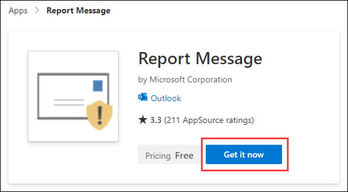
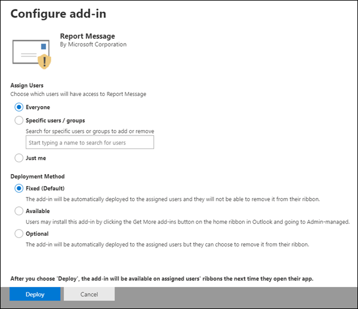

# Enable the Report Message add-in

> [!NOTE]
> If you're an admin in a Microsoft 365 organization with Exchange Online mailboxes, we recommend that you use the Submissions portal in the Security & Compliance Center. For more information, see [Use Admin Submission to submit suspected spam, phish, URLs, and files to Microsoft](admin-submission.md).

The Report Message add-in for Outlook and Outlook on the web (formerly known as Outlook Web App) enables people to easily report false positives (good email marked as bad) or false negatives (bad email allowed) to Microsoft and its affiliates for analysis. Microsoft uses these submissions to improve the effectiveness of email protection technologies.

For example, suppose that people are reporting a lot of messages as phishing. This information surfaces in the [Security Dashboard](security-dashboard.md) and other reports. Your organization's security team can use this information as an indication that anti-phishing policies might need to be updated. Or, if people are reporting a lot of messages that were flagged as junk mail as Not Junk by using the Report Message add-in, your organization's security team might need to adjust [anti-spam policies](configure-your-spam-filter-policies.md).

In addition, if your organization is using [Office 365 Advanced Threat Protection Plan 1](office-365-atp.md) or [Plan 2](office-365-ti.md), the Report Message add-in provides your organization's security team with useful information they can use to review and update security policies.

Admins can enable the Report Message add-in for the organization, and individual users can install it for themselves.

If you're an individual user, you can [enable the Report Message add-in for yourself](#get-the-report-message-add-in-for-yourself).

If you're a global administrator or an Exchange Online administrator, and Exchange is configured to use OAuth authentication, you can [enable the Report Message add-in for your organization](#get-and-enable-the-report-message-add-in-for-your-organization). The Report Message Add-In is now available through [Centralized Deployment](https://docs.microsoft.com/microsoft-365/admin/manage/centralized-deployment-of-add-ins).

## What do you need to know before you begin?

- The Report Message add-in works with most Microsoft 365 subscriptions and the following products:

  - Outlook on the web
  - Outlook 2013 SP1 or later
  - Outlook 2016 for Mac
  - Outlook included with Microsoft 365 apps for Enterprise

- The Report Message add-in is not available for mailboxes in on-premises Exchange organizations.

- You can configure reported messages to be copied or redirected to a mailbox that you specify. For more information, see [Specify a mailbox for user submissions of spam and phishing messages in Exchange Online](user-submission.md).

- Your existing web browser should work with the Report Message add-in. But, if you notice the add-in is not available or not working as expected, try a different browser.

- For organizational installs, the organization needs to be configured to use OAuth authentication. For more information, see [Determine if Centralized Deployment of add-ins works for your organization](../../admin/manage/centralized-deployment-of-add-ins.md).

- Admins need to be a member of the Global admins role group. For more information, see [Permissions in the Security & Compliance Center](permissions-in-the-security-and-compliance-center.md).

## Get the Report Message add-in for yourself

1. Go to the Microsoft AppSource at <https://appsource.microsoft.com/marketplace/apps> and search for the Report Message add-in. To go directly to the Report Message add-in, go to <https://appsource.microsoft.com/product/office/wa104381180>.

2. Click **GET IT NOW**.

   

3. In the dialog that appears, review the terms of use and privacy policy, and then click **Continue**.

4. Sign in using your work or school account (for business use) or your Microsoft account (for personal use).

After the add-in is installed and enabled, you'll see the following icons:

- In Outlook, the icon looks like this:

  

- In Outlook on the web, the icon looks like this:

  

To learn how to use the add-in, see [Use the Report Message add-in](https://support.microsoft.com/office/b5caa9f1-cdf3-4443-af8c-ff724ea719d2).

## Get and enable the Report Message add-in for your organization

> [!NOTE]
> It could take up to 12 hours for the add-in to appear in your organization.

1. In the Microsoft 365 admin center, go to the **Services & add-ins** page at <https://admin.microsoft.com/AdminPortal/Home#/Settings/ServicesAndAddIns>, and then click **Deploy Add-In**.

   

2. In the **Deploy a new add-in** flyout that appears, review the information, and then click **Next**.

3. On the next page, click **Choose from the Store**.

   

4. In the **Select add-in** page that appears, click in the **Search** box, enter **Report Message**, and then click **Search** . In the list of results, find **Report Message** and then click **Add**.

   

5. In the dialog that appears, review the licensing and privacy information, and then click **Continue**.

6. In the **Configure add-in** page that appears, configure the following settings:

   - **Assigned users**: Select one of the following values:

     - **Everyone** (default)
     - **Specific users / groups**
     - **Just me**

   - **Deployment method**: Select one of the following values:

     - **Fixed (Default)**: The add-in is automatically deployed to the specified users and they can't remove it.
     - **Available**: Users can install the add-in at **Home** \> **Get add-ins** \> **Admin-managed**.
     - **Optional**: The add-in is automatically deployed to the specified users, but they can choose to remove it.

   

   When you're finished, click **Deploy**.

7. In the **Deploy Report Message** page that appears, you'll see a progress report followed by a confirmation that the add-in was deployed. After you read the information, click **Next**.

   

8. On the **Announce add-in** page that appears, review the information, and then click **Close**.

   

## Learn how to use the Report Message add-in

People who have the add-in assigned to them will see the following icons:

- In Outlook, the icon looks like this:

  

- In Outlook on the web, the icon looks like this:

  

When you notify users about the Report Message add-in, include a link to [Use the Report Message add-in](https://support.microsoft.com/office/b5caa9f1-cdf3-4443-af8c-ff724ea719d2).

## Review or edit settings for the Report Message add-in

1. In the Microsoft 365 admin center, go to the **Services & add-ins** page at <https://admin.microsoft.com/AdminPortal/Home#/Settings/ServicesAndAddIns>.

   

2. Find and select the **Report Message** add-in.

3. In the **Edit Report Message** flyout that appears, review and edit settings as appropriate for your organization. When you're finished, click **Save**.

   

## View and review reported messages

To review messages that users report to Microsoft, you have these options:

- Use the Admin Submissions portal. For more information, see [View user submissions to Microsoft](admin-submission.md#view-user-submissions-to-microsoft).

- Create a mail flow rule (also known as a transport rule) to send copies of reported messages. For instructions, see [Use mail flow rules to see what your users are reporting to Microsoft](use-mail-flow-rules-to-see-what-your-users-are-reporting-to-microsoft.md).
