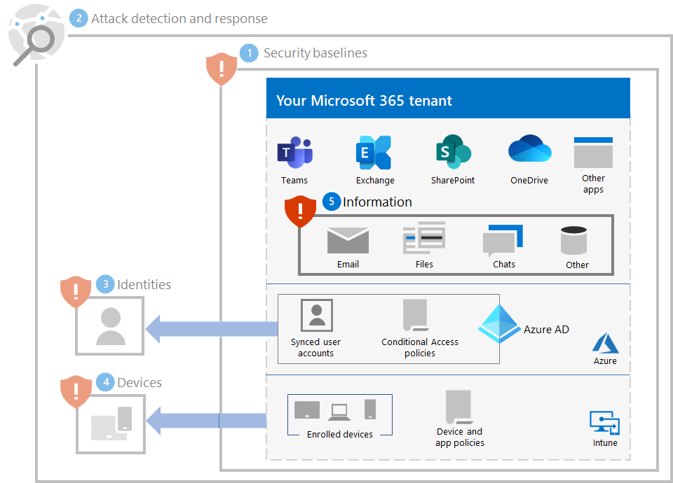

# Step 5. Protect information

Because ransomware attackers will also look at your on-premises data on file, database, and other types of servers, one of the best ways to protect that data is to migrate it to your Microsoft 365 tenant. Once there, it can be protected by built-in mitigation and recovery features such as versioning, recycle bin, and the Preservation Hold library.

Providing additional protection your ransomable information in your Microsoft 365 tenant consists of:

- Locating the ransomable information.
- Implementing tight permissions and eliminating broad access (for example, too many users having write, edit, and delete abilities).
- Protecting your ransomable information.

## Locate your ransomable information

The first task is to identify the types and locations of ransomable information in your tenant, which can include the following types:

- Sensitive
- Proprietary or intellectual property
- Regulated, such 
- IT recovery plans

For each type of ransomable information, determine the following:

- The use of the information to your organization
- A relative measure of its monetary value if it were held for ransom (such as high, medium, low)
- Its current location, such as a OneDrive or SharePoint folder or collaboration venue such as a Microsoft Teams team
- The current permissions, which consist of:

   - The user accounts who have access to it

   - The actions that are allowed to each account that has access to it

## Implement tight permissions for locations with ransomable information

Using tight permissions within your Microsoft 365 tenant is the "only those that need to know" principle for locations and communications venues, which in Microsoft 365 are typically OneDrive folders, SharePoint sites and folders, and teams. 

While it is easier to create file storage locations or Teams with broad permissions (such as the default of everyone in your organization), for ransomable information, the user accounts that are permitted and the actions that are allowed must be confined to the minimum set required to meet collaboration and business requirements.

Once a ransomware attacker has infiltrated your tenant, they try to escalate their privileges by compromising the credentials of user accounts with wider scope of permissions across your tenant, such as administrator role accounts or user accounts that have access to ransomable information. 

Based on this typical attacker behavior, there are two levels of difficulty for the attacker:

- **Low:** An attacker can use a low-permission account and discover your ransomable information because of broad access throughout your tenant.
- **Higher:** An attacker can't use a low-permission account and discover your ransomable information because of tight permissions. They must escalate their permissions by determining and then compromising the credentials of an account that has access to a location with ransomable information, but then may only be able to do a limited set of actions.

For ransomable information, you must make the level of difficulty as high as you can.

You can ensure tight permissions in your tenant with these steps:

1. From the effort to locate your ransomable information, review the permissions for the locations of ransomable information. 
2. Implement the minimum permissions for the ransomable information while meeting collaboration and business requirements and inform the users that are affected.
3. Perform change management for your users so that future locations for ransomable information are created and maintained with the minimum permissions.
4. Audit and monitor the locations for ransomable information to ensure that broad permissions aren't being granted.

An example of a communication and collaboration venue with minimal permissions for sensitive information is a [team with security isolation](/microsoft-365/solutions/secure-teams-security-isolation).

## Protect your ransomable information

To protect your ransomable information in case a ransomware attacker has access to it:

- Designate [Protected Folders](/en-us/windows/security/threat-protection/microsoft-defender-atp/controlled-folders) to make it more difficult for unauthorized applications to modify the data in these folders.

- Implement [controlled folder access](https://support.microsoft.com/en-us/topic/ransomware-protection-in-windows-security-445039d6-537a-488a-ad53-48906f346363) to help prevent files from being altered or encrypted by ransomware. See [Set controlled folder access to Enabled or Audit mode](https://docs.microsoft.com/en-us/microsoft-365/security/defender-endpoint/enable-controlled-folders?view=o365-worldwide).

- Use [Microsoft Information Protection](/microsoft-365/compliance/information-protection) and sensitivity labels and apply them to ransomable information. Sensitivity labels can be configured for additional encryption and permissions with defined user accounts and allowed actions. A file labeled with this type of sensitivity label that is exfiltrated from your tenant will only be useable to a user account defined in the permissions.

- Use Microsoft 365 [Data Loss Prevention (DLP)](/microsoft-365/compliance/dlp-learn-about-dlp) to detect, warn, and block risky, inadvertent, or inappropriate sharing of data containing personal or confidential information based on sensitivity labels, both internally and externally.

- Use [Microsoft Cloud App Security](/cloud-app-security/what-is-cloud-app-security) to block downloads of sensitive information such as files. 

- Back up important files regularly. Use the 3-2-1 rule. Keep three backups of your data, on two different storage types, and at least one backup offsite.

## Impact on users and change management

For the protection of ransomable information in your Microsoft 365 tenant:

- Train your users to create communication and collaboration venues with the minimum set of user accounts for access and the minimal allowed actions for each. 
- Administrative changes to broad permissions can lead to users being denied access or being unable to execute some actions.
- Train your users to apply the proper sensitivity labels to ransomable information.
- Train your users to use Protected Folders and controlled folder access.

## Resulting configuration

Here is the ransomware protection for your tenant after this final step.

