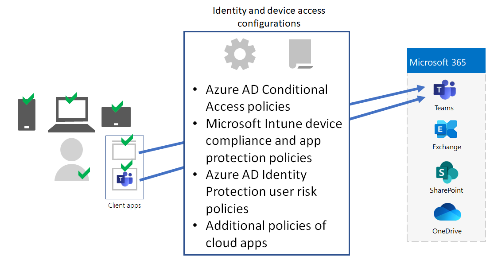
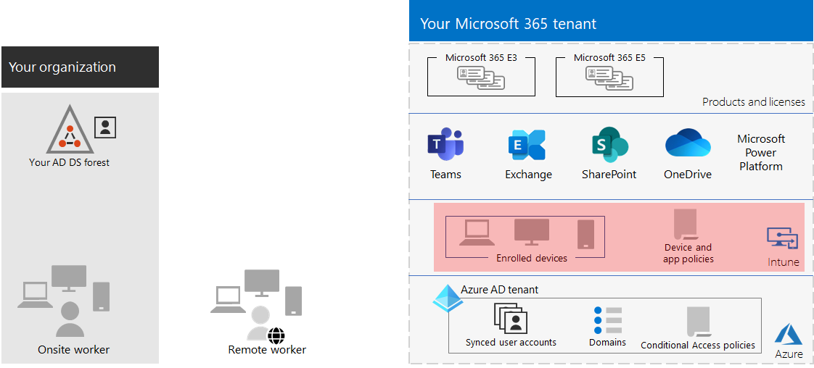

# Step 5. Device and app management for your Microsoft 365 for enterprise tenants

Microsoft 365 for enterprise includes features to help manage devices and the use of apps on those devices within your organization with mobile device management (MDM) and mobile application management (MAM). You can manage iOS, Android, macOS, and Windows devices to protect access to your organization's resources, including your data. For example, you can prevent emails from being sent to people outside your organization or isolate organization data from personal data on your worker's personal devices.

Here is an example of the validation and management of users, their devices, and their use of local and cloud productivity apps like Microsoft Teams.

To help you secure and protect your organization's resources, Microsoft 365 for enterprise includes features to help manage devices and their access to apps. There are two options for device management:

- Microsoft Intune, which is a comprehensive device and app management solution for enterprises.
- Basic Mobility and Security, which is a subset of Intune services included with all Microsoft 365 products for managing devices in your organization. For more information, see [Capabilities of Basic Mobility and Security](https://docs.microsoft.com/microsoft-365/admin/basic-mobility-security/capabilities).

If you have Microsoft 365 E3 or E5, you should use Intune.

## Microsoft Intune

You use [Microsoft Intune](https://docs.microsoft.com/mem/intune/fundamentals/planning-guide) to manage access to your organization using MDM or MAM. MDM is when users "enroll" their devices in Intune. After a device is enrolled, it is a managed device and can receive your organization's  policies, rules, and settings. For example, you can install specific apps, create a password policy, install a VPN connection, and more.

Users with their own personal devices may not want to enroll their devices or be managed by Intune and your organization's policies. But you still need to protect your organization's resources and data. In this scenario, you can protect your apps using MAM. For example, you can use an MAM policy that requires a user to enter a PIN when accessing SharePoint on the device.

You'll also determine how you're going to manage personal devices and organization-owned devices. You might want to treat devices differently, depending on their uses.

## Identity and device access configurations

Microsoft provides a set of configurations for [identity and device access](../security/defender-365-security/microsoft-365-policies-configurations.md) to ensure a secure and productive workforce. These configurations include the use of:

- Azure AD Conditional Access policies
- Microsoft Intune device compliance and app protection policies
- Azure AD Identity Protection user risk policies
- Additional policies of cloud apps

Here is an example of the application of these settings and policies to validate and restrict users, their devices, and their use of local and cloud productivity apps like Microsoft Teams.

For device access and app management, use the configurations in these articles:

- [Prerequisites](../security/defender-365-security/identity-access-prerequisites.md)
- [Common identity and device access policies](../security/defender-365-security/identity-access-policies.md)

## Results of Step 5

For device and app management for your Microsoft 365 tenant, you have determined the Intune settings and policies to validate and restrict users, their devices, and their use of local and cloud productivity apps.

Here is an example of a tenant with Intune device and app management with the new elements highlighted.

In this illustration, the tenant has:

- Organization-owned devices enrolled in Intune.
- Intune device and app policies for enrolled and personal devices.

## Ongoing maintenance for device and app management

On an ongoing basis, you might need to: 

- Manage device enrollment.
- Revise your settings and policies for additional apps, devices, and security requirements.
