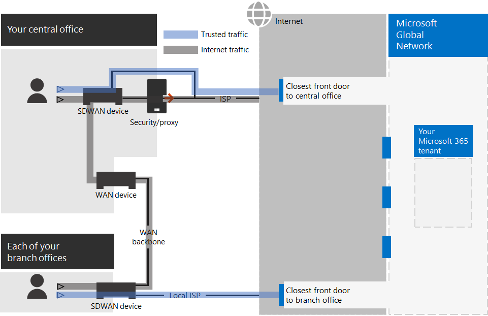

# Optimal networking for your Microsoft 365 for enterprise tenancies

## Enterprise on-premises workers

For enterprise networks, you should optimize the end user experience by enabling the least restrictive access between clients and the closest Microsoft 365 endpoints. The quality of end user experience is directly related to the performance and responsiveness of the application that the user is using. For example, Microsoft Teams relies on low latency so that user phone calls, conferences and shared screen collaborations are glitch-free, and Outlook relies on great networking connectivity for instant search features that leverage server-side indexing and AI capabilities.

The primary goal in the network design should be to minimize latency by reducing the round-trip time (RTT) from client machines to the Microsoft Global Network, Microsoft's public network backbone that interconnects all of Microsoft's datacenters with low latency, high availability cloud application entry points spread around the world.

Here is an example of a traditional enterprise network.

Here are the problems with this configuration for Microsoft 365 cloud services:

- Traffic gets sent to non-local front doors, increasing latency.
- Network hairpins perform duplicate packet processing for trusted traffic, increasing latency.
- Network edge devices perform unneeded and duplicate packet processing on trusted traffic, increasing latency.

Optimizing Microsoft 365 network performance doesn't need to be complicated. You can get the best possible performance by following a few key principles:

- Identify Microsoft 365 network traffic, which is trusted traffic bound to Microsoft cloud services.
- Allow local branch egress of Microsoft 365 network traffic to the internet from each location where users connect to Microsoft 365.
- Avoid network hairpins.
- Allow Microsoft 365 traffic to bypass proxies and packet inspection devices.

If you implement these principles, you get an enterprise network optimized for Microsoft 365.

Here's are how this configuration solves the latency issues of a traditional enterprise network:

- Traffic skips the WAN backbone and is sent to local front doors for all offices, decreasing latency.
- Network hairpins that perform duplicate packet processing are skipped for Microsoft 365 trusted traffic, decreasing latency.
- Network edge devices that perform unneeded and duplicate packet processing are skipped for trusted traffic, decreasing latency.

For more information, see [Microsoft 365 network connectivity overview](../enterprise/microsoft-365-networking-overview.md).

## Remote workers

If your remote workers are using a traditional VPN client to obtain remote access to your organization network, verify that the VPN client has split tunneling support. Without split tunneling, all of your remote work traffic gets sent across the VPN connection, where it must be forwarded to your organization’s edge devices, get processed, and then sent on the Internet. Here is an example.

Microsoft 365 traffic must take an indirect route through your organization, which could be the forwarded to a Microsoft network entry point far away from the VPN client’s physical location. This indirect path adds latency to the network traffic and decreases overall performance. 

With split tunneling, you can configure your VPN client to exclude specific types of traffic from being sent over the VPN connection to the organization network.

To optimize access to Microsoft 365 cloud resources, configure your split tunneling VPN clients to exclude traffic to the **Optimize** category Microsoft 365 endpoints over the VPN connection. For more information, see [Office 365 endpoint categories](../enterprise/microsoft-365-network-connectivity-principles#new-office-365-endpoint-categories). See [the lists](../microsoft-365/enterprise/microsoft-365-vpn-implement-split-tunnel#implement-vpn-split-tunneling) of Optimize category endpoints.

Here is the resulting traffic flow for split tunneling, in which most of the traffic to Microsoft 365 cloud apps bypass the VPN connection.

This allows the VPN client to send and receive crucial Microsoft 365 cloud service traffic directly over the Internet and to the nearest entry point into the Microsoft network.

For more information and guidance, see [Optimize Office 365 connectivity for remote users using VPN split tunneling](../microsoft-365/enterprise/microsoft-365-vpn-split-tunnel?).

## Using Network Insights

Kelley: Can you please flesh out this section?

## SPO performance with the Office 365 CDN

Kelley: Can you please flesh out this section?

## Automated endpoint listing

Kelley: Can you please flesh out this section?

## Next step

Continue with [identity](tenant-management-identity.md) to synchronize your on-premises accounts and groups and enforce secure user sign-ins.
