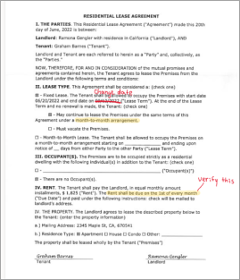
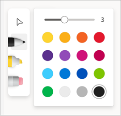

# Comment and collaborate using annotations in Microsoft Syntex

:::row:::
   :::column span="":::
      Use the annotations feature in Microsoft Syntex to add notes and comments to your content in document libraries—either for yourself or for collaborating with others. You can use the annotations feature without modifying the original files, so the original records are preserved.

      Annotation tools currently include pen and highlighter, where can choose the colors you want to use, and an eraser for removing ink strokes and previous annotations.
   :::column-end:::
   :::column span="":::
      
   :::column-end:::
:::row-end:::

The feature is currently available for the following file types: .ai, .dwg, .epub, .pdf, .rtf, and .tiff.

More annotation tools and file types will be added in future releases.

> [!NOTE]
> This feature is available for users who have Syntex per-user or pay-as-you-go licensing.

## To use annotations

1. From a SharePoint document library, open the file you want to annotate.

    

2. On the upper-right side of the document viewer, select **Annotate**.

    

3. On the left side of the document viewer, select the annotation tool you want to use.

    

4. To change the color or thickness or the pen or highlighter, double-tap the tool to show the color palette options.

    

5. After you annotate a page, you can hide or display the notations by selecting the annotations icon. Other users can also add to, hide, or display any notations that have been added by selecting the annotations icon.

    > [!NOTE]
    >  Annotations do not alter or modify the original document. They are added only as an overlay to the page.

6. If needed, you can also use the zoom and rotate page options when you view annotations.

    
