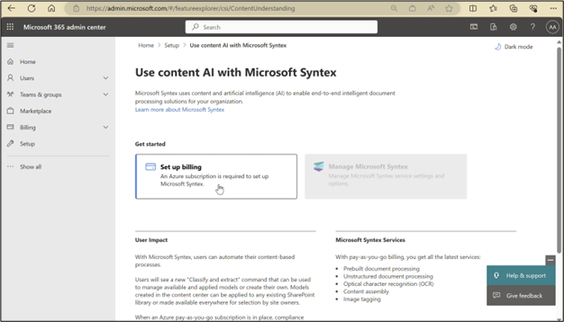
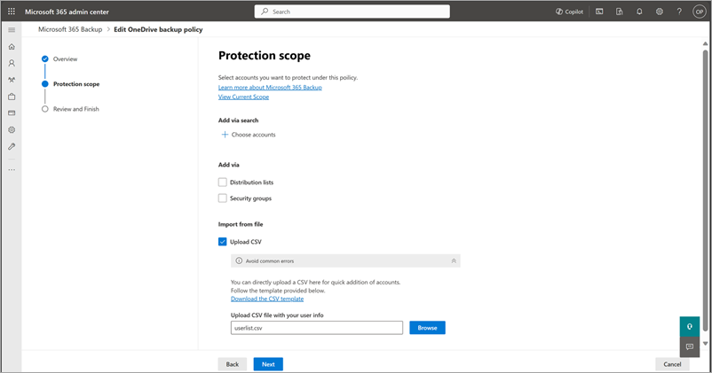

# Set up Microsoft 365 Backup (Preview)

> [!NOTE]
> This feature is currently in preview and subject to change.

Get started with Microsoft 365 Backup by following the simple three steps in the Microsoft 365 admin center.

<!---<insert how-to Affirma video   – https://aka.ms/M365Backup-how-to-video> --->

## Prerequisites

### Set up pay-as-you-go billing

As a first step to sign up for Microsoft 365 Backup, you should first link an Azure subscription in [Syntex pay-as-you-go](https://admin.microsoft.com/Adminportal/Home#/featureexplorer/csi/ContentUnderstanding), if you have not already done so. Although Microsoft 365 Backup is not part of the Syntex product suite, this offering is still leveraging the Syntex billing setup for consistency with other Microsoft 365 pay-as-you-go offerings.

1. Go to the [Microsoft 365 admin center](https://admin.microsoft.com/Adminportal/Home).

2. Select **Setup**.

3. On the **Setup** page, in the **Files and content** section, select **Use content AI with Microsoft Syntex**.

4. On the **Use content AI with Microsoft Syntex** page, select **Set up billing**.

    

> [!NOTE]
> To set up pay-as-you-go billing for Microsoft 365 Backup, the admin must have an owner or contribution role on the Azure subscription to be used.

5. If you do not have an Azure subscription or resource group, follow these steps. If you have an Azure subscription and resource group, skip this step and go to step 6.

    

    a. To create a new Azure subscription, on the **Set up pay-as-you-go billing** panel, select **Learn more about Azure subscriptions**. Alternatively, you can follow the steps in [Create your initial Azure subscriptions](https://learn.microsoft.com/azure/cloud-adoption-framework/ready/azure-best-practices/initial-subscriptions).

    b. To create a new Azure resource group, on the **Set up pay-as-you-go billing** panel,select **Learn more about Azure resource groups**. Alternatively, you can follow the steps in [Manage Azure resource groups by using the Azure portal](https://learn.microsoft.com/azure/azure-resource-manager/management/manage-resource-groups-portal) to create a resource group. Note that the resource group should be within the Azure subscription.

    c. After you create an Azure subscription with owner or contributor role, you will need to have a resource group created.

6. If you have an Azure subscription, select the subscription from the drop-down menu.

    

To enable pay-as-you-go billing at Syntex billing, follow the steps in [Configure Microsoft Syntex for pay-as-you-go billing](../syntex-azure-billing.md).

### Permissions

You must have Global admin or SharePoint admin permissions to access the Microsoft 365 admin center and set up Microsoft 365 Backup.

### Enable Microsoft 365 Backup

To enable Microsoft 365 Backup, you will need to go to the Microsoft 365 admin center.

1. Go to the [Microsoft 365 admin center](https://admin.microsoft.com/Adminportal/Home).

2. Select **Setup**.

3. On the **Setup** page, in the **Files and content** section, select **Use content AI with Microsoft Syntex**.

4. On the **Use content AI with Microsoft Syntex** page, select **Manage Microsoft Syntex**.

5. From the list of products, select **Backup Preview**.

6. By default, the feature will be turned off. Select **Turn on** to enable Microsoft 365 Backup for your organization.

7. Review the applicable [terms of service for Microsoft 365 Backup](backup-preview-terms.md) and select **Confirm**.

    

8. Select **Go to Microsoft 365 Backup** to start setting up Microsoft 365 Backup on OneDrive, SharePoint, or Exchange.

    

## Admin roles and backup management privileges

Only tenant-level admins can create and manage backups using Microsoft 365 Backup for their users. End users do not have the ability to enable backup or restores for their user account, distribution lists, mailboxes, or sites. It’s important to note that your admin role will determine which products you can manage with Microsoft 365 Backup. In the future, we might introduce a Backup admin role that can control the entire tool.

|Admin role  |OneDrive  |SharePoint  |Exchange  |
|---------|---------|---------|---------|
|Global admin     | X        | X        | X       |
|SharePoint admin     | X        | X        |         |
|Exchange admin (export/import role is also required for Exchange item-level restore actions)    |         |         | X        |

## Glossary

- **Protection units** – SharePoint sites, OneDrive accounts, or Exchange Online mailboxes backed up by the Microsoft 365 Backup tool.

- **Restore point** – A prior point in time from which you can restore a version of your content and metadata. If the protection unit from a prior point in time is identical to the present state of your data, then a restore from that point will have no impact on your current data.

- **RPO** – Recovery point objective, or how close in time the most recent restore point is to an impacting event.

- **RTO** – Recovery time objective, or how fast a restore to a prior point in time can complete.

- **EXO** – Exchange Online

- **SPO** – SharePoint Online

- **ODB** – OneDrive for Business accounts

## Set up backup policies

If you want to use Microsoft 365 Backup for OneDrive, Exchange, and SharePoint, you need to create a *policy* for each product. A policy represents the backup plan defined by admins for protecting the Micorsoft 365 data of an organization. It contains details of what data (SharePoint sites, OneDrive accounts, and Exchange mailboxes) to protect. Although you’ll see the retention period and backup frequency (which defines the restore point objective), those settings are not currently variable or modifiable.

### To set up a backup policy in Microsoft 365 Backup

Set up OneDrive Backup policy

Follow these steps to set up backup on OneDrive using Microsoft 365 Backup.

1. Go to the [Microsoft 365 admin center](https://admin.microsoft.com/Adminportal/Home).

2. Select **Settings**.

3. Select **Microsoft 365 Backup** from the list of products.

4. On the **Microsoft 365 Backup** page, in the **OneDrive** section, select **Set up policy**.

    

5. On the **Overview** page, review the backup features for OneDrive, and then select **Next**.

    

6. On the **Protection scope** page, you can set up OneDrive user accounts using any or all three ways. A protection scope is the scope of user accounts within OneDrive that you want to protect with Microsoft 365 Backup.

    

    a. Under **Add via search**, select **Choose accounts** to see user accounts that can be added via search. On the **Search and select accounts** panel, select the accounts you want to add to the policy.

    

    b. Under **Add via**, select **Distribution lists** or **Security groups**, or both. Note that the distribution list and security group is flattened when added, meaning the policy will not update dynamically if the groups or distribution list are updated later.

    

    - Under **Import from file**, select **Upload CSV** to import user account details via CSV upload.

    

7. The backup policy for OneDrive is created.

    

Screenshot 3 Select 'Set up policy' to create backup policy for OneDrive
 
Screenshot 4 Overview page with details of backup frequency, retention period, cost details
 
Screenshot 5 Create the protection scope using one of the three options to add OneDrive accounts to backup
 
Screenshot 6 Option 1: Add OneDrive accounts to backup via user account search
 
Screenshot 7 Option 2: Add OneDrive accounts to backup via distribution lists and security group names
 
Screenshot 8 Option 3: Add OneDrive accounts via CSV
  
Screenshot 9 OneDrive backup policy successfully created

Set up SharePoint Backup policy

To set up backup sites using Microsoft 365 Backup, 
1.	Go to Microsoft Admin Center 
2.	Select ‘Settings’
3.	Select ‘Microsoft 365 Backup’ from the list of products
4.	Select ‘Set up policy’ under SharePoint
5.	Review backup features for SharePoint in the Overview page, 
6.	Now create your ‘Protection scope’ for SharePoint sites by choosing to back up individual sites or collection of sites. A protection scope is the scope of sites within SharePoint that you want to protect with Microsoft 365 Backup
a.	Create backup of individual sites or collection by searching for sites using ‘+Choose Sites’ or via rules or via CSV upload  
7.	Once you have made the right selection, select ‘next’ to create backup policy for SharePoint
 
Screenshot 10 Select SharePoint to set up backup policy for SharePoint
 Screenshot 11 Overview page with details of backup frequency, retention period, cost details
 
Screenshot 12 Three options of choosing SharePoint site(s) or site collection

 
Screenshot 13 Multiselect sites to backup
 
Screenshot 14 Import list of backup sites from a CSV 
 
Screenshot:15 Review and create SharePoint backup policy
 
Screenshot 16 Backup for selected SharePoint scope setup
Set up Exchange Backup policy
With Microsoft 365 Backup, you can backup users’ Exchange mailboxes. To set up a backup policy on Exchange Mailboxes: 
Prerequisite: Ensure M365 Backup is enabled for your tenant by following steps here   
1.	Login to Microsoft Admin center 
2.	Select Settings -> Microsoft 365 Backup 
3.	Select ‘Set up policy’ under Exchange
 
4.	An Overview page will show with details of backup policy attributes - backup frequency, backup retention, cost details, etc. Verify the details and select ‘Next‘.
 
Screenshot 17 Overview page with details of backup frequency, retention period, cost details
5.	Choose the scope of protection for this mailbox policy. Microsoft 365 Backup for Exchange will allow addition of mailboxes via
i.	User accounts that can be added via Search
ii.	Distribution list & Security groups – note that the distribution list and group is flattened when added, meaning the policy will not update dynamically if the groups or distribution list is updated later.
iii.	Import user account details via CSV upload

 
Screenshot 18 User mailboxes that can be added via Search
 

Screenshot 19 Mailboxes can be added searching for user accounts
 
Screenshot 20 Mailboxes can be added via distribution lists 
 
Screenshot 21 Mailboxes can be added via security groups
 
Screenshot 22 Import user account details via CSV upload

6.	Select ‘Next’ and review the details of your Exchange backup policy, then select ‘Create Policy’
 

 

7.	Wait for status of your policy to show as ‘Active’ in the home screen. This might take between 15 and 60 minutes. Backup policy is set up for Exchange. Select **View scope** to verify the details at any time.
