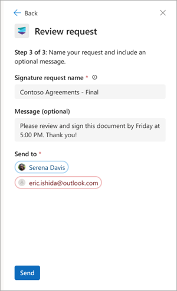

# Create a signature request using Microsoft Syntex eSignature

## Create a signature request

Use the following steps to start the Syntex eSignature process.

1. From a SharePoint document library, open the document for which you want to start the Syntex eSignature process.

2. In the document viewer, select **More options** (...), and then select **Get signatures**.

    

3. On the **Syntex eSignature** panel, add up to 10 internal or external recipients you want to sign the document, and then select **Next**.

    

4. To **specify where ti sign**, drag and drop the **Signature**, **Initials**, and **Date** fields to the appropriate locations in the document for each recipient. Each form field can be marked either as required or not required.

    

5. Select **Next** to progress to the next stage. At least one required signature field is needed for each recipient. Up to 50 fields (total) can be added to the document.

6. On the **Review request** panel, enter a title for the request, add an optional message, and review the details on the panel to make sure it's correct. Then select **Send**.

    

    Once sent, the status of the request is set to **In progress** and recipients are able to add their signatures.

## Cancel a signature request

If you create a signature request and want to cancel it, follow these steps.

1. From one of your email notifications, select **View Request**.

2. When the document is open in the document viewer, select **More options** (...), and then select **Cancel request**.

    

3. On the **Cancel signature request** confirmation screen, enter a message detailing why the request is canceled if needed, and then select **Yes, cancel**.

    

    Once canceled, the status of the request is set to **Canceled** and recipients receive an email notification telling them that the request was canceled and that no further action is possible on this request.

## Troubleshoot a signature request

### Unable to create a request

If you aren't able to create a signature request, check the PDF viewer settings or the collaboration settings.

#### PDF settings from the PDF viewer

The PDF viewer is opened by selecting a PDF file from SharePoint Online. The ability to request signatures won't be available if the PDF is viewed in any other way (for example, in Microsoft Edge). If  PDF files are opened in any other way, the **Get signatures** option isn't available.

#### Collaboration settings

Syntex eSignature is an extension of SharePoint document storage and management service. Therefore, all existing access, sharing, and data loss prevention policies that are already applied at the tenant level, SharePoint site and library level, or folder and file level might affect whether a request can be started from a document in SharePoint and who it can be sent to. Some of the scenarios that might affect the signature request process are:

- The document has a sensitivity label applied that restricts access or sharing. This event limits who can start signature request with that document or the recipients that it can be sent to, depending on the label settings and the user's role.

- The document is stored in a library or folder that has unique permissions or sharing settings. This event might override the default settings of the SharePoint site or tenant and either allow or block certain users from initiating or accessing an eSignature request with that document.

- Microsoft Entra collaboration settings restrict document sharing to specific individuals. This event limits who the requests can be sent to.

#### Conditional access policies
Certain [conditional access](https://learn.microsoft.com/entra/identity/conditional-access/overview) policies might determine whether an external recipient (signers outside of your organization or Microsoft 365 tenant) will be able sign a document. When this happens, the external signers might not be able to access the document for signing. In some other cases, they might be able to access the document for signing but the signing operation will be unsuccessful. One common way to resolve this is to contact your IT admin who will be able to add the eSignature app to the list of approved apps via the  Microsoft Entra admin center.

 

> [!div class="nextstepaction"]
> [Review and sign a request](esignature-review-sign-requests.md)
