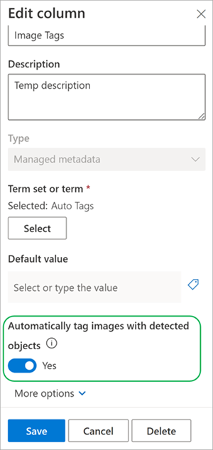
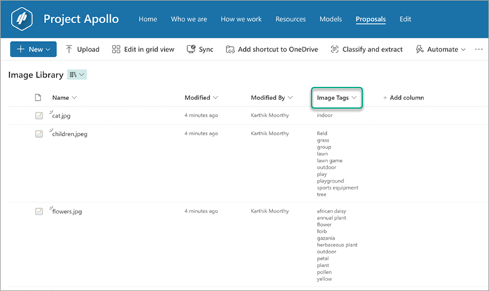

# Tag images in Microsoft Syntex

Microsoft Syntex makes it easier to find and manage images in SharePoint document libraries. It does this by automatically tagging images with descriptive keywords using AI. These keywords are stored in a managed metadata column (the **Image Tags** column), which makes it easier to search, sort, filter, and manage the images.

The image tagging feature makes it even easier to tag images without any training, thereby reducing the need for manual tagging or custom AI model building. This means you can quickly find images in your libraries and set up processes based on the tags for the images.

> [!NOTE]
> Syntex image tagger is available on a [pay-as-you-go basis](syntex-pay-as-you-go-services.md) and is not included in the Syntex seat license.

## To enable image tagging in a library

There are two methods you can use to enable image tagging in a document library:

- [Use an existing **Image Tags** column](#use-an-existing-image-tags-column)
- [Enable the **Image Tags** column](#enable-the-image-tags-column)

### Use an existing Image Tags column

If you already have an [**Image Tags** column in your library](https://support.microsoft.com/office/work-with-image-tags-in-a-sharepoint-library), use these steps to enable enhanced image tagging:

1. On the **Image Tags** column, select **Column settings**. 

2. On the **Edit column** panel, in the **Automatically tag images with detected objects** section, toggle the switch to **Yes**.

     
 
Once enabled, any new images uploaded to the library will be tagged with the descriptive keywords.

### Enable the Image Tags column

If you don't have an **Image Tags** column in your library, do these steps to enable enhanced image tagging:

1. From the document library, select **Automate** > **Enable image tagger**.

2. Enhanced image tagging is then activated. Images uploaded will be tagged with a set of descriptive keywords. The keywords will be available in the **Image Tags** column that will get added to the library view.

     

Once the **Image Tags** column is configured, you can upload images and the relevant tags will displayed in the library for each image.

     

### Release notes

- Supported image file types: .bmp, .png, .gif, .jpeg, .jpg, .tif, .tiff, .ari, .arw, .bay, .cap, .crw, .cr2, .cr3, .dcr, .dcs, .dng, .drf, .eip, .erf, .fff, .heic, .heif, .iiq, .kdc, k25, .mef, .mos, .mrw, .nef, .nrw, .orf, .pef, .ptx, .pxn, .raf, .raw, .rwl, .rw2, .sr2, .srf, .srw, .x3f, and .3fr.

- Time taken to reflect tags getting in the **Image Tags** column: Minimum: 5 minutes, maximum: 24 hours. 

- Existing image processing: Currently, existing images are not processed when image tagger is enabled. Any newly uploaded images will be processed for automatic image tagging.

- Responsible AI guidelines: Send us feedback on the image tagging quality. We will monitor it closely and take appropriate action based on the feedback.

<!---
> [!NOTE]
>  **Release notes**
> - Supported image file types: .bmp, .png, .gif, .jpeg, .jpg, .tif, .tiff, .ari, .arw, .bay, .cap, .crw, .cr2, .cr3, .dcr, .dcs, .dng, .drf, .eip, .erf, .fff, .heic, .heif, .iiq, .kdc, k25, .mef, .mos, .mrw, .nef, .nrw, .orf, .pef, .ptx, .pxn, .raf, .raw, .rwl, .rw2, .sr2, .srf, .srw, .x3f, and .3fr.
> - Time taken to reflect tags getting in the **Image Tags** column: Minimum: 5 minutes, maximum: 24 hours. 
> - Existing image processing: Currently, existing images are not processed when image tagger is enabled. Any newly uploaded images will be processed for automatic image tagging.
> - Responsible AI guidelines: You can send feedback to us on the image tagging quality. We will monitor it closely and take appropriate action based on the feedback.
--->