# Validate applications from your own Intune tenant

Many enterprises' IT departments have mentioned compatibility concerns after applications re-formatting during their migration to Intune. Others might be suffering to validate policy deployment before they reach the end users.

Test Base now provides an efficient way that allows you to validate your Intune applications in batch, or to set up even more complex automatic testing plans. This guidance shows you how to enroll the testing VM under your Intune tenant and set up your test plan with our upgraded testing service.

**In this article,**

- [Prerequisites](#Prerequisites)
- [Importing Intune Credential in Test Base](#Importing_Intune_Credentials)
- [Validate Intune app deployment against Windows monthly updates](#Validate_Intune_app)
- [Validate Intune app deployment before / after in-place upgrade to next version OS](#Validate_Intune_app_before)
- [Check Intune enrollment test results](#Check_Intune_enrollment)

### Prerequisites

1. [*Creating a Test Base Account | Microsoft Learn*](createaccount.md)
2. [*Grant Test Base managed identities to your Key Vault account*](https://aka.ms/testbase-doc-ManagedIdentity)
3. *Prepare your Intune tenant:*
    - *Disable MFA for new created account (Conditional access policy)*
    - *Enable Windows automatic enrollment*[*: Enable MDM automatic enrollment for Windows | Microsoft Learn*](/mem/intune/enrollment/windows-enroll#enable-windows-automatic-enrollment)
    - *Create dynamic group to include the new enrolled VM (Query: device.displayName -startsWith "exepipe")*
    - *Assign test apps and policies to newly created dynamic groups.*

### Importing Intune Credentials in Test Base

Security might be one of the top concerns when it comes to enrolling testing VM into your Intune tenant. Test Base provides a secure way for Intune account connection via managed identity.

**Attention:** Before importing Intune credentials, please make sure you or your organization administrators have already granted Test Base managed identities to your Key Vault account where you store the Intune credentials ([guidance](https://aka.ms/testbase-doc-ManagedIdentity)).

In this section, we show you how to

- [Store your Intune credentials in Azure key vault](#Store_your_Intune)
- [Import your credential secrets in Test Base](#Import_your_credential)

#### Store your Intune credentials in Azure key vault

1. Store your user account in Azure key vault **Secret**
   
    a. Select **Secrets** , select **Generate/Import**
    > [!div class="mx-imgBorder"]
    > [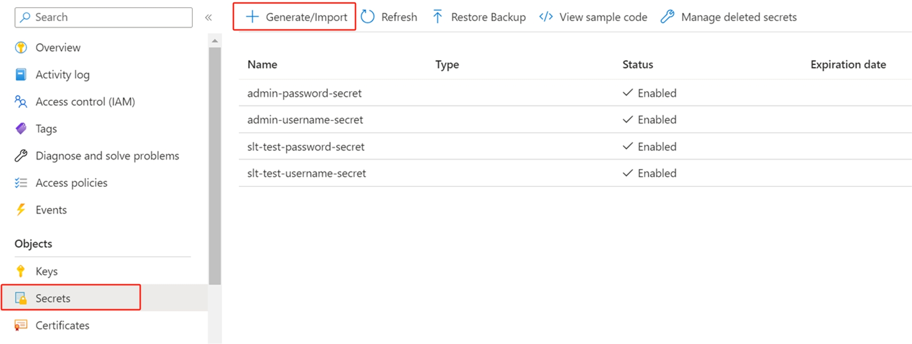](Media/import_intune_credentials_1.png#lightbox)
    
    b. Put your user account in the input box **Secret value**. Name the secret.
    > [!div class="mx-imgBorder"]
    > [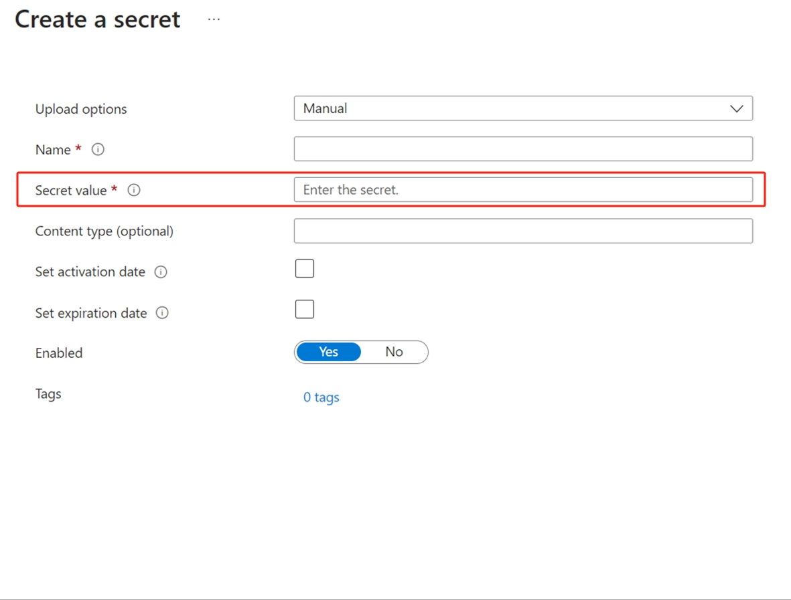](Media/import_intune_credentials_2.png#lightbox)
    
    c. Select **Create**

2. Store your password in Key vault **Secret**
    1. Select **Secrets** , select **Generate/Import**
    2. Put your password in the input box **Secret value**. Name the secret.
    3. Select **Create**

#### Import your credential secrets in Test Base

1. Select **Manage** | **Manage credentials**. Click on **+ New Intune Credentials**
    > [!div class="mx-imgBorder"]
    > [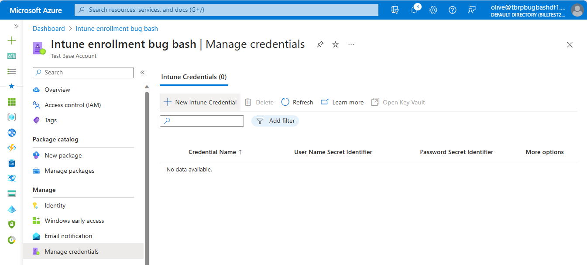](Media/import_intune_credentials_3.png#lightbox)

2. Name the new credential so that you can find it easily later.
3. Select Key Vault account and secrets where you stored Intune credentials.

    a. If you're the admin of both the Test Base account and the Key Vault account, you may easily select to input your key vault information **From Azure subscription**.
    > [!div class="mx-imgBorder"]
    > [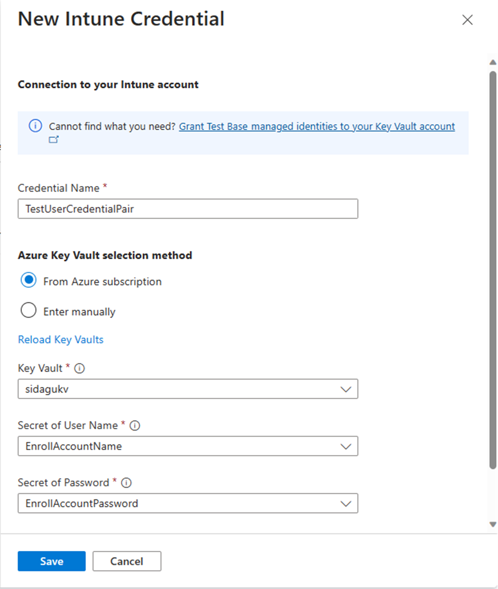](Media/import_intune_credentials_4.png#lightbox)

    >[!Note]
    >If you use the prepared testing account, please select the same value as shown on above image.

    b. If you don't have access to your tenant's Key Vault account, please select **Enter manually**. Paste the **username secret ID** and **password secret ID** into input box (You would need your colleague's help to get the secret IDs).
    > [!div class="mx-imgBorder"]
    > [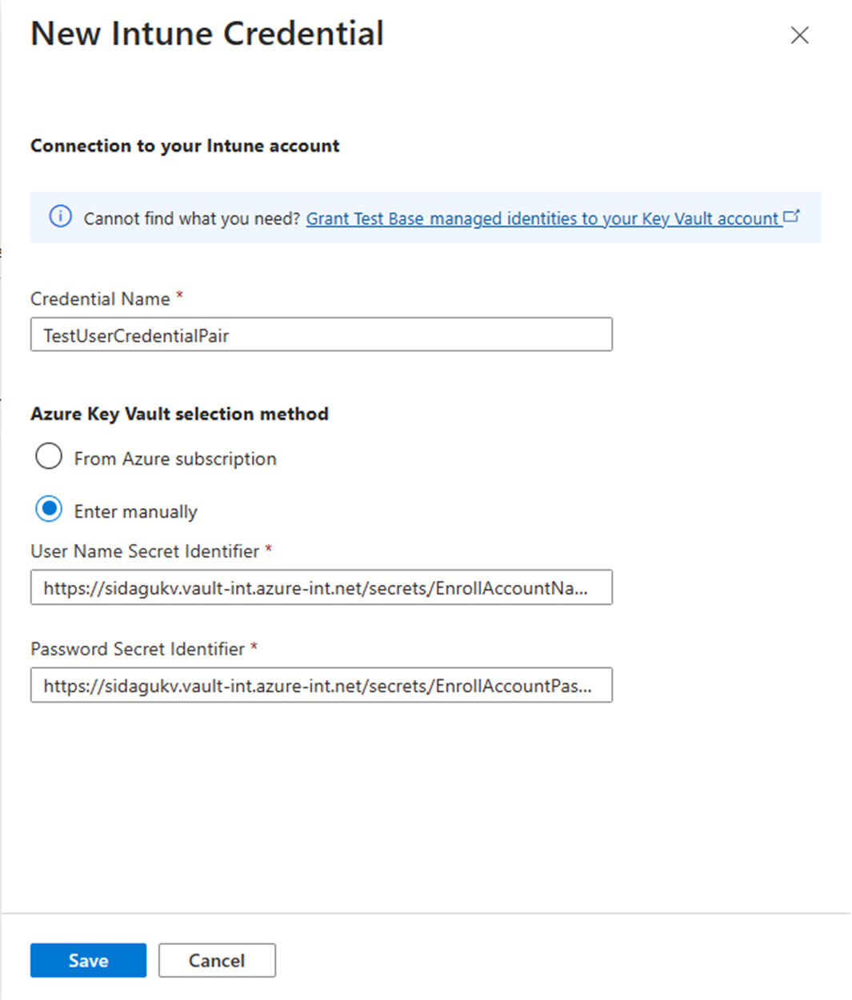](Media/import_intune_credentials_5.png#lightbox)

    Copy secret IDs from your Intune account: Open your key vault account \> Secrets \> Select the secret \> Select the version \> Copy secret identifier
    > [!div class="mx-imgBorder"]
    > [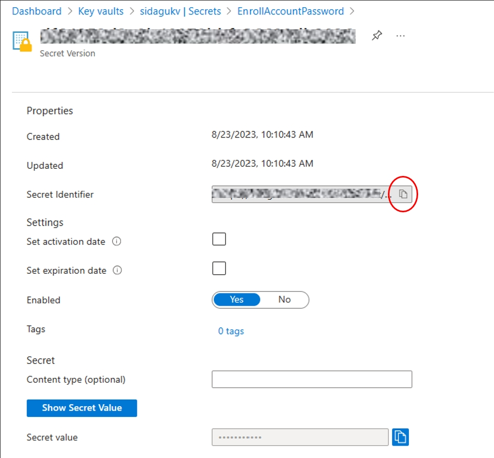](Media/import_intune_credentials_6.png#lightbox)

### Validate Intune app deployment against Windows monthly updates

In this section, you should follow the steps below to set up your tests:

- [Step 0: Start your package onboarding](#Start)
- [Step 1: Define content](#Define)
- [Step 2: Configure test](#Configure)
- [Step 3: Edit package](#Edit)
- [Step 4: Set test matrix](#Set)
- [Step 5: Review + Publish](#Review)

#### Step 0: Start your package onboarding

1. Log in into your Test Base account.
2. Click on menu **New package** \> **Enroll from Intune**.
    > [!div class="mx-imgBorder"]
    > 

#### Step 1: Define content

1. Create a new package with **Package source type** as **Enroll from Intune**.
2. Select credential pair. Or, click on **Add new credential**.
    *Reference:* [*Import your credential secrets in Test Base*](#Import_your_credential)

    > [!div class="mx-imgBorder"]
    > 

3. (Optional) Select application(s) to test against (Apps from your Intune account).

    a. Click on **Select application(s) from Intune**.
    > [!div class="mx-imgBorder"]
    > 

    b. Select application(s) to test against (Multi-selection available). Then, click on **Next: App Setting** to proceed.
    > [!div class="mx-imgBorder"]
    > 

    c. For each application selected, it's required to let the system know where to find the executable file. This is to automatically generate test scripts for you so that you can complete following steps easier.
    > [!div class="mx-imgBorder"]
    > 

    d. Click on **Save Selection**.
4. (Optional) If you have any testing scripts, dependency libraries, or other test app packages, you can click on **Select file** and upload them.
5. Input **Package name** and **Package version** so that you can track this group of tests easier in the result reports.

#### Step 2: Configure test

1. Select Functional as your Test type.
    > [!div class="mx-imgBorder"]
    > [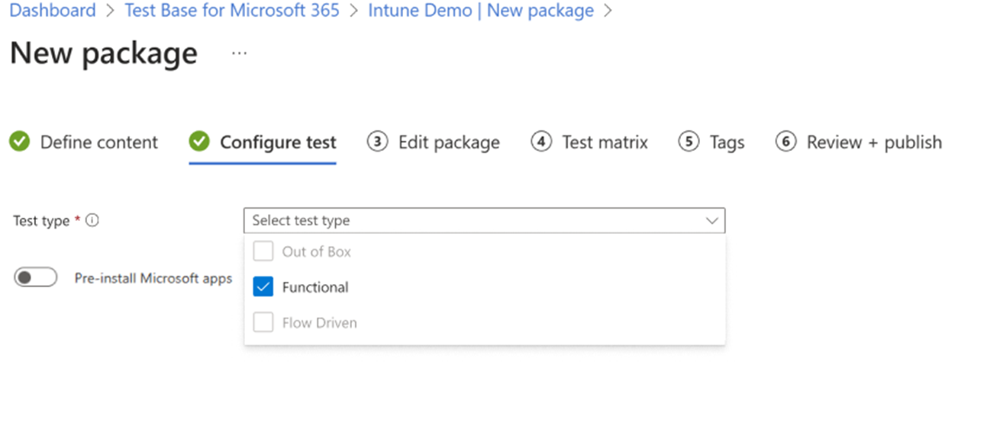](Media/import_intune_credentials_12.png#lightbox)

2. (Optional) Turn on the toggle Pre-install Microsoft apps if you want to set interoperability tests with other Microsoft first party application updates.

#### Step 3: Edit package

1. (Optional) System automatically generated launch / close scripts files. You may click the file and open Code editor to check if need to reorder the scripts.
2. Click on the Edit button to set up detailed test flow.
    > [!div class="mx-imgBorder"]
    > [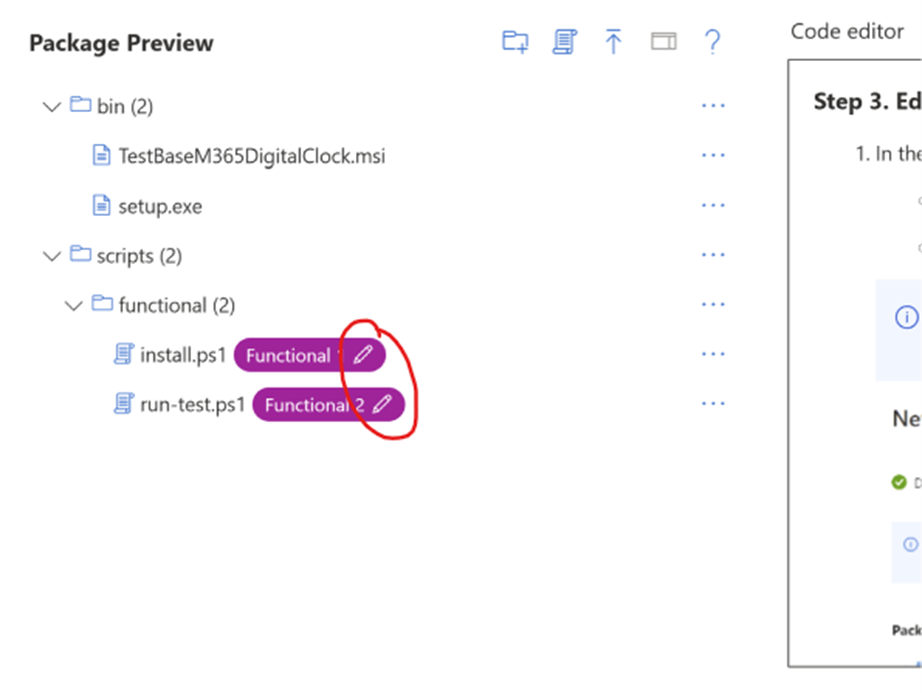](Media/import_intune_credentials_13.png#lightbox)

3. Define the script execution sequence.
    > [!div class="mx-imgBorder"]
    > 

4. Click on **Apply** to confirm setting

#### Step 4: Set test matrix

1. Select **Security update** as the OS update type
2. Select the OS(es) you'd like to set up scheduled tests for monthly updates.

#### Step 5: Review + Publish

1. Review the configuration.
2. Click to **Publish** the package.
    > [!div class="mx-imgBorder"]
    > [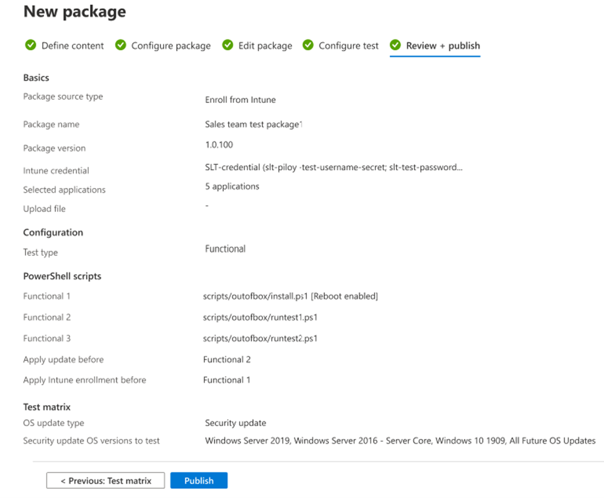](Media/import_intune_credentials_15.png#lightbox)

3. The first test is triggered immediately with the latest Windows update that you selected. It may take up-to 24 hours to complete the initial validation test. You can learn quickly if there is any compatibility issue or package setting issue.

    After that, your test will be automatically triggered when there is a new update depending on the update ring you selected.

4. You can track published package status or modify existing package via **Package catalog** | **Manage packages**.

### Validate Intune app deployment before / after in-place upgrade to next version OS

In this section, you should follow the steps below to set up your tests:

- [Step 0: Start your package onboarding](#Start_1)
- [Step 1: Define content](#Define_1)
- [Step 2: Configure test](#Configure_1)
- [Step 3: Edit package](#Edit_1)
- [Step 4: Set test matrix](#Set_1)
- [Step 5: Review + Publish](#Review_1)

#### Step 0: Start your package onboarding

1. Log in into your Test Base account.
2. Click on menu **New package** \> **Enroll from Intune**.
    > [!div class="mx-imgBorder"]
    > 

#### Step 1: Define content

1. Create a new package with **Package source type** as **Enroll from Intune**.
2. Select credential pair. Or, click on **Add new credential**.

    *Reference:* [*Import your credential secrets in Test Base*](#Import_your_credential)
    > [!div class="mx-imgBorder"]
    > 

3. (Optional) Select application(s) to test against (Apps from your Intune account).

    a. Click on **Select application(s) from Intune**.
    > [!div class="mx-imgBorder"]
    > 

    b. Select application(s) to test against (Multi-selection available). Then, click on **Next: App Setting** to proceed.

    > [!div class="mx-imgBorder"]
    > 

    c. For each application selected, it's required to let the system know where to find the executable file. This is to automatically generate test scripts for you so that you can complete following steps easier.
    > [!div class="mx-imgBorder"]
    > 

    d. Click on **Save Selection**.

4. (Optional) If you have any testing scripts or dependency libraries, you can click on **Select file** and upload them.
5. Input **Package name** and **Package version** so that you can track this group of tests easier in the result reports.

#### Step 2: Configure test

1. Select **Flow Driven** as your Test type.
    > [!div class="mx-imgBorder"]
    > [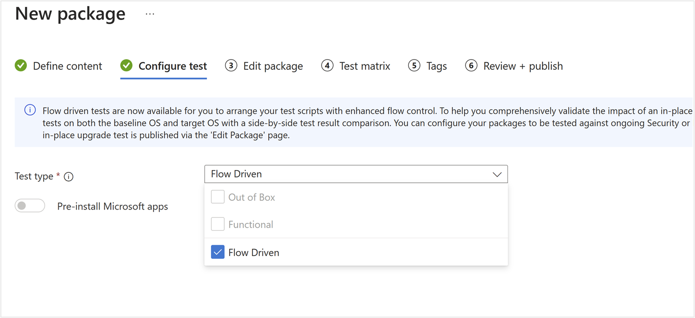](Media/import_intune_credentials_16.png#lightbox)

#### Step 3: Edit package

1. (Optional) System automatically generated launch / close scripts files. You may click the file and open Code editor to check if need to reorder the scripts.
2. Click on the Edit button to set up detailed test flow.
    > [!div class="mx-imgBorder"]
    > [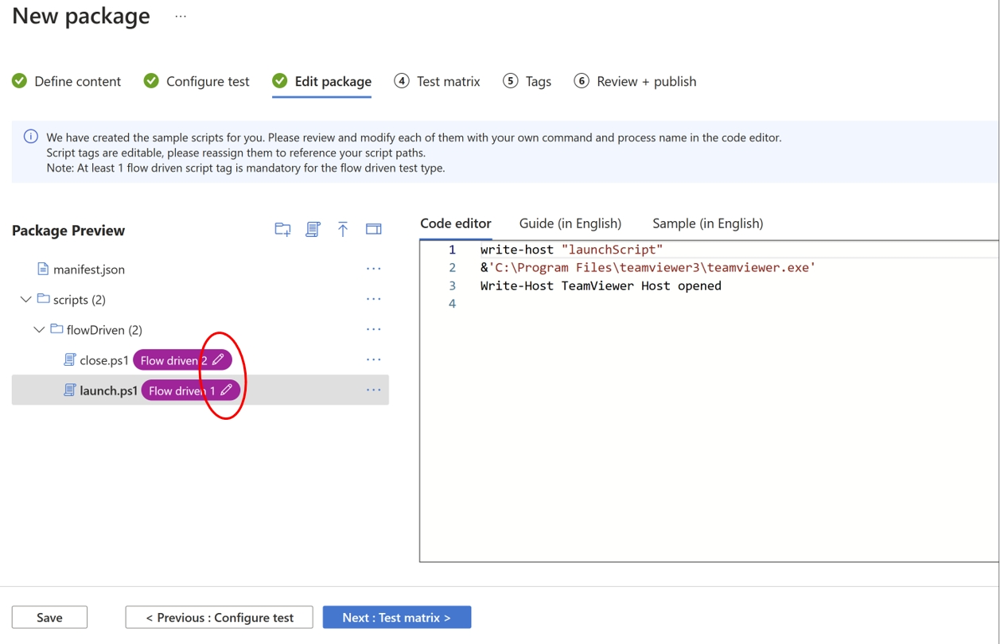](Media/import_intune_credentials_17.png#lightbox)

3. Define the script execution sequence.
    > [!div class="mx-imgBorder"]
    > 

4. Click on **Apply** to confirm setting

#### Step 4: Set test matrix

1. Select **Inplace upgrade** as the OS update type.
2. Select the baseline OS version and the target OS version.
    > [!div class="mx-imgBorder"]
    > [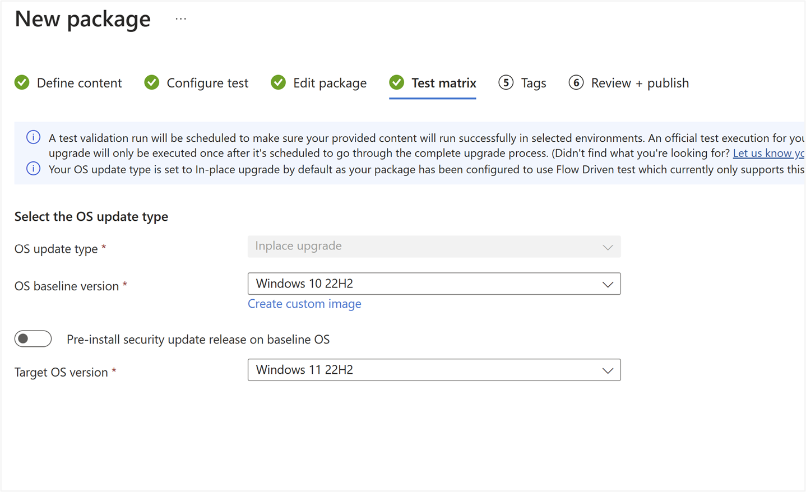](Media/import_intune_credentials_19.png#lightbox)

#### Step 5: Review + Publish

1. Review the configuration.
2. Click to **Publish** the package.
    > [!div class="mx-imgBorder"]
    > [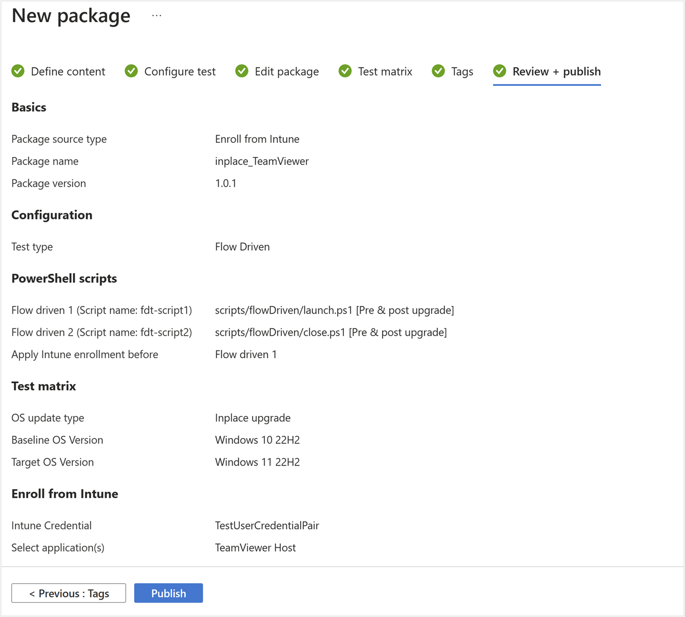](Media/import_intune_credentials_20.png#lightbox)

3. The first test is triggered immediately with the latest Windows update that you selected. It may take up-to 24 hours to complete the initial validation test. You can learn quickly if there is any compatibility issue or package setting issue.

    After that, your test will be automatically triggered when there is a new update depending on the update ring you selected.

4. You can track published package status or modify existing package via **Package catalog** | **Manage packages**.

### Check Intune enrollment test results

1. Find your package under navigation menu **Insights** \> **Test summary**.
2. Select the run, which you want to check. Click on **See details**. You may click to check execution log of each test script, or download log file package and videos for more test details.
    > [!div class="mx-imgBorder"]
    > [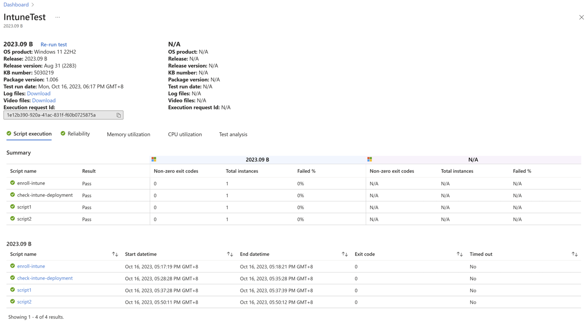](Media/import_intune_credentials_21.png#lightbox)

