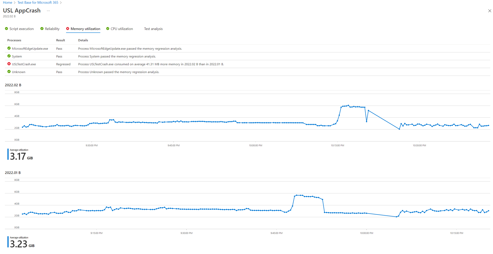

# Understanding Memory Regression Analysis

As a performance metric, memory usage can be an indication of overall application health. With **Test Base**, you can readily observe increasing memory usage of the test virtual machines (VMs) that are hosting your application/s, as it occurred during a test run.

For all test runs in the **Test Base** service, memory signals are captured in the **Memory utilization** tab.  The example that follows shows a recent test run against a February 2022 OS security update, with an onboarded application named “USL AppCrash” (a test application written to illustrate regressions). 

 > [!div class="mx-imgBorder"]  
 >   
 > **Figure 4. Memory utilization data graph**

&nbsp;&nbsp;&nbsp;**Note:**
- In the previous graph, process utilization may not have lined up exactly, due to different factors in the execution of a test.

In the former example, the process “USLTestCrash.exe” consumed an average of 41.31 MB more memory in the February release (2022:2B) compared to the January release (2022:1B), causing Test Base to identify a regression in memory utilization, as shown in the **Processes** table. The other processes shown in the table are also relevant to the same application but consumed approximately the same amount of memory for each of the two releases, therefore the indicated result is **Pass** for these processes.

&nbsp;&nbsp;&nbsp;**Note:**
- The consumption of more memory is not necessarily an indication of a failure. 

The regression on the relevant process was determined to be statistically significant, so the **Test Base** service exposed this difference to the user in the **Processes** table. At times, memory utilization can be somewhat noisy, so in some cases, **Test Base** uses statistical methods to distinguish across builds and releases as to whether there are meaningful differences.
