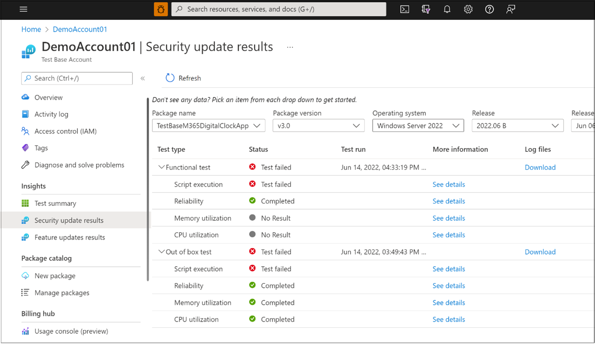
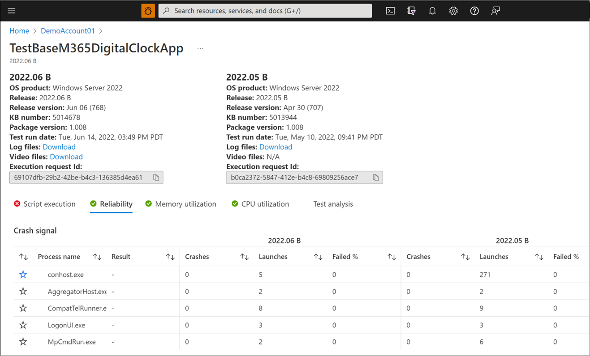

# Viewing Application Reliability Results

You can determine application reliability by reviewing the data in the tables on the **Reliability** tab. For example, by reviewing data from this tab on how your application processes performed, you can determine if such processes are crashing or hanging at an unacceptable rate. This is possible because the **Reliability** tab exposes statistics for all the underlying running processes, which is inclusive of specific application reliability performance data. The dashboard also organizes the details of these processes that ran on the test machine into **Crash** signal and **Unresponding** signal categories for better assessment of results. 

To display the **Reliability** tab, perform the steps of the procedure that follows:
1. Click **Security update results** under **Insights**.
2. Select the values associated with your package in the following drop-downs: **Package name, Package version, Operating system, Release**, and **Release build version**, as shown in the figure that follows.

> The drop-downs are populated with data followed by Test results for the **Functional** and **Out of box** tests.  
> [!div class="mx-imgBorder"]  
>   
> **Figure 2. Populating security update results**

3. Click **See details** in the **Reliability** row to display the **Reliability** data, providing that the status is **Completed**, as shown in the figure that follows.

> [!div class="mx-imgBorder"]  
>   
> **Figure 3. Reliability tab**

From the **Reliability** tab you can also sort the **Crash** and **Unresponding** data to ensure quick visibility into prominent information of interest. For example, you could sort processes by the highest failure rate, by the number of crashes, or by the number of times a process became unresponsive.

**For more information** about how relevant processes are identified, see [Determining Relevant Process for Regression Detection](determiningrelevantprocessesforregressiondetection.md).
